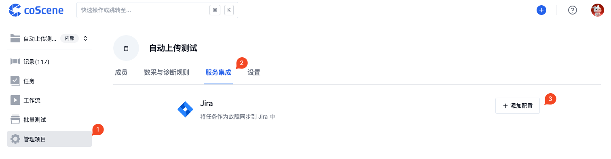
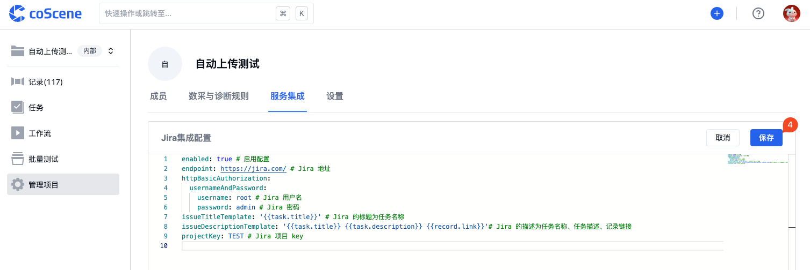
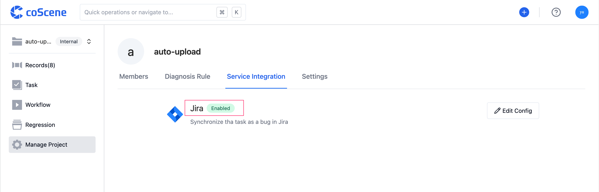
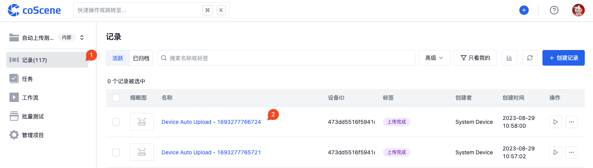
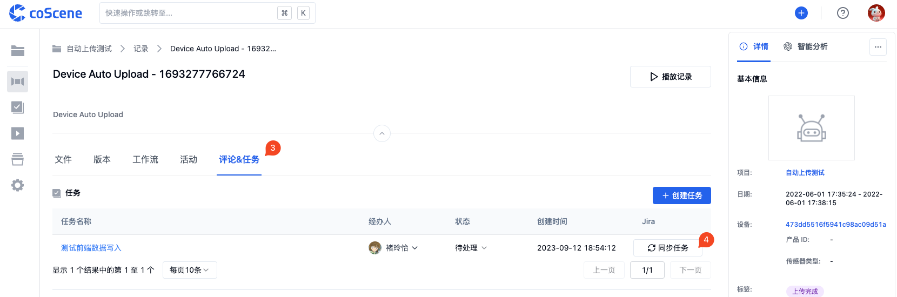
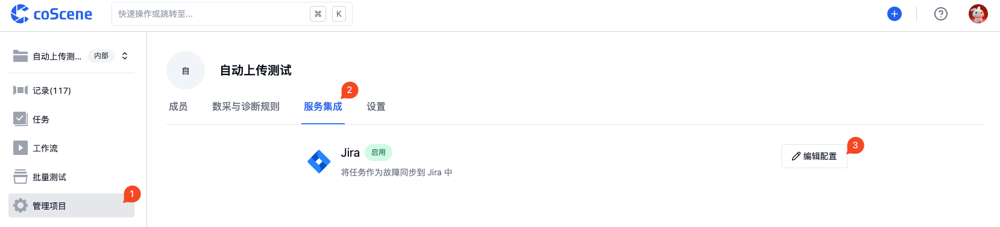

# Jira

通过集成 Jira，将任务作为故障同步到 Jira 中。

 

## 配置集成

> 每个项目单独配置，仅项目管理员可编辑

在项目中，进入「管理项目-服务集成」页面，点击【添加配置】。

在线编辑配置，完成配置后点击【保存】。

保存成功后，自动启用配置。

 

## 集成的配置格式

示例配置如下：

- **Jira 项目 Key**

  项目的 Key 需要在 Jira 平台上进行查询，如下：

  

- **Jira 类型**

  支持标准字段，如：Bug、Task、Story

- **自定义字段**

  若有自定义字段，请联系刻行。

 

## 任务同步到 Jira

> Jira 集成配置完成后，项目中的任务即可同步到 Jira 中。

进入项目的记录页面

在「评论&任务」模块中，点击任务对应的【同步任务】按钮

同步成功后，即展示创建的 Jira 链接。

 

## 管理 Jira 集成

### 编辑集成

在项目中，进入「管理项目-服务集成」页面，点击【编辑配置】。

在线编辑配置，完成配置后点击【保存】。

 

### 禁用集成

在项目中，进入「管理项目-服务集成」页面，点击【编辑配置】。

将配置中的 `enabled: true` 改为 `enabled: false` 后，点击【保存】。

 

### 删除集成

在项目中，进入「管理项目-服务集成」页面，点击【编辑配置】。

将配置中的内容全部删除后，点击【保存】。

 
