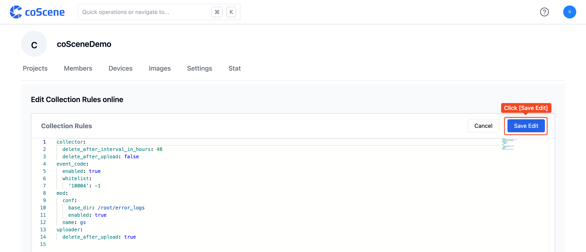
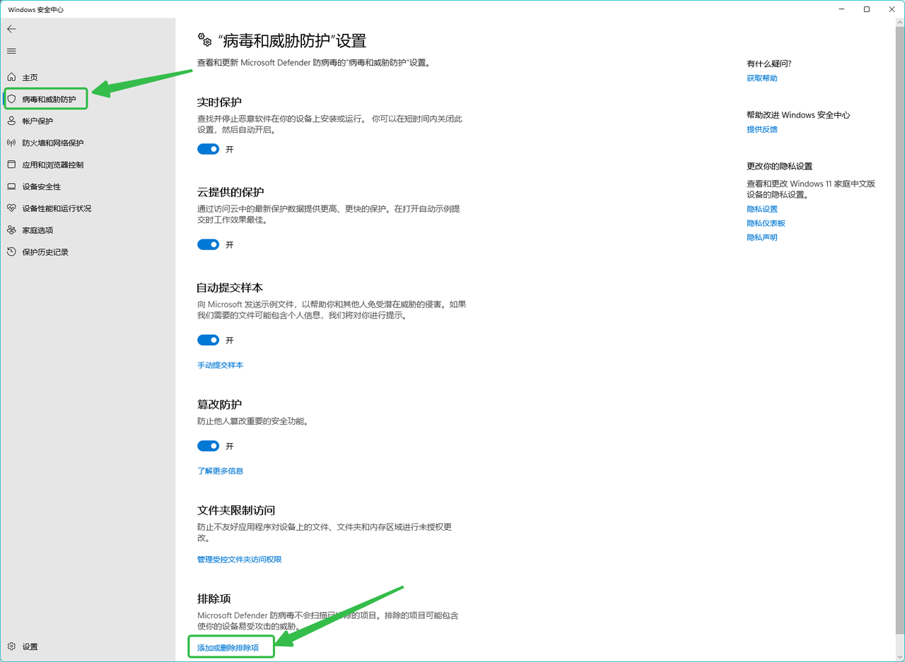
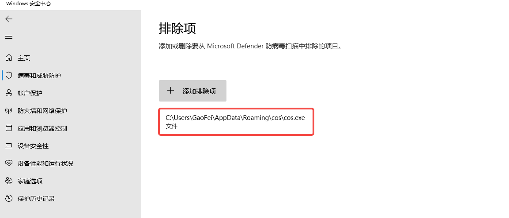
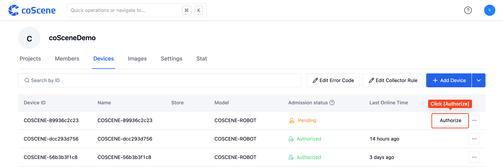

## Device Authorizations

> Authorized devices can automatically upload data to projects based on data collection rules.

Device authorization consists of three steps: configuring data collection rules, device registration, and device review.

<br />

## Configure Data Collection Rules

> Data collection rules apply to all devices within the organization and can only be edited by organization administrators.

Data collection rules define directories for monitored device logs, directories for device information files, etc. The structure format of the data collection rules is described below.

<br />

Navigate to the "Devices" tab on the organization management page and click [Edit Data Collection Rules].


Edit the data collection rules online, and click [Save Edits] after completing the configuration.



<br />

## Data Collection Rule Format

Data collection rules primarily set up three modules:

- **Data Collector Settings (collector)**: Whether to delete data on the device after data collection.
- **Storage Settings (mod)**: Directory for data storage on the device; address for the device identifier file.
- **Event Settings (event_code)**: Upload rule addresses for event error codes and upload condition restrictions.
- **Update Settings (updater)**: Whether the current program enables automatic updates.

<br />

Example data collection device information file:

````yaml
collector:
  delete_after_upload: true # Default value is False
  delete_after_interval_in_hours: 48 # Default is -1, meaning files won't be deleted
  scan_interval_in_secs: 60 # Default is 60, meaning folders are scanned every 60s

mod:
  name: 'default' # mod name, default is "default". For custom versions, please contact coScene for more information.
  conf:
    enabled: true # Whether it's enabled, default is true
    robot_file: '/root/.ros/sn.txt' # Device identifier file, used to store unique device identifiers like sn
    base_dir: '/root/.ros/auto-upload/' # Directory for data monitoring

event_code: # Error code feature
  enabled: false # Configuration for error code whitelist, default is False
  whitelist:
    '1001': 8 # Key is the error code (string type); value is the count, indicating the maximum number of uploads within the reset_interval_in_sec period. Excess data is ignored.
  reset_interval_in_sec: 86400 # Calculation period, default is a day
  code_json_url: cos://organizations/current/configMaps/device.errorCode # Default uses cloud configuration, supports other public files

updater:
  enabled: true # Automatic update configuration, default is True


<br />

### Data Collector Settings

After completing data collection, settings decide whether to delete data on the device to free up device hard disk storage.

```yaml
# Data Collector Settings
collector:
  delete_after_upload: true # Default is False
  delete_after_interval_in_hours: 48 # Default is -1, meaning files won't be deleted
  scan_interval_in_secs: 60 # Default is 60s, meaning folders are scanned every 60s
````

<br />

### Storage Settings

Sets up storage addresses for data on the device.

```yaml
# Data processing settings, can be customized. Please consult coScene for detailed processes.
mod:
  name: 'default' # mod name, default is "default". For custom versions, please contact coScene for more information.
  conf:
    enabled: true # Whether it's enabled, default is true
    robot_file: '/root/.ros/sn.txt' # Device identifier file, used to store unique device identifiers like sn
    base_dir: '/root/.ros/auto-upload/' # Directory for data monitoring
```

<br />

### Event Code Settings

Sets the event error codes and conditions that trigger data collection.

```yaml
# Event Code Settings
event_code: # Error code feature
  enabled: false # Whether the error code feature is enabled, default is False
  whitelist:
    '1001': 8 # Key is the error code (string type); value is the count, indicating the number of uploads within the reset_interval_in_sec period. Excess data is ignored.
  reset_interval_in_sec: 86400 # Calculation period in seconds, default is 86400s
  code_json_url: cos://organizations/current/configMaps/device.errorCode # Default uses cloud configuration
```

- **whitelist**：Events with error codes in the whitelist will trigger automatic data uploads. You can set the maximum number of uploads for a given error code, preventing the same issue from being reported multiple times.
- **reset_interval_in_sec**：Resets the settings for the "maximum number of uploads" for an error code. For example, 86400 means that 24 hours later, when the same error code occurs again, the "number of uploads" starts counting from 1 again.
- **code_json_url**：The JSON data source address for event codes.

<br />

### Update Settings

Sets whether to automatically update the data collection program.

```yaml
# Update Settings

updater:
  enabled: true # 是否自动更新数采程序，默认值为 true
```

<br />

## Configure Error Code Lookup Table

> Configure as needed. Only devices with event error codes can use the error code lookup table feature.

The error code lookup table manages the correspondence between error codes and error messages. It's primarily used to:

- Assist in viewing settings for the event whitelist in data collection rules.
- In records created by automatic data collection, correlate error codes with error messages.

<br />

### Configure Error Codes in the Organization

In the organization management - Devices page, click [Error Code Lookup Table].


Edit the error code lookup table online and click [Save] after completing the configuration.

<br />

### Error Code Lookup Table Format

The format for the error code lookup table is as follows:

```yaml
'1001': Machine cannot move # Error code: 1001, Error message: Machine cannot move
'1002': Task ended abnormally # Error code: 1002, Error message: Task ended abnormally
```

Note: When using a custom version, i.e., the mod name isn't "default", the error code format may be customized. Please contact coScene for details.

<br />

## Device Registration

### Prerequisites

Device data is uploaded to the auto-upload project by default. Please make sure the project exists. If not, you need to create a project named "auto-upload" first. See [Creating a Project](https://docs.coscene.cn/en/docs/get-started/create-project-flow). When other projects configure rules for automatic data collection and diagnosis, device data will also be uploaded to the corresponding project based on these rules.

<br />

### Linux Devices

#### Online Installation and Registration

Navigate to the "Devices" tab on the organization management page.


Copy the installation command.


Open a terminal window, access the device, and paste the installation command.


Once the installation is complete, registration is successful.


<br />

#### Offline Installation and Registration

1. Download the installation script [install.sh](https://download.coscene.cn/coscout/install.sh) and the offline binary compressed package [cos_binaries.tar.gz](https://download.coscene.cn/coscout/tar/latest/cos_binaries.tar.gz) to the device.

2. The program requires the installation of a systemd service. **Please execute the following commands using the root account**.

3. Grant permissions to the installation script by executing the following command:

   ```
   chmod +x install.sh
   ```

4. Execute the local installation command on the device:

Taking the offline binary compressed package `cos_binaries.tar.gz` located at `/root/cos_binaries.tar.gz` on the device as an example:

```
$ ./install.sh --server_url=*** --project_slug=*** --use_local=/root/cos_binaries.tar.gz
```

For the parameters `--server_url` and `--project_slug`, refer to the previous section "Online Installation and Registration - Copy Installation Command". The parameter `--use_local` is the path to the offline binary compressed package.

<br />

#### Viewing Logs

Execute the following command on the device to view the logs of the data collection program:

```
journalctl -fu cos
```

<br />

### Windows Devices

#### Online Installation and Registration

> The following operations need to be executed on the device.

<br />

1. Open cmd

2. 在 cmd 中运行安装命令

   ```yaml
   powershell -c "Set-ExecutionPolicy RemoteSigned; Invoke-WebRequest -Uri https://download.coscene.cn/coscout/install-beta.ps1 -OutFile install.ps1; ./install.ps1 --server_url=*** --project_slug=*** --beta"
   ```

   Among them, the parameters `--server_url` and `--project_slug` can be referred to the above section '**Online Installation Registration - Copy Installation Command**' for reference.

<br />

#### Installation FAQ

1. **Question**: A service registration prompt pops up during installation.

   **Solution**: Enter the current Windows system username and password.

   

2. **Question**: Detected as a virus, cannot install.

   **Solution 1**: Disable Windows Defender.

   **Solution 2**: Add to whitelist in Windows Defender.

   

   

<br />

## Device Approval

> Only organization administrators can approve devices.

After completing the installation of the data collection program on the device, the organization management-device page on the engraving platform will add this device, and its corresponding admission status is "Pending Approval". Devices that pass the audit are in the "Approved" status, and approved devices can automatically upload data to the project according to the rules.

<br />

Enter the "Device" tab of the organization management page.


Find the device that needs to be approved and click [Approve Access].



Device successfully authorized.


<br />
