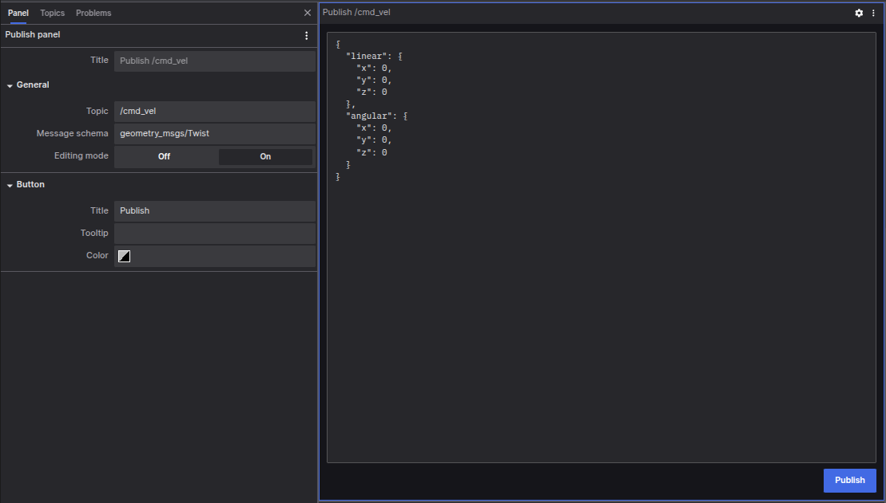

# Publish Panel

The Publish Panel allows the users to publish messages to specified topics via [coBridge](https://github.com/coscene-io/coBridge).

## Settings Options

- Editing Mode: When enabled, you can edit the message content; when disabled, only the publish button is displayed
- Button Title: Customize the display text of the publish button
- Button Tooltip: Set the tooltip information displayed on mouse hover
- Button Color: Customize the button's display color

## Usage Steps

1. Specify Topic: Enter the target topic name in the topic field, and the system will automatically recognize the corresponding message schema and generate a JSON template
2. Select Schema: Click the schema selection box to view a list of common ROS schemas, selecting one will automatically generate the corresponding JSON template
3. Edit Message: Modify the JSON template content according to your needs
4. Send Message: Click the publish button to send the message to the specified topic

## Notes

- The web client must be connected to a machine that supports the publishing feature, otherwise the publish button will be disabled
- The coBridge configuration on the machine must enable the clientPublish feature to support publishing topic messages from the web client

The Publish Panel provides you with an intuitive interface to conveniently interact with your robot system, improving operational efficiency.
