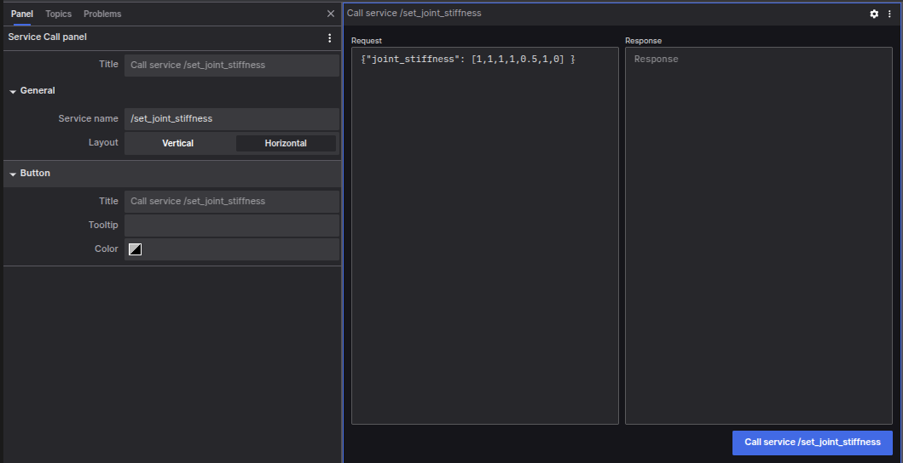

# Service Call Panel

The Service Call Panel allows you to call ROS services via coBridge and view their responses.

## Settings Options
### General Settings
- Service Name: The name of the service to request.
- Layout: The layout method for request and response inputs, with options for "Vertical" or "Horizontal".

### Button Settings
- Title: The text for the button.
- Tooltip: The tooltip text for the button.
- Color: The button color.

## Interaction
The "Call Service" button will be disabled until connected to a supported data source. Use a valid JSON formatted service request in the "Request" input box, then click the "Call Service" button. The result will be displayed in the "Response" input box.

**With the Service Call Panel, you can easily interact with the services of the robot system, send requests, and view responses, enhancing your control and monitoring capabilities over the system.**
