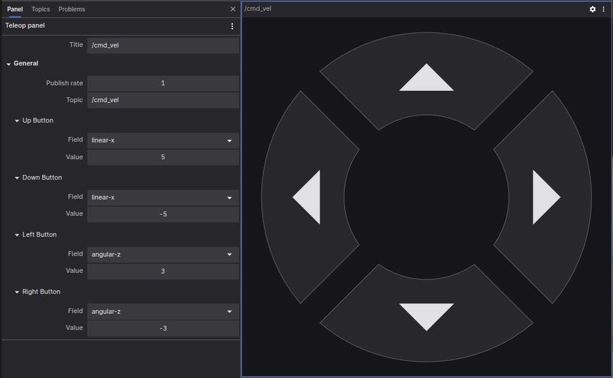

# Teleop Panel

The Teleop Panel allows you to remotely control your robot by publishing geometry_msgs/Twist or geometry_msgs/msg/Twist messages on a specified topic. To remotely operate a connected robot using the control panel, you need to establish communication with the robot via [coBridge](https://github.com/coscene-io/cobridge).

## Settings
- Publish Rate: Set the frequency of publishing Twist messages.
- Topic: Specify the topic for publishing Twist messages.
- Up/Down/Left/Right Buttons: Assign corresponding fields (linear or angular velocity for x, y, or z) and their values for each directional button.

## Supported Message Types:
- Twist:
  **ROS 1**: `geometry_msgs/Twist`

- **ROS 2**: `geometry_msgs/msg/Twist`

 
**To use this panel, your data source must provide messages that conform to the supported message schema mentioned above.**

## How It Works

The Teleop Panel is a specialized "Publish" panel, and its operation is similar to that of the "Publish" panel, both of which send topics to the machine side via coBridge.
  
To achieve teleoperation, the machine side must have components capable of processing the topics sent from the cloud.
