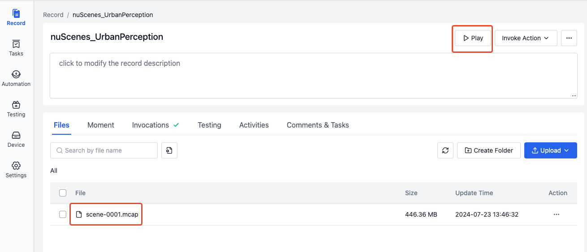
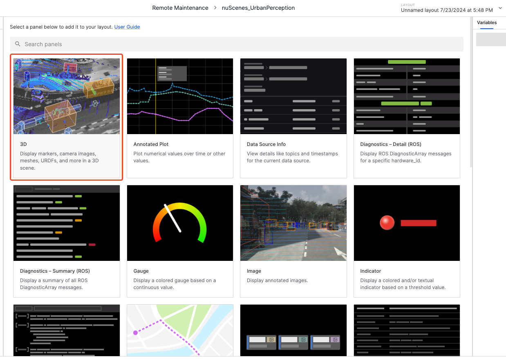
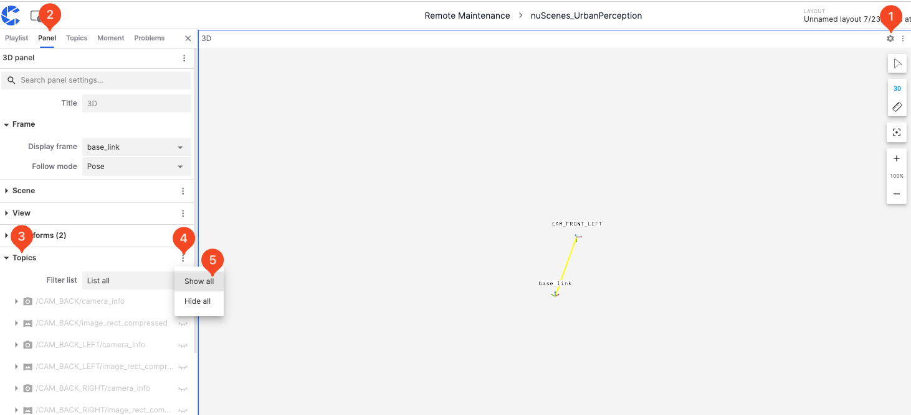
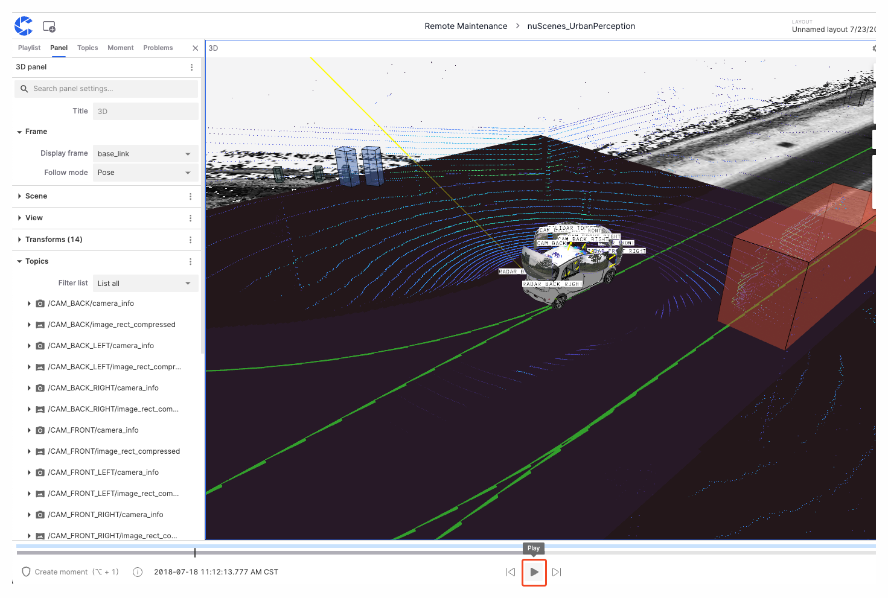

# Visualize Your Data Using the 3D Panel

This section will demonstrate the steps to visualize data using coScene's 3D panel with the "scene-0001.mcap" file as an example.

## File Preparation

1. Create a record in the project. For detailed steps, see [Create a Record](../4-record/1-create-record.md).
2. [Download the sample file](https://download.coscene.cn/public-sample-data/scene-0001.mcap), and click the **Upload** button to upload the file to the record.
   For detailed steps on uploading files, refer to [Upload Files](../4-record/2-upload-files.md).
3. Click the **Play** button to enter the visualization page.

    

4. In the **Layout Menu** on the visualization page, select **Create Empty Layout**.
 

 
5. Select the **3D** panel.
 

 
6. Use the **Settings** button on the top bar of the **3D** panel to access the panel page in the **Left Sidebar**. Click the **Show All** button next to **Topics** to display all topics.
    

 
7. Click the **Play** button on the **Timeline** to play the data.
 

Congratulations, you have just visualized your first data. For more visualization operations and instructions, please refer to the Data Visualization documentation.

---
