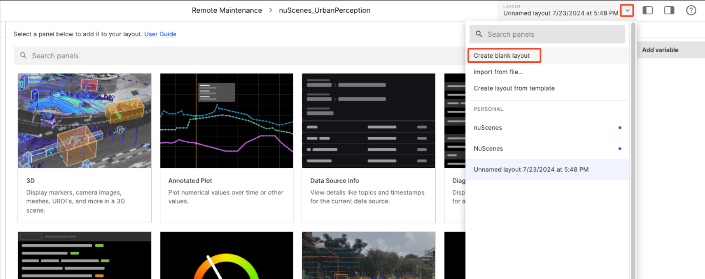

# Visualizing Your Data with 3D Panel

This document will demonstrate the steps to visualize data using coScene's 3D panel with the "scene-0001.mcap" file from the Record.

1. First, create a Record in the project containing the bag file. For detailed steps, refer to [create record](../4-record/1-create-record.md).
   
2. Click the **Play** button or the filename on the Record details page to enter the visualization page.
    

3. In the **Layout Menu** on the visualization page, select **Create Empty Layout**.
 

 
4. Select the **3D** panel.
 

 
5. Use the **Settings** button on the top bar of the **3D** panel to access the panel page in the **Left Sidebar**. Click the **Show All** button next to **Topics** to display all topics.
    

 
6. Click the **Play** button on the **Timeline** to play the data.
 

Congratulations, you have just visualized your first data. For more visualization operations and instructions, please refer to the Data Visualization documentation.

---
