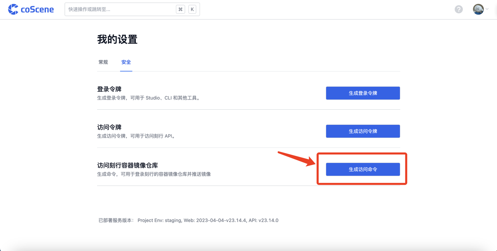

# Image Management

> 了解如何配置镜像文件、推送镜像至刻行平台并进行管理。

## 1. 准备镜像文件

**1. 运行 Docker**

**2. 配置镜像**

新建一个文件夹，其中包含 dockerfile 和相关测试代码

- 示例 dockerfile

  ```bash
  FROM ubuntu:latest

  RUN apt update -y
  RUN apt upgrade -y
  RUN apt install -y python3 unzip python-is-python3
  RUN apt install -y python3-pip
  RUN pip install pytest
  copy tests.py /tests.py
  ```

- 示例测试代码

  ```python
  import os
  import subprocess
  import tempfile

  BUNDLE_DIR = '/cos/bundles'
  DATA_DIR = '/cos/files'
  ARTEFACT_DIR = '/cos/artifacts'

  def __count(word):
      with tempfile.TemporaryDirectory() as d:
          print(d)
          os.system('unzip %s/*.zip -d %s' % (BUNDLE_DIR, d))

          cmd = [d + '/count', word , DATA_DIR, ARTEFACT_DIR]
          print('RUNNING TEST COMMAND')
          print(cmd)
          proc = subprocess.run(cmd, text=True, capture_output=True)
          print('COMMAND RETURN CODE IS: ' + str(proc.returncode))
          output = proc.stdout
          print('COMMAND OUTPUT IS: ' + output)
          return int(output)

  def test_romeo():
      assert __count('romeo') > 0
  ```

  - 若需要在最终的测试结果中输出图型测试报告，请参见 [输出测试结果](../8-regression/6-status-and-output.md#输出图表) 章节。

**3. build 镜像**

镜像文件准备完成后，打开终端，进入对应文件夹后执行命令 build 镜像，各操作系统对应命令如下（请根据实际替换镜像地址部分）：

- Linux

  ```bash
  docker build -f dockerfile -t cr.coscene.cn/coscene-lark/image:latest .
  ```

- macOS

  ```bash
  docker build -f dockerfile -t cr.coscene.cn/coscene-lark/image:latest --platform linux/amd64 .
  ```

<br />

## 2. 推送镜像

登录刻行平台，在「我的设置 - 安全-访问刻行容器镜像仓库」中点击「生成访问命令」，获取刻行容器镜像仓库访问权限：




复制上述命令，在终端执行，以登录并推送镜像至刻行平台。

  <br />

## 3. 查看组织镜像列表

在「我的 - 组织管理 - 镜像」页面，可以查看当前组织内的镜像列表：


点击镜像名称，展示该镜像所有版本，可以点击「复制」按钮复制完整的镜像地址：


  <br />
