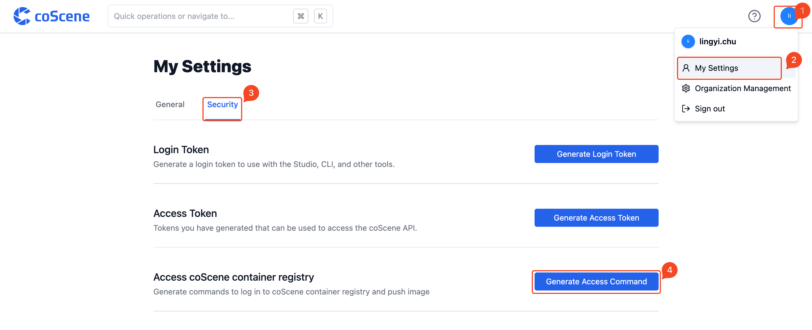

# Image Management

> Learn how to configure image files, push images to the coScene platform, and manage them.

## 1. Prepare Image Files

**1. Run Docker**

**2. Configure the Image**

Create a new folder containing the dockerfile and related test code.

- Sample dockerfile:

```
FROM ubuntu:latest

RUN apt update -y
RUN apt upgrade -y
RUN apt install -y python3 unzip python-is-python3
RUN apt install -y python3-pip
RUN pip install pytest
copy tests.py /tests.py
```

- Sample test code:

```
import os
import subprocess
import tempfile

BUNDLE_DIR = '/cos/bundles'
DATA_DIR = '/cos/files'
ARTEFACT_DIR = '/cos/artifacts'

def __count(word):
with tempfile.TemporaryDirectory() as d:
print(d)
os.system('unzip %s/\*.zip -d %s' % (BUNDLE_DIR, d))

        cmd = [d + '/count', word , DATA_DIR, ARTEFACT_DIR]
        print('RUNNING TEST COMMAND')
        print(cmd)
        proc = subprocess.run(cmd, text=True, capture_output=True)
        print('COMMAND RETURN CODE IS: ' + str(proc.returncode))
        output = proc.stdout
        print('COMMAND OUTPUT IS: ' + output)
        return int(output)

def test_romeo():
assert __count('romeo') > 0
```

- If you need to output graphic test reports in the final test results, please refer to the [Output Test Results](../8-regression/6-status-and-output.md#output-charts) section.

**3. Build the Image**

Once the image file is ready, open the terminal, navigate to the corresponding folder, and execute the command to build the image. The commands for different operating systems are as follows (please replace the image address part as needed):

- Linux:

```
docker build -f dockerfile -t cr.coscene.cn/coscene-lark/image:latest .
```

- macOS:

```
docker build -f dockerfile -t cr.coscene.cn/coscene-lark/image:latest --platform linux/amd64 .
```

<br />

## 2. Push the Image

Log in to the coScene platform. In "My Settings - Security - Access coScene Container Image Repository", click "Generate Access Command" to obtain access rights to the coScene container image repository:




Copy the above command and execute it in the terminal to log in and push the image to the coScene platform.

  <br />

## 3. View the Organization Image List

In the "My - Organization Management - Images" page, you can view the image list within the current organization:


Click on the image name to display all versions of that image. You can click the "Copy" button to copy the full image address:


  <br />
