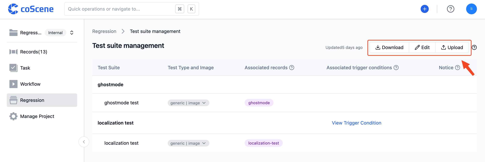

# Configuration Management

> Learn about writing, uploading/editing configuration files, and viewing parsed test suite information.

## 1. Prepare Configuration File

The configuration file is named either `cos.yaml` or `cos.yml`. For its specific format and rules, please refer to [Configuration File Format and Samples](../8-regression/yaml-sample.md).

 

## 2. Upload and Edit Configuration File

On the "Batch Testing - Test Suite Management" page within the project, you can directly select and upload a configuration file from your local device or write one online:

 

You can click on the top right corner of the "Batch Testing - Test Suite Management" page to download/edit/upload configuration files.

 

You can click "Edit" to edit the configuration file online. After modifying the content of the configuration file, click "Save Edits" to update it:

 

## 3. View Test Suite Information

After parsing a configuration file that adheres to the format and content standards, the test suite management page will display the parsed test suites and related information.

You can click on some column content to view detailed information. For example, you can click on the "Test Type and Image" column to view and copy the image address, click "View Trigger Conditions" to view the automatic trigger conditions for that test suite, click "View Notification Configuration" to view the notification template content for that test suite, and more:

 
