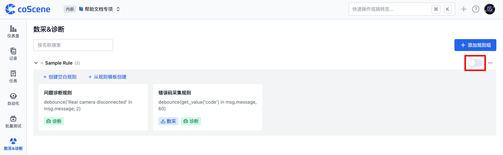
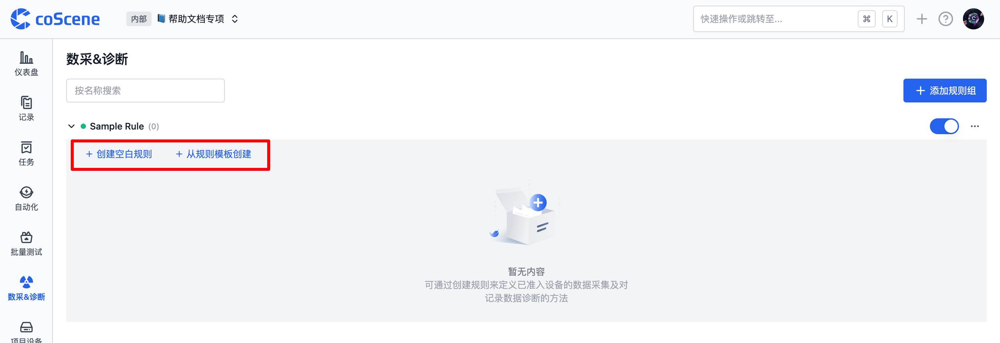
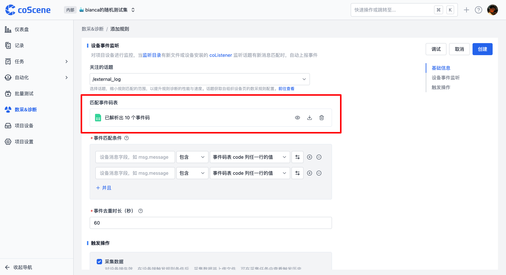

# Add Rule
On the Data Collection & Diagnosis Rules page, rules can be added to achieve automatic monitoring and collection of project device data.

## Permission Explanation

> Only **Project Administrators** and **Organization Administrators** have the right to add and edit rules; other permission roles can only view the rule content.

## Specific Data Format

Platform rules only apply to data in specific formats, which must include message, timestamp, topic, and message type, and belong to streaming data.

The supported timestamp formats for log text files are as follows:

| Timestamp Type                                                      | Timestamp Format        | Example                         |
| ---------------------------------------------------------- | -------------------- | -------------------------- |
| Regular file timestamp                                                  | %m%d %H:%M:%S.%f     | 0212 12:12:12.548513       |
|                                                            | %b %d %H:%M:%S       | Dec 12 12:12:12            |
|                                                            | %Y-%m-%d %H:%M:%S.%f | 2023-02-12 12:12:12.548513 |
|                                                            | %H:%M:%S.%f          | 12:12:12.548513            |
| Special *filename / first line of the file's timestamp* (for cases where the year, month, day, hour, minute, and second are not fully included in the file) | %Y-%m-%d %H:%M:%S    | 2023-02-12 12:12:12        |
|                                                            | %Y/%m/%d %H:%M:%S    | 2023/02/12 12:12:12        |
|                                                            | %Y%m%d%H             | 2023021212                 |

If there are other timestamp formats that need to be supported, please contact us.

## Rule Group

A rule group is a collection of rules used for categorizing and managing rules.

### 1. Add Rule Group

In the project, go to the "Data Collection & Diagnosis Rules" tab, click on "Add Rule Group." After successful addition, specific rules can be added within that rule group.

### 2. Enable and Disable Rule Group

Newly added rule groups are disabled by default. To allow project devices to use the rules for data monitoring, they must be manually enabled.

If temporarily not needed but will be used later, they can also be set to "disabled."

### 3. Rule Group Management

In more operations, you can rename and delete rule groups.

## Rule Creation and Configuration

A rule is a single rule within a rule group, used to define the conditions for triggering data collection and diagnosis, as well as the actions taken afterward.

### Add Rule

In the rule group, you can add a new rule by clicking "Create Blank Rule" or "Create from Rule Template." Below, we mainly introduce the steps for creating a blank rule.

### Basic Information

Name the rule; the rule name is used to distinguish different rules for easier management and identification later.

### Device Event Monitoring

> **Module Illustration**
>
> This module monitors project devices. When new files are present in the pre-set monitoring directory or new messages matching the [coListener](https://github.com/coscene-io/coListener) listening topic are installed, events will be automatically reported and recorded in the current project's dashboard.

#### 1. Topics of Interest

* Setting the topics of interest can narrow the rule matching range, improving the performance, speed, and accuracy of rule diagnosis.

* If you want to monitor log-type files in the device, please select `/external_log`.

* Other topic options can be set in the organization's data collection client configuration. For details, please refer to the [4-Data Collection Client Configuration](https://coscene0.feishu.cn/wiki/S3kvw7wYmic1LxkzBPxcLExHntc?fromScene=spaceOverview) document.

#### 3.2 Event Code Table Matching

* In the event code table, you can define the code value, event name, level, solution, and other information for the event. The event code table must include a code column as the unique identifier for the event.

* After uploading the event code table (supports JSON or CSV files), the system will automatically parse it and also supports previewing, downloading, and deleting operations. If you want to modify the table content, you can download it to your local computer, make changes, and then upload it again.

#### 3.3 Event Matching Conditions

* Determine whether an event is triggered based on the matching relationship between the device message fields and a certain value.

* Click the "Switch" button to toggle between the code header and the specific value input box.

* In the predefined input box, the code value from the event code table is set as the matching variable.

* In the specific value input box, directly input text information.

* To check if the log file contains the keyword "error 1," you need to fill in: `msg.message contains error 1`, and the "Topics of Interest" section needs to select `/external_log`.

* To check if the `msg.data` message field in the `/error_code` topic (message type is `std_msgs/string`) of the bag file contains the keyword "error 1," you need to fill in: `msg.data contains error 1`.

* Multi-line logical judgment conditions are in an "AND" relationship and must all be met to take effect.

#### 3.4 Event Deduplication Duration

* If a new event (the same event) occurs within the set time after the last merged event, it will be merged with the original event. Each time a new event occurs, the time is reset until no new events occur beyond the time window, completing the merge.

* The supported range is set between 1 second and 86400 seconds (1 day).

### Trigger Operations

Trigger operations refer to the actions taken after the rule conditions are met. Currently, data collection and data diagnosis modules are supported.

#### 1. Data Collection

* After the rule conditions are triggered on the device side, a data collection task will be automatically created in this project, collecting device data for the corresponding time. After the collection is completed, a record will be generated in the logs, containing the data when the trigger conditions were met.

* You can set the time range for uploaded files, record names, record descriptions, record tags, and collection limits.

* Uploaded files refer to all files in the data collection directory that meet the time range.

* Record names and descriptions support using code variables (using the format `{scope.header_name}`) interspersed with text.

* In more settings, you can use [file wildcards](https://www.malikbrowne.com/blog/a-beginners-guide-glob-patterns/) for secondary filtering.

* If there are specific additional files, such as map files, you can specify the exact file location here.

#### 3.2 Data Diagnosis

* Perform data diagnosis actions on records that have already been collected on the platform. The time points that meet the trigger conditions will automatically create a moment, which can be viewed in the records after collection.

* Supports setting moment names, moment descriptions, moment attribute values, and whether to create associated general tasks for the diagnosed moment for circulation.

* Moment names, moment descriptions, and moment attribute values support using code variables (using the format `{scope.header_name}`) interspersed with text.

### Usage of Code Variables

In the trigger operations of the rules, some text input boxes can use code variables to obtain relevant data values at the time of triggering. The writing specifications can refer to the following table:

| Meaning                     | Writing Specification                            | Example of Effect After Translation                                                                                      |
| ---------------------- | ------------------------------- | ---------------------------------------------------------------------------------------------------------- |
| Call the code value of the event code table uploaded to the rule | `{scope.code}`                    |  `ERROR-CODE-001`                                                                                            |
| Call other column values of the event code table uploaded to the rule    | `{scope.solution}` Note: The header name must be in English and without spaces | `Try restarting the device`                                                                                                     |
|                        | `{msg}`                           | `{"timestamp": {"sec": 123456, "nsec": 789}, "message": "demo log message", "file": "demo.log", "level": 2}` |
|                        | `{topic}`                         | `/external_log`                                                                                             |
|                        | `{ts}`                            | `1738915780.123`                                                                                             |

***

After completing the rule content filling, click the save button to add the project rule, achieving automatic monitoring and collection of project device data.

If you have any questions during the operation, feel free to contact us for assistance.