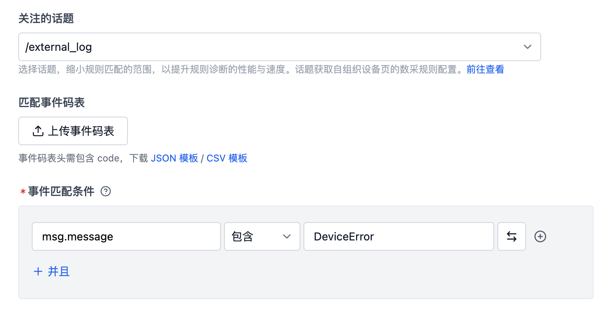
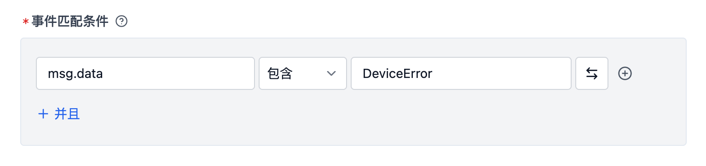
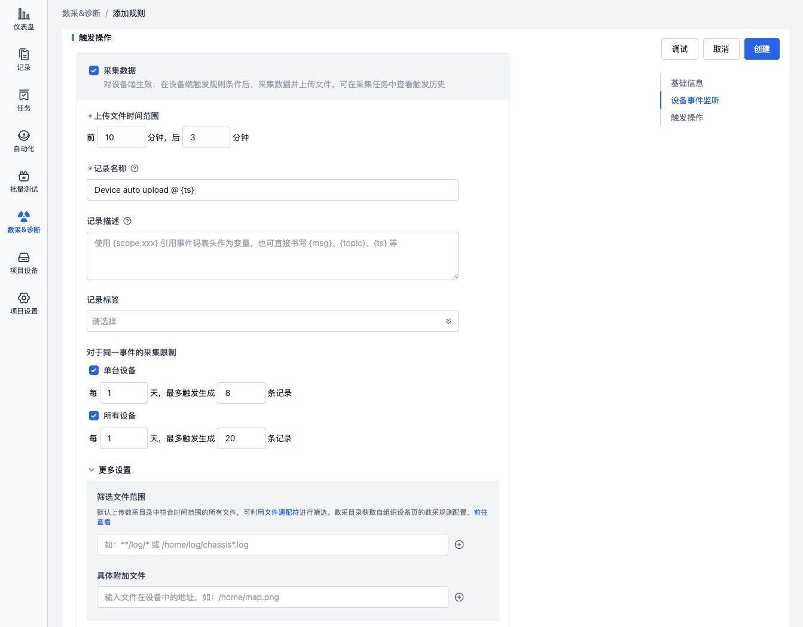
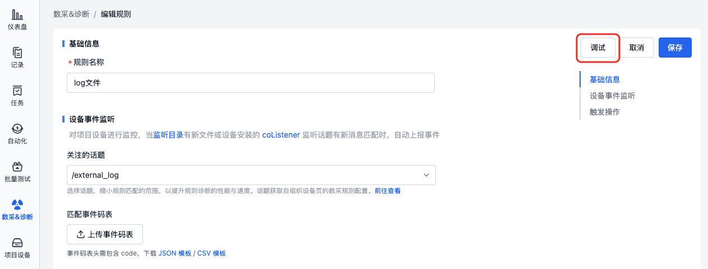

# Add Rule

> Only **Project Administrators** and **Organization Administrators** have the right to add and edit rules; other permission roles can only view the rule content.

## Data Format Requirements

Platform rules only apply to data in specific formats, which must include message, timestamp, topic, and message type, and belong to streaming data.

File requirements:

- File extensions must be: .log, .mcap, .bag
- Currently supported log timestamp formats are as follows:

| Timestamp Type                                                                                                                              | Timestamp Format     | Example                    |
| ------------------------------------------------------------------------------------------------------------------------------------------- | -------------------- | -------------------------- |
| Regular file timestamp                                                                                                                      | %m%d %H:%M:%S.%f     | 0212 12:12:12.548513       |
|                                                                                                                                             | %b %d %H:%M:%S       | Dec 12 12:12:12            |
|                                                                                                                                             | %Y-%m-%d %H:%M:%S.%f | 2023-02-12 12:12:12.548513 |
|                                                                                                                                             | %H:%M:%S.%f          | 12:12:12.548513            |
| Special _filename/first line timestamp_ (for cases where timestamps in files don't contain complete year, month, day, hour, minute, second) | %Y-%m-%d %H:%M:%S    | 2023-02-12 12:12:12        |
|                                                                                                                                             | %Y/%m/%d %H:%M:%S    | 2023/02/12 12:12:12        |
|                                                                                                                                             | %Y%m%d%H             | 2023021212                 |

If you need support for other timestamp formats, please contact us.

## Rule Groups

Rule groups are collections of rules used for categorizing and managing rules.

### Add Rule Group

In the project, go to the "Data Collection & Diagnosis Rules" tab, click "Add Rule Group". After successful addition, you can add specific rules within that rule group.

### Enable Rule Group

Newly added rule groups are disabled by default. To monitor project device data, they need to be manually enabled.

### Manage Rule Group

In "More" operations, you can rename and delete rule groups.

## Rules

A rule is a single rule within a rule group, used to define conditions for triggering data collection and diagnosis, as well as actions taken afterward.

### Add Rule

In the rule group, you can click "Create Blank Rule" or "Create from Rule Template" to add a new rule.

### Rule Content

Rules mainly include: basic information, event monitoring conditions, and trigger actions.

#### Basic Information

Name the rule; the rule name is used to distinguish different rules for easier management and identification.

#### Device Event Monitoring

> Monitor project devices. When new files appear in the monitored directory or new messages match the [coListener](https://github.com/coscene-io/coListener) listening topics, events will be automatically reported and displayed in the project dashboard. (Contact us to use the dashboard feature)

##### Topics of Interest

- Topics of Interest: Narrow down the rule matching range to improve rule diagnosis performance, speed, and accuracy
- Topic options source: Set in the organization's data collection client configuration, see ["Data Collection Client - Storage Settings"](https://docs.coscene.cn/docs/recipes/device/device-collector#%E8%A7%84%E5%88%99%E8%A7%A6%E5%8F%91%E8%AF%9D%E9%A2%98topic)
- Topic type: Supports topics with message type `std_msgs/string`
- To monitor log-type files in the device, please select `/external_log`

##### Event Code Table

- The event code table defines event code values, event names, levels, solutions, and other information. Including:
  - Event code table: Supports JSON or CSV files
  - Must include a code column as the unique identifier for events; other column headers must be in English, content can be customized for later reference
- Manage event code table: Upload, preview, download, delete

##### Event Matching Conditions

> Determine whether to trigger events based on the matching relationship between device message fields and values. If triggered, execute subsequent actions.

Event matching conditions include: message field, logical relationship, value. Where:

- Message field: Enter the field to monitor, such as msg.data (if monitoring log files, enter msg.message)
- Logical relationship: Choose "contains" or "equals"
- Value: Enter the specific value to match, defaults to referencing the code in the event code table (triggers when any content in the code column is detected), click the "Switch" icon to input value directly
- Note: Multiple conditions have an "AND" relationship

**Example 1: Check if certain codes appear in log files**

Monitor if values from the event code table's code column appear in log files:

1. Topics of Interest: Select `/external_log`
2. Event code table: Upload csv file with matching content in code column
3. Event matching conditions: msg.message contains any value from event code table's code column

When 1001, 1002, or 1003 appears in the log file (any value from the code column), the event match is successful.

**Example 2: Check if a keyword appears in log files**

Monitor if keyword DeviceError appears in log files:

1. Topics of Interest: Select `/external_log`
2. Event matching conditions: msg.message contains DeviceError

When DeviceError appears in the log file, the event match is successful.

**Example 3: Check if certain codes appear in bag files**

Monitor if values from the event code table's code column appear in the msg.data message field of the `/error_code` topic (message type std_msgs/string) in bag files:

1. Event code table: Upload csv file with matching content in code column
2. Event matching conditions: msg.data contains any value from event code table's code column

When 1001, 1002, or 1003 appears in the bag file (any value from the code column), the event match is successful.

**Example 4: Check if a keyword appears in bag files**

Monitor if keyword DeviceError appears in the msg.data message field of the `/error_code` topic (message type std_msgs/string) in bag files:

1. Event matching conditions: msg.data contains DeviceError

When DeviceError appears in the bag file, the event match is successful.

Note: Use "+AND" if multiple conditions need to be met simultaneously.

##### Event Deduplication Duration

> If a new event (same event) occurs within the set time after the last merged event, it will be merged with the original event. Each time a new event occurs, the time is reset until no new events occur beyond the time window, completing the merge.

- Supported range: 1 second ~ 86400 seconds (1 day)

#### Trigger Actions

Trigger actions are operations executed after rule conditions are met, supporting data collection and data diagnosis.

##### Data Collection

> When rules are triggered on the device side, a collection task will be automatically created to collect device data for the corresponding time and save it to records.

The data collection module includes: time range for uploaded files, record information, collection limits, more settings. Where:

- Time range for uploaded files
  - Define the time range of files to collect before and after the trigger time, see [Data Collection Client - Storage Settings](https://docs.coscene.cn/docs/recipes/device/device-collector#%E5%AD%98%E5%82%A8%E8%AE%BE%E7%BD%AEmod) for collection directory settings
- Record information
  - Define record name, description, and tag information for saving data, where name and description support variables (e.g., `{scope.code}`, see below)
  - When data upload is complete, an "Upload Complete" tag will be automatically added to the record
- Collection limits
  - Define maximum number of data collections per day when the same event repeats
  - Supports limiting single device and all devices, when either limit is reached, no more data will be collected
  - If no limit is set, all events will trigger uploads, adding limits is recommended
- More settings
  - Filter file range: Use file wildcards to set upload whitelist, filter the predetermined upload list to only upload whitelisted files, reducing device traffic costs
  - Specific additional files: Add extra device files to upload, typically maps, configuration files, and other non-real-time device files

Example of rule-triggered collection task:

Example of task-related record:

##### Data Diagnosis

> - After collecting data from the device side and saving to records, automatically create a moment at the rule trigger time
> - Manually created records can automatically mark key time points by calling the "Data Diagnosis" action. The "Data Diagnosis" action aggregates all rules with "Auto Diagnosis" module checked in the project to match files in the record against rules.

The data diagnosis module includes: moment information, task information. Where:

- Moment information
  - Define moment name, description, attribute values etc. for the trigger time point, supports variables (e.g., `{scope.code}`, see below)
- Task information
  - Define whether to create tasks, task assignee, whether to sync tasks to ticket system etc., to circulate events that trigger rules

Example of automatically created moment in record:

### Rule Variables

Rules support using variables, see table below:

| Variable Name      | Meaning                                        | Effect Example                                                                                               |
| ------------------ | ---------------------------------------------- | ------------------------------------------------------------------------------------------------------------ |
| `{scope.code}`     | Value from code column in event code table     | `ERROR-CODE-001`                                                                                             |
| `{scope.solution}` | Value from solution column in event code table | `Try restarting device`                                                                                      |
| `{msg}`            | Message content that triggered the rule        | `{"timestamp": {"sec": 123456, "nsec": 789}, "message": "demo log message", "file": "demo.log", "level": 2}` |
| `{topic}`          | Topic that triggered the rule                  | `/error_code`                                                                                                |
| `{ts}`             | Timestamp when rule was triggered              | `1738915780.123`                                                                                             |

### Debug Rule

#### Prerequisites

Prepare a record with files available for debugging, i.e., mcap, bag or log files that can trigger rules.

#### Debug Steps

1. Click "Debug" button in rule details, select the prepared record

2. View debug logs

3. Check debug files in the "Output" section of debug logs

### Manage Rules

In the rule list, you can delete rules

