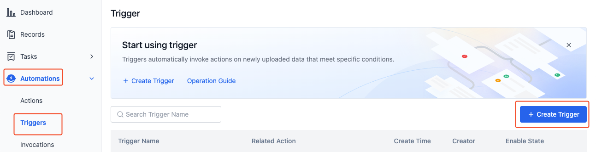
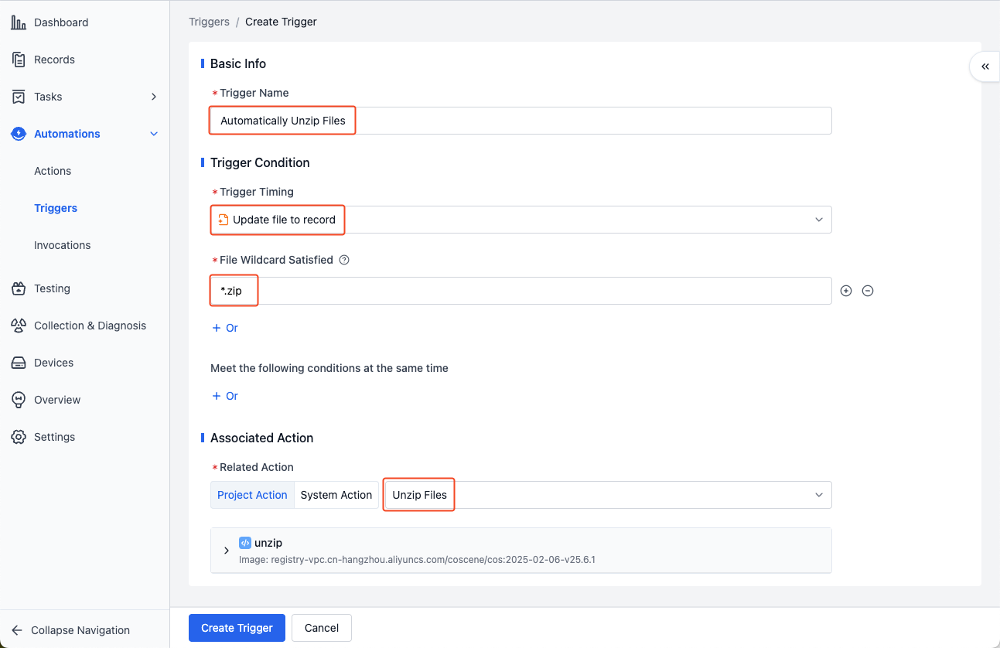
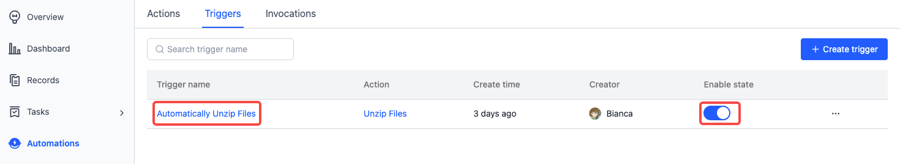
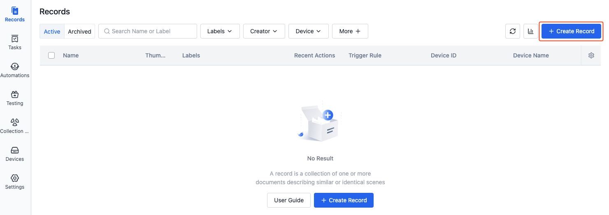
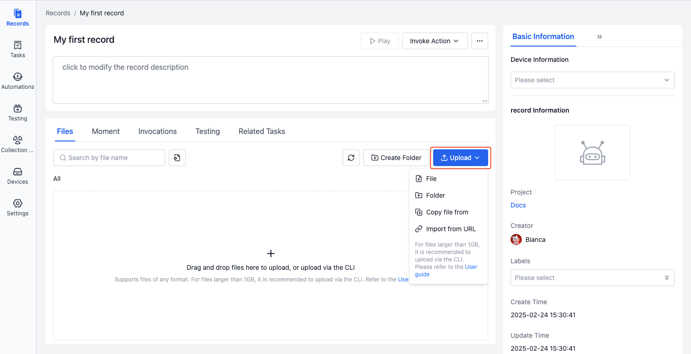
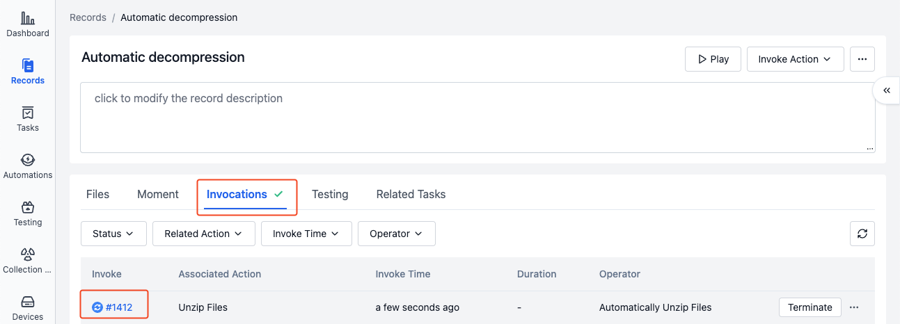
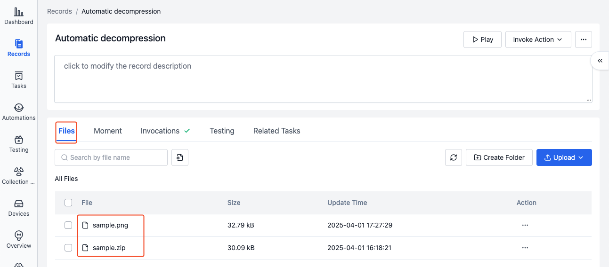

# Quick Start with Automation

Automation is a task-based workflow system. With its flexible and powerful features, it adds more value to the data stored on the platform. It is mainly applied in scenarios such as data processing, transformation, and analysis. By leveraging the automation process, you can efficiently handle large volumes of data and significantly enhance your work efficiency.

## Basic Information

### Concept Explanation

| Concept     | Explanation                                                                                                                                                                                  |
| ----------- | -------------------------------------------------------------------------------------------------------------------------------------------------------------------------------------------- |
| Actions     | An action is the basic building block of an automation process, representing a specific task. See [Actions](./2-action-overview.md) for details.                                             |
| Triggers    | A trigger is the starting condition for an action, defining how the system should execute the corresponding action when a specific event occurs. See [Triggers](./4-trigger.md) for details. |
| Invocations | The invocation records information related to all executed invocations, including the invocation time, status, execution results, etc. See [Invocations](./5-invocation.md) for details.     |

### System Directories

During runtime, action containers mount multiple system directories to facilitate interaction with platform data. The following are common directories. For the complete directory list, please refer to [Action Runtime Information](./6-action-runtime.md)."

| Directory    | Explanation                                            |
| ------------ | ------------------------------------------------------ |
| /cos/files   | Input directory, i.e., the files in the record.        |
| /cos/outputs | Output directory, i.e., the output of each invocation. |

## Quick Start

This section will introduce in detail how to create an automation process through a simple example: when a file with the `.zip` suffix is uploaded, the system will automatically trigger and execute the "Unzip Action".

### Create an Action

1. Enter the project. On the "Automation - Actions" page, click the "Create Action" button.

   

2. On the "Create Action" page, fill in information such as the action name and steps.

- Action Name: Unzip Files

  

- Add a Step:

  

- Step Name: unzip
- Image: `python:3.12-slim`
  - This is a publicly pullable Python image from Docker Hub, suitable for quickly verifying the automation flow.
  - For production actions, package your script and dependencies into your own image and push it to the organization image registry. Each organization is automatically assigned a coScene image registry, usually in the form `cr.coscene.cn/<org-slug>`. Use `cocli registry login` to authenticate local Docker pushes; action runs are automatically authorized to pull images from the current organization registry.
- Command: enter the following 3 lines into the command fields. Each line is one separate argument.

  ```bash
  python
  -c
  import pathlib,zipfile;root=pathlib.Path('/cos/files');[zipfile.ZipFile(p).extractall(root) for p in root.rglob('*.zip')]
  ```

  - This command uses Python's standard library to scan for `*.zip` files under `/cos/files` and extract them back to the original record.
  - Commands and arguments must be entered line by line; do not merge `python -c ...` into a single line.

- Record File Mount Permission: Read/Write
  - Allow the action to read from and write to the original record during execution.

  

3. Click the "Create Action" button to complete the action creation. The created action will be displayed in the action list.

   

### Create a Trigger

1. Enter the project. On the "Automation - Triggers" page, click the "Create Trigger" button.

   

2. On the "Create Trigger" page, fill in information such as the trigger name, trigger timing, and associated action.

- Trigger Name: Automatically Unzip Files
- Trigger Timing: Update file to record
- File Wildcard Match: \*.zip
- Associated Action: Unzip Files

  

3. Click the "Create Trigger" button to complete the trigger creation. The created trigger is enabled by default and will be displayed in the trigger list.

   

### Create a Record and Upload a File

1. Enter the project. On the left sidebar of the project, select "Records" and click the "Create Record" button.

   

2. In the pop - up window, enter the record name and relevant information, then click "Create".
3. After the creation is complete, you will automatically enter the record details page. Click the "Upload" button to upload a zip file.

   

### View the Invocation Results

1. On the invocations page of the record details, view the automatically triggered action.

   

2. After the action is completed, view the decompressed files in the file list.

   

You have successfully created and tested an automation process. For more operations, see the subsequent documentation.
