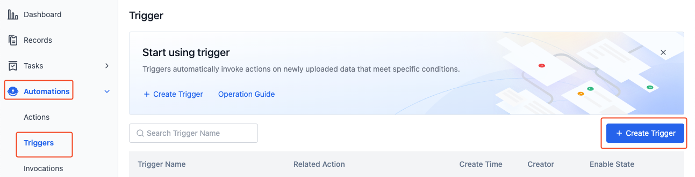
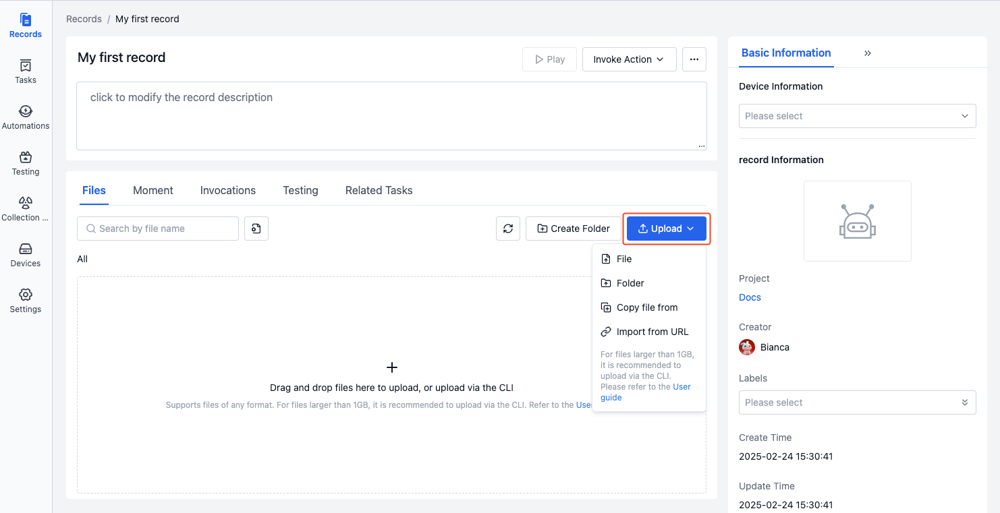

# Quick Start with Automation

Automation is a task-based workflow system. With its flexible and powerful features, it adds more value to the data stored on the platform. It is mainly applied in scenarios such as data processing, transformation, and analysis. By leveraging the automation process, you can efficiently handle large volumes of data and significantly enhance your work efficiency.

## Basic Information

### Concept Explanation

| Concept     | Explanation                                                                                                                                                                                  |
| ----------- | -------------------------------------------------------------------------------------------------------------------------------------------------------------------------------------------- |
| Actions     | An action is the basic building block of an automation process, representing a specific task. See [Actions](./2-action-overview.md) for details.                                             |
| Triggers    | A trigger is the starting condition for an action, defining how the system should execute the corresponding action when a specific event occurs. See [Triggers](./4-trigger.md) for details. |
| Invocations | The invocation records information related to all executed invocations, including the invocation time, status, execution results, etc. See [Invocations](./5-invocation.md) for details.     |

### System Directories

During runtime, action containers mount multiple system directories to facilitate interaction with platform data. The following are common directories. For the complete directory list, please refer to [Action Runtime Information](./6-action-runtime.md)."

| Directory    | Explanation                                            |
| ------------ | ------------------------------------------------------ |
| /cos/files   | Input directory, i.e., the files in the record.        |
| /cos/outputs | Output directory, i.e., the output of each invocation. |

## Quick Start

This section will introduce in detail how to create an automation process through a simple example: when a file with the `.zip` suffix is uploaded, the system will automatically trigger and execute the "Unzip Action".

### Create an Action

1. Enter the project. On the "Automation - Actions" page, click the "Create Action" button.

   

2. On the "Create Action" page, fill in information such as the action name and steps.

- Action Name: Unzip Files

  

- Add a Step:

  

- Step Name: unzip
- Image: registry-vpc.cn-hangzhou.aliyuncs.com/coscene/cos:2025-02-06-v25.6.1
  - This image is provided by Kehang Shikong and has the `icos` tool built - in. It is only supported for use within the platform. Learn more about [Images](../image/1-about-docker-image.md).
- Command: icos fs decompress f \*.zip -i /cos/files -o /cos/files
  - Call the `icos` tool to decompress files with names matching `*.zip` in the `/cos/files` directory (record) and output them to the original record.
  - You need to fill in one parameter per line. For example, fill in `icos` on the first line, `fs` on the second line, and so on.

  

- Record File Mount Permission: Read/Write
  - Allow the action to read from and write to the original record during execution.

  

3. Click the "Create Action" button to complete the action creation. The created action will be displayed in the action list.

   

### Create a Trigger

1. Enter the project. On the "Automation - Triggers" page, click the "Create Trigger" button.

   

2. On the "Create Trigger" page, fill in information such as the trigger name, trigger timing, and associated action.

- Trigger Name: Automatically Unzip Files
- Trigger Timing: Update file to record
- File Wildcard Match: \*.zip
- Associated Action: Unzip Files

  

3. Click the "Create Trigger" button to complete the trigger creation. The created trigger is enabled by default and will be displayed in the trigger list.

   

### Create a Record and Upload a File

1. Enter the project. On the left sidebar of the project, select "Records" and click the "Create Record" button.

   

2. In the pop - up window, enter the record name and relevant information, then click "Create".
3. After the creation is complete, you will automatically enter the record details page. Click the "Upload" button to upload a zip file.

   

### View the Invocation Results

1. On the invocations page of the record details, view the automatically triggered action.

   

2. After the action is completed, view the decompressed files in the file list.

   

You have successfully created and tested an automation process. For more operations, see the subsequent documentation.
