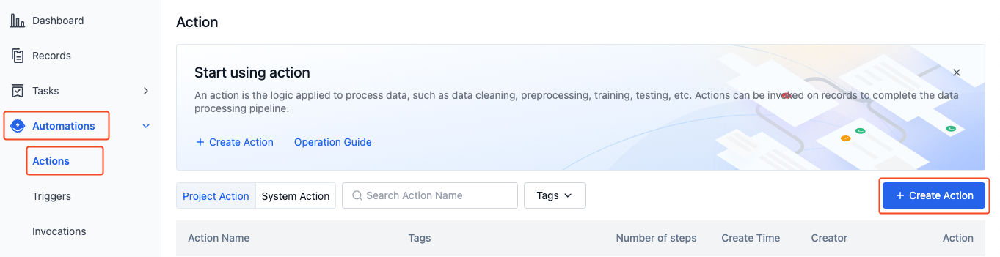
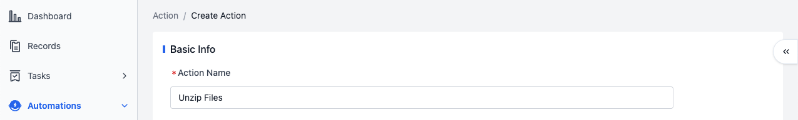
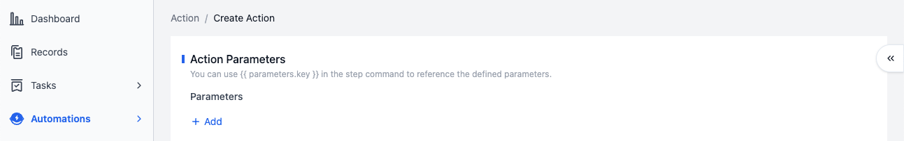
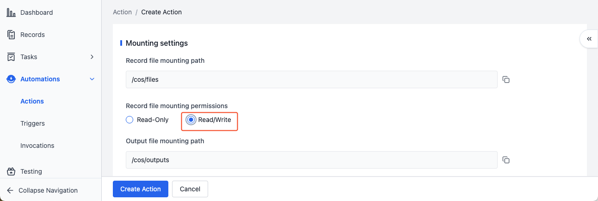
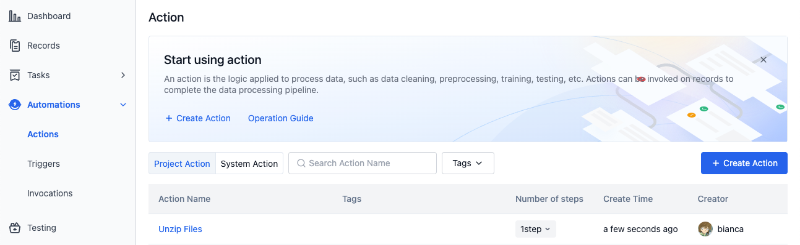
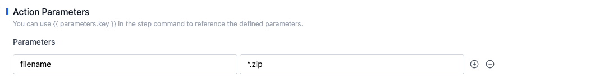

# Create an Action

When you need to execute a specific task, you can create an action in the project. Here are two ways to create an action:

1. Create an action by adding blank steps
2. Create an action by copying steps from an existing action

## Create an Action by Adding Blank Steps

Take creating an action for "Unzipping Files" as an example to illustrate how to create an action by adding a "Image Code Execution" step.

1. Enter the project, go to the "Automation - Actions" page, and click the "Create Action" button.

   

2. On the action creation page, fill in information such as the action name and steps.

- Action name: Unzip Files

  

- Add a "Image Code Execution" step:

  

- Step name: unzip
- Image: `python:3.12-slim`
  - This is a publicly pullable Python image from Docker Hub, suitable for quickly verifying the automation flow.
  - For production actions, package your script and dependencies into your own image and push it to the organization image registry. Each organization is automatically assigned a coScene image registry, usually in the form `cr.coscene.cn/<org-slug>`. Use `cocli registry login` to authenticate local Docker pushes; action runs are automatically authorized to pull images from the current organization registry.
- Command: enter the following 3 lines into the command fields. Each line is one separate argument.

  ```bash
  python
  -c
  import pathlib,zipfile;root=pathlib.Path('/cos/files');[zipfile.ZipFile(p).extractall(root) for p in root.rglob('*.zip')]
  ```

  - This command uses Python's standard library to scan for `*.zip` files under `/cos/files` and extract them back to the original record.
  - Commands and arguments must be entered line by line; do not merge `python -c ...` into a single line.

- Record file mount permission: Read/Write
  - Allow this action to read from and write to the original record during execution.

  

3. Click the "Create Action" button to complete the action creation. Calling this action can decompress files whose names match `*.zip` in the record.

   

## Create an Action by Copying Steps from an Existing Action

Take creating an action for "Unzipping Files" as an example to illustrate how to create an action by copying steps from an existing action.

1. Enter the project, go to the "Automation - Actions" page, and click the "Create Action" button.

   

2. On the action creation page, fill in the action name and copy steps from an existing action.

- Action name: Unzip Files
- Add a step: Copy the "main" step from the existing system action "Unzip Files".

  

- Add a parameter: Add the parameter `filename` with a value of `*.zip` for the command `{{parameter.filename}}` to reference this parameter, indicating that files whose names match `*.zip` in the specified directory will be decompressed.

  

3. Click the "Create Action" button to complete the action creation. Calling this action can decompress files whose names match `*.zip` in the record and output the results to the "Output" page of the "Invocation Details".
