***

## sidebar\_position: 3

# Triggers

This manual summarizes the operation methods for the 5 core triggers in the system (When update file to record, When device collection state updated, When record updated, When general task updated, Scheduled execution). It aims to help users quickly master the configuration process, functional usage, and precautions for each type of trigger, enabling process automation, reducing manual repetitive operations, and improving work efficiency.

The manual follows a unified structure of "Feature Introduction - Operation Process - Key/Common Notes - Precautions", with each trigger presented as an independent section for easy reference and operation. It is suitable for all relevant personnel who need to configure triggers in the system.

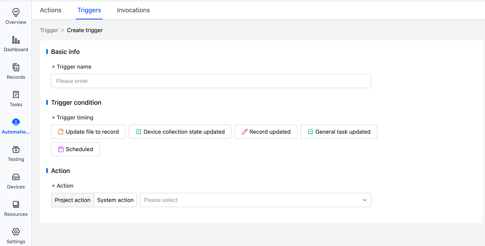

## Table of Contents

1. "When update file to record"
2. "When device collection state updated"
3. "When record updated"
4. "When general task updated"
5. "Scheduled execution"

## 1. "When update file to record"

### 1.1 Feature Introduction

"When update file to record" is an event-driven automation tool. When the preset conditions such as file matching and uploader are met, the system will automatically execute specified actions such as creating tasks without manual intervention. It automates the process after file uploads, significantly reducing repetitive operations and improving efficiency.

### 1.2 Operation Process

#### Step 1: Enter the trigger creation page

In the top navigation bar, click the **Triggers** tab to enter the trigger management page, then click "Create Trigger" to enter the configuration interface.

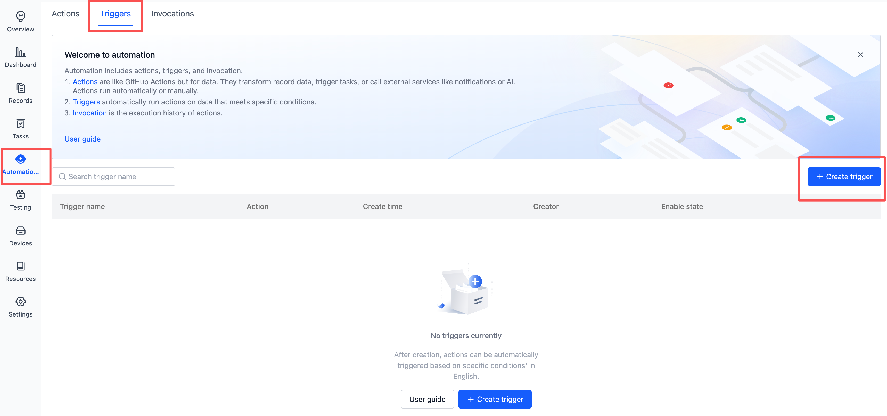

#### Step 2: Fill in basic information

In the **Basic info** section, find the trigger name input box and fill in a clear and identifiable name (e.g., "Automatically create review task when bag file is uploaded") for easy management and troubleshooting.

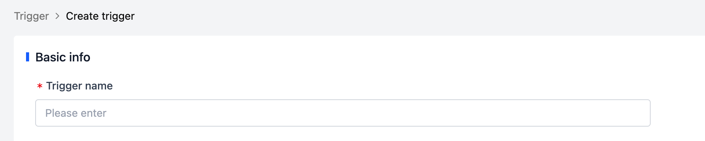

#### Step 3: Configure trigger conditions

1. **Select trigger timing**: In the "Trigger Timing" dropdown menu, select "Update file to record".
2. **Set file wildcard**: In the "File wildcard" input box, fill in the matching rule (e.g., `**/bag_*.tar.gz` matches all files with names starting with "bag\_" and ending with ".tar.gz" in any path). The system will only trigger actions for uploaded files that match this rule.
3. **(Optional) Add additional filter conditions**: For more precise trigger control, click **+ And/Or** to set filter rules such as "File uploader" or "File size" (e.g., trigger only when the uploader is a "Member"). Without special requirements, you can keep only the file wildcard rule.

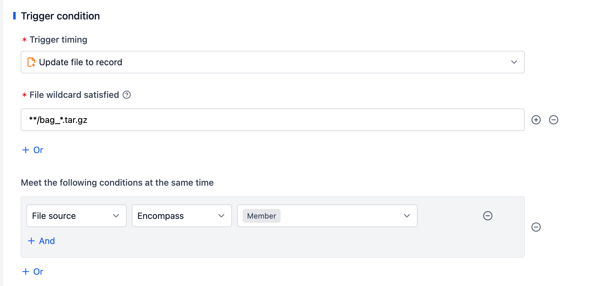

#### Step 4: Associate execution actions (example)

In the **Action** section, complete the following configuration:

1. **Select action type**: Click the dropdown menu and select the action to be executed automatically (e.g., "System Action - Create General Task").
2. **Fill in required action parameters**:
   - **Task title**: Fill in the title of the automatically created task (customizable, e.g., "New file uploaded pending review")
   - **Assignee**: Select the person responsible for the task
   - **Reviewer**: Select the reviewer for the task
   - **(Optional) Task reviewer/Task review description**: Fill in additional reviewer information and task description as needed
3. **(Optional) Linked record**: Enable the "Associate record" switch to bind the automatically created task with the record of the uploaded file for easy traceability.

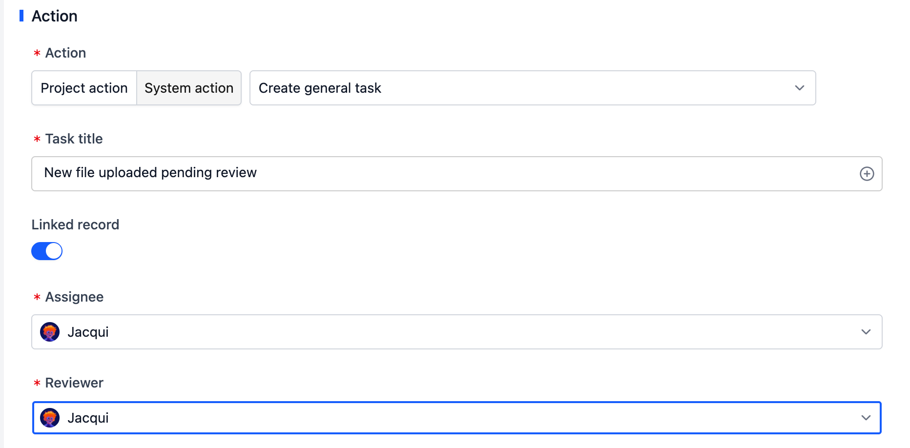

#### Step 5: Save and activate

After completing all configurations, click the **Create Trigger** button in the lower-left corner of the page. The trigger will take effect immediately. When files meeting the conditions are uploaded, the system will automatically execute the actions you set.

 

### 1.3 Common Notes

- **Wildcard rules**: `**` matches any path, `*` matches any character. They can be flexibly combined to adapt to different file formats.
- **Condition logic**: "And" means all conditions must be met simultaneously; "Or" means any condition can trigger the action.
- **View execution records**: In the **Invocations** tab, you can view all trigger execution logs to troubleshoot trigger anomalies.

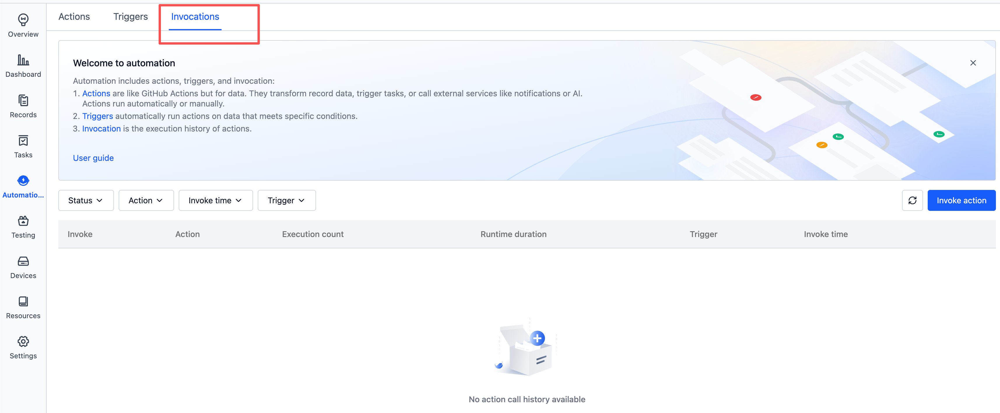

### 1.4 Precautions

- It is recommended to use clear and understandable trigger names to distinguish different automation rules.
- After configuration, upload test files to verify whether the trigger fires as expected and whether actions execute normally.
- To modify rules, re-enter the edit page to make adjustments. The new rules will take effect immediately after saving.

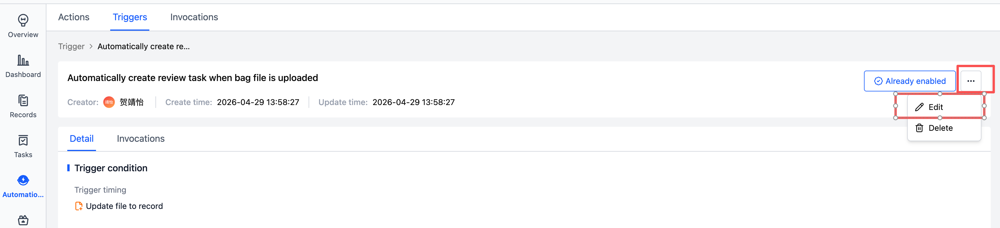

## 2. "When device collection state updated"

### 2.1 Feature Introduction

The "When device collection state updated" trigger can accurately monitor status changes of device collection tasks. When the device collection status is updated to the specified target status (e.g., "Done"), the system will automatically execute preset actions such as creating general tasks, enabling automated closed-loop device collection processes, and reducing manual monitoring and repetitive operations.

### 2.2 Operation Process

#### Step 1: Enter the trigger creation page

Click the **Triggers** tab in the top navigation bar. After entering the trigger management interface, click **Create Trigger** to enter the configuration page.

#### Step 2: Fill in basic information

In the trigger name input box of the **Basic Info** section, fill in an easily identifiable name (e.g., "Automatically create review task when device collection completes") for easy management and troubleshooting.

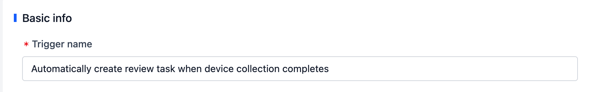

#### Step 3: Configure trigger conditions

1. **Select trigger timing**: In the "Trigger Timing" dropdown menu, select "Device collection state updated".

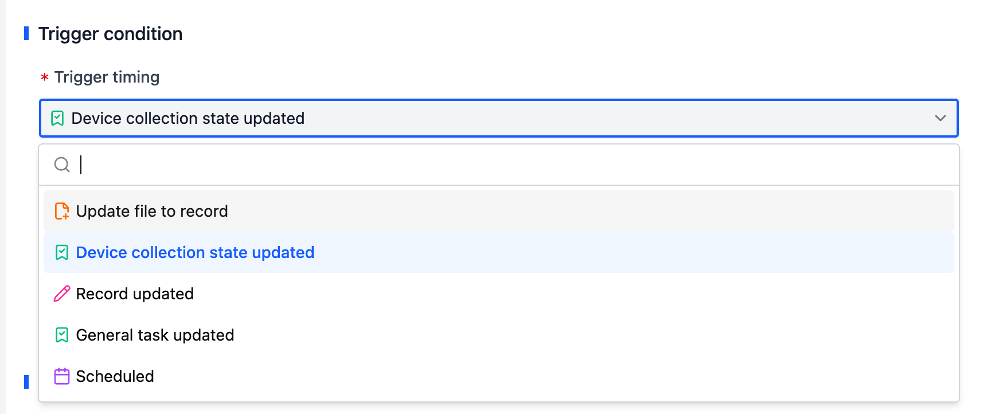

1. **Select task type**: In the "Task category" dropdown box, select the corresponding device collection task type (e.g., "Manual Collection", "Rule-based Collection") to specify the monitoring scope.

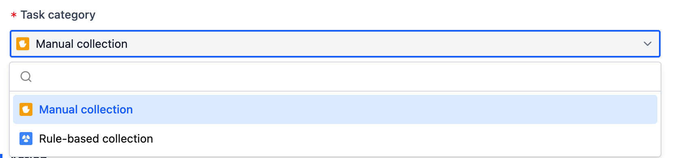

1. **Set post-change status**: In the "Task state updated" options, check the target trigger status (e.g., check "Done", meaning the action will only be triggered when the device collection status is updated to "Done").

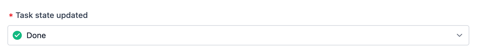

#### Step 4: Associate execution actions (example)

In the **Action** section, complete the automation action configuration:

1. **Select associated action**: Click the dropdown menu and select the action to be executed automatically (e.g., "System Action - Create General Task").
2. **Fill in required action parameters**:
   - **Task title**: Fill in the title of the automatically created task (customizable, e.g., "Device collection completed pending review")
   - **Assignee**: Select the task owner from the dropdown
   - **Reviewer**: Select the reviewer for the task
   - **(Optional) Task reviewer/Task review description**: Fill in additional reviewer information and task description as needed

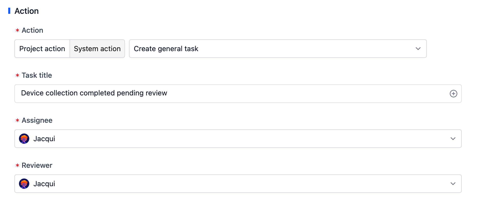

#### Step 5: Save and activate

After confirming all configurations are correct, click the **Create Trigger** button in the lower-left corner of the page. The trigger will take effect immediately. When the corresponding device collection task status changes to the specified status, the system will automatically execute the preset actions.

### 2.3 Key Notes

- **Status trigger logic**: Actions are only triggered when the device collection task status is updated to the checked target status. Actions will not be executed if the status does not change to the target status.
- **Task type matching**: Select the task type that matches the actual device collection task to avoid invalid triggers due to type mismatch.
- **Execution record query**: In the **Invocations** tab at the top of the page, view the trigger execution logs to troubleshoot anomalies.

### 2.4 Precautions

- It is recommended to name triggers based on business scenarios to clearly distinguish different device collection trigger rules.
- After configuration, manually simulate device collection status changes to test whether the trigger fires as expected.
- To adjust trigger conditions or associated actions, enter the trigger edit page to make modifications. The new rules will take effect immediately after saving.

## 3. "When record updated"

### 3.1 Feature Introduction

"When record updated" is a data-driven automation tool. When specific fields of specified records in the system change and meet the preset filter conditions, the system will automatically execute preset actions such as exporting dashboard data. It helps automate processes after data changes, completely replacing manual repetitive operations and improving work efficiency.

### 3.2 Operation Process

#### Step 1: Enter the trigger creation page

In the top navigation bar, click the **Triggers** tab to enter the trigger management page, then click **Create Trigger** to enter the configuration interface.

#### Step 2: Fill in basic information

In the **Basic info** section, find the trigger name input box and fill in a clear and identifiable name (e.g., "Automatically export dashboard data when inspector changes") for easy management and troubleshooting.

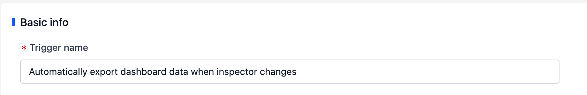

#### Step 3: Configure trigger conditions

1. **Select trigger timing**: In the "Trigger Timing" dropdown menu, select "Record updated".
2. **Select  record updated field**: In the "**Record updated field**" dropdown box, select the target field to monitor (e.g., "QC Reviewer"). The system will only trigger actions when this field's content changes.
3. **(Optional) Add additional filter conditions**: For more precise trigger control, click **+ And/Or **to set field matching rules (e.g., trigger only when "QC Reviewer contains Jacqui"). Without special requirements, you can keep only the field monitoring rule.

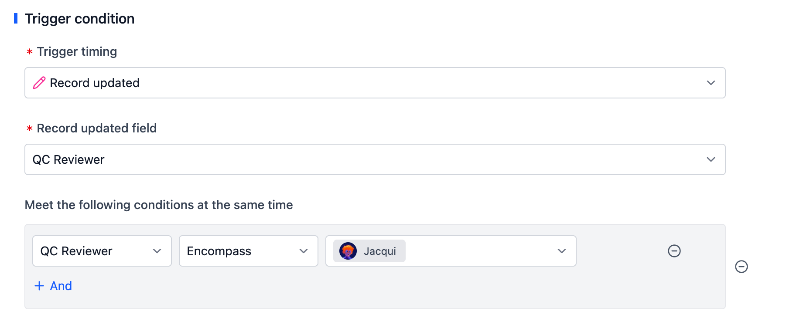

#### Step 4: Associate execution actions (example)

In the **Action** section, complete the automation action configuration:

1. **Select associated action**: Click the dropdown menu and select the action to be executed automatically (e.g., System Action - Export Dashboard Data).
2. **Fill in action parameters**: (The parameter items vary according to the selected action type. Fill in as needed.)
   - **end\_date**: Fill in the end date for data export (e.g., 2026-04-15)
   - **start\_date**: Fill in the start date for data export (e.g., 2026-04-15)

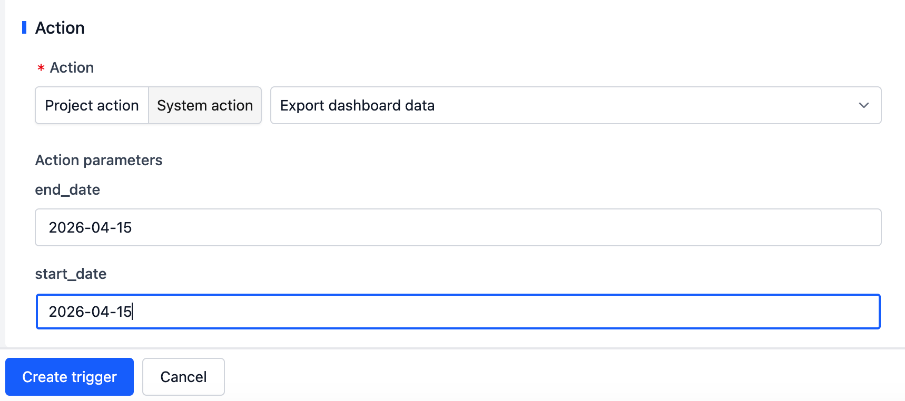

#### Step 5: Save and activate

After confirming all configurations are correct, click the **Create Trigger** button in the lower-left corner of the page. The trigger will take effect immediately. When records meeting the conditions change, the system will automatically execute the actions you set.

### 3.3 Key Notes

- **Trigger logic**: Actions are only triggered when the content of the specified "Record updated field" is modified. Changes to other fields will not trigger actions.
- **Condition logic**: "And" means all conditions must be met simultaneously; "Or" means any condition can trigger the action. Flexible combinations enable precise control.
- **Execution record query**: In the **Invocations** tab at the top of the page, view all trigger execution logs to troubleshoot trigger anomalies.

### 3.4 Precautions

- It is recommended to use clear and understandable trigger names to distinguish different automation rules.
- After configuration, manually modify the corresponding record fields to verify whether the trigger fires as expected and whether actions execute normally.
- To modify rules, re-enter the edit page to make adjustments. The new rules will take effect immediately after saving.

## 4. "When general task updated"

### 4.1 Feature Introduction

"When general task updated" is a task process automation tool. It can accurately monitor specified field changes in general tasks. When task fields are updated to preset target conditions (e.g., status becomes "Done"), the system will automatically execute preset actions such as exporting dashboard data, enabling automated closed-loop task processes, completely replacing manual repetitive operations, and significantly improving work efficiency.

### 4.2 Operation Process

#### Step 1: Enter the trigger configuration page

In the top navigation bar, click the **Triggers** tab to enter the trigger management page, then click "Create Trigger" to enter the configuration interface.

#### Step 2: Fill in basic information

In the **Basic info** section, find the trigger name input box and fill in a clear and identifiable name (e.g., "Automatically export dashboard data when general task is processed") for easy management and troubleshooting.

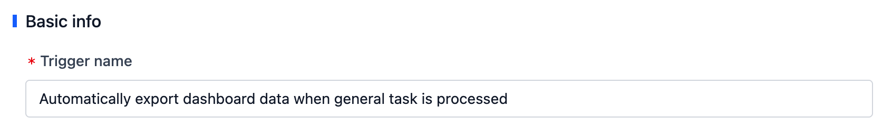

#### Step 3: Configure trigger conditions

1. **Select trigger timing**: In the "Trigger Timing" dropdown menu, select "General task updated".
2. **Select changed task field**: In the "Task updated field" dropdown box, select the target field to monitor (e.g., "Status"). The system will only trigger actions when this field's content changes.
3. **(Optional) Add filter conditions**: For precise trigger scenario control, set matching rules (e.g., Status "equals" "Done") to trigger only when the field changes to the specified value. You can also click **+ And/Or** to add multi-condition combination rules. Configure as needed.

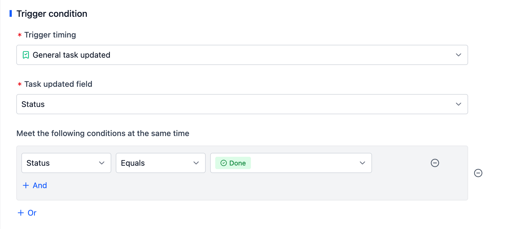

#### Step 4: Associate execution actions

In the **Action** section, complete the automation action configuration:

1. **Select associated action**: Click the dropdown menu and select the action to be executed automatically (e.g., System Action - Export Dashboard Data).
2. **Fill in action parameters**: (The parameter items vary according to the selected action type. Fill in according to actual business needs.)
   - **end\_date**: Fill in the end date for data export (e.g., 2026-04-15)
   - **start\_date**: Fill in the start date for data export (e.g., 2026-04-15)

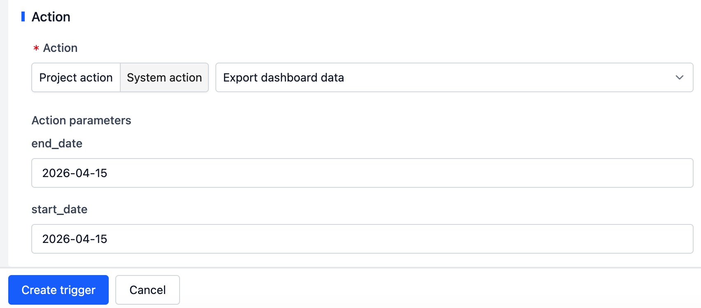

#### Step 5: Save and activate

After confirming all configurations are correct, click the **Save** (or **Create Trigger**) button in the lower-left corner of the page. The trigger will take effect immediately. When general tasks meet your configured change conditions, the system will automatically execute the preset actions.

### 4.3 Key Notes

- **Trigger logic**: Actions are only triggered when the content of the specified "Task updated field" is modified and meets the preset filter conditions. Changes to other fields will not trigger actions.
- **Condition logic**: "And" means all conditions must be met simultaneously; "Or" means any condition can trigger the action. Flexible combinations enable precise control for complex scenarios.
- **Execution record query**: In the **Invocations** tab at the top of the page, view all trigger execution logs to troubleshoot trigger anomalies.

### 4.4 Precautions

- It is recommended to name triggers based on business scenarios to clearly distinguish different task trigger rules for easy management.
- After configuration, manually modify the corresponding task fields to verify whether the trigger fires as expected and whether actions execute normally.
- To modify trigger conditions or associated actions, re-enter the edit page to make adjustments. The new rules will take effect immediately after saving.

## 5. "Scheduled execution"

### 5.1 Feature Introduction

"Scheduled execution" is a customizable automation tool that supports configuring trigger times by daily, monthly, or other cycles to automatically execute task creation, completely replacing daily/monthly manual repetitive operations and significantly improving work efficiency.

### 5.2 Operation Process

#### Step 1: Enter the trigger configuration page

In the top navigation bar, click the **Triggers** tab, then click **Create Trigger** to enter the trigger creation/edit page.

#### Step 2: Fill in basic information

In the **Basic info** section, find the trigger name input box and fill in an identifiable name (e.g., "Automatically create review task at 9 AM daily") for easy management.

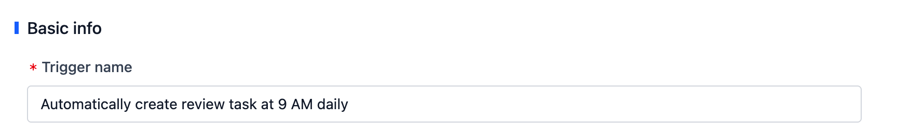

#### Step 3: Configure trigger conditions

1. **Select trigger timing**: In the "Trigger Timing" dropdown menu, select "Scheduled".
2. **Set trigger time**:
   - In the "Trigger timing" input box, fill in the time according to the rules (format examples: `0 9 * * *` means execute daily at 9 AM, `0 0 1 * *` means execute on the 1st of each month at midnight, `* * * * *` means execute every minute)
   - Time zone defaults to Asia/Shanghai (GMT+08:00) (Beijing time), no modification needed
   - After filling in, check the "Next run time" to confirm the time setting is correct
3. **(Optional) Add filter conditions**: To execute only when specific conditions are met, click **+ And/Or** to set filtering rules such as tags and fields. No need to fill in without special requirements.

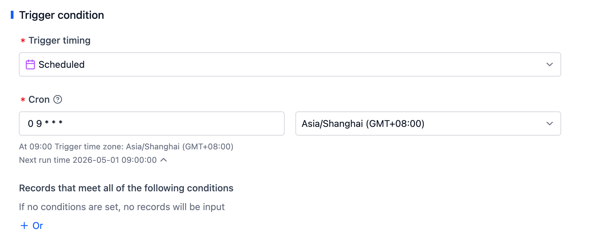

#### Step 4: Associate execution actions (example)

In the **Action** section, click the dropdown menu to select the action you want to execute automatically (divided into project actions and system actions. For example, select system action and click the dropdown to select "Data matching"), and fill in the corresponding parameters (such as ruleId) in the "Action parameters" to complete the action binding.

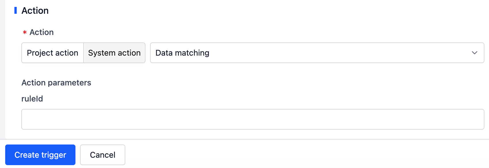

#### Step 5: Save and activate

After completing all configurations, click the **Creat tigger** button at the bottom of the page. The trigger will automatically run according to your configured rules without manual repetitive operations.

### 5.3 Common Notes

- **Time format explanation**: `* * * * *` corresponds to "minute hour day month week", which can be flexibly configured according to requirements.
- **Time zone explanation**: Beijing time (Asia/Shanghai) is used uniformly to avoid execution time confusion.
- **View execution records**: In the **Invocations** tab, view all trigger execution logs to troubleshoot issues.

### 5.4 Precautions

- It is recommended to use clear and understandable trigger names to distinguish different scheduled tasks.
- After configuration, be sure to check the "Next run time" to ensure the time setting meets expectations.
- To modify rules, re-enter the edit page to make adjustments. The new rules will take effect immediately after saving.

