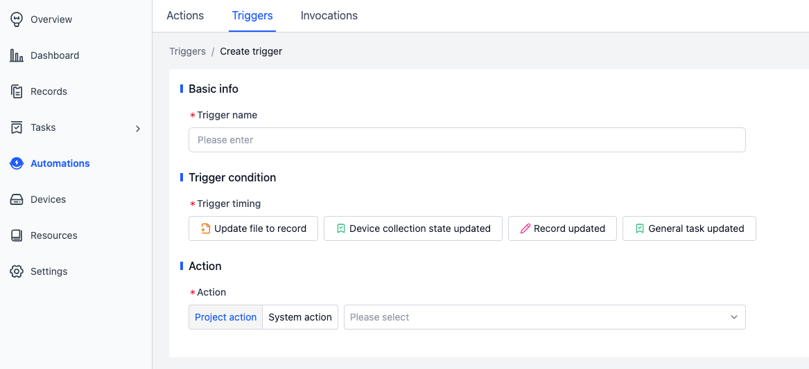
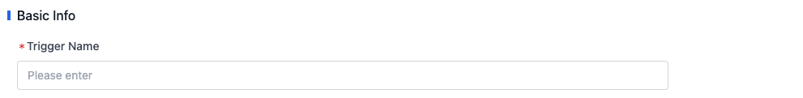
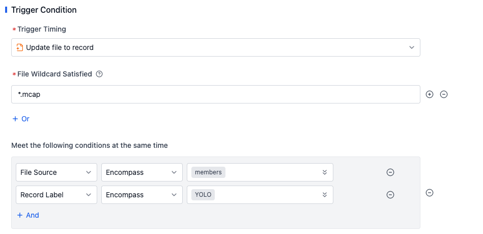
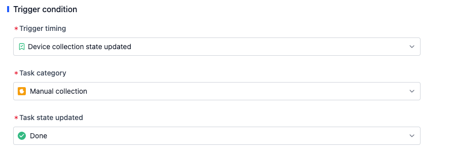
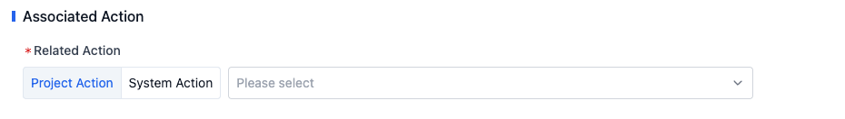
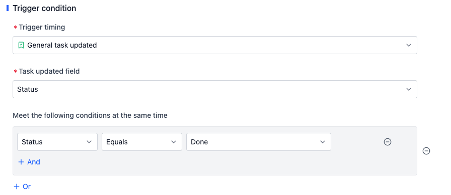
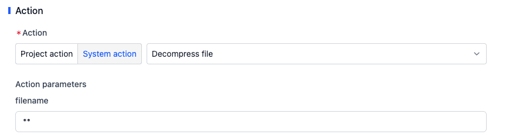

# Triggers

Triggers define the conditions for triggering actions. When the triggering conditions are met, the triggers will perform checks based on the configuration and execute the corresponding actions.

## Trigger Name

Fill in meaningful name information according to business requirements.

## Trigger Conditions

The platform supports the following trigger timings:

- When a file is uploaded to a record
- When a device collection state is updated
- When a record is updated
- When a general task is updated
- On a schedule

### When a file is uploaded to a record

When a new file is uploaded to a record, the trigger will check whether the file wildcard, file source, and record label meet the triggering conditions.

- **File wildcard**: Used to match whether the uploaded file conforms to the relevant format definition. Learn more about the [syntax logic](https://www.malikbrowne.com/blog/a-beginners-guide-glob-patterns/).
- **File source**: Used to match whether the user uploading the file is a member or a device.
- **Record label**: Used to match the labels on the record. Labels are evaluated only when the file upload event occurs. Adding or removing labels on an existing record will not trigger this file-upload trigger. To react to label changes, use a record-updated trigger instead.

For example, if the file wildcard matches `*.mcap`, the file source includes `Members`, and the record tags include `YOLO`, it means that when a file is uploaded to a record, if the file format is `.mcap`, the file uploader is a member, and the record has the `YOLO` label, the trigger will execute the action.

### When a device collection state is updated

When the status of a "Manual Collection" or a "Rule-based Collection" changes, the trigger will check whether the task status meets the triggering conditions.

For example, when a manual collection is completed, the trigger will execute the action.

### When a record is updated

When the tags or custom fields of a record are modified, the trigger will check whether the changes meet the triggering conditions.

For example: when the `uploaded` tag is added to a record, the trigger will execute the associated action.

### When a general task is updated

When fields in a **General Task** are modified, the trigger will check whether the changes meet the triggering conditions.

For example: when the task status becomes **Done**, the trigger will execute the associated action.

### On a schedule

A scheduled trigger runs the associated action periodically according to a Cron expression and the selected time zone. It is useful for regular checks, recurring batch processing, and periodic summaries.

- **Cron**: Use a 5-field Cron expression to define the schedule. See [Cron](./7-cron.md).
- **Time zone**: Used to interpret the hour and date fields in the Cron expression. New triggers default to the current browser time zone, and you can change it manually.
- **Record conditions**: Optionally restrict which records are matched by the scheduled trigger using record fields, labels, or custom fields.

For example, `0 9 * * 1` with the `Asia/Shanghai` time zone runs every Monday at 09:00 Beijing time.

## Associated Actions

All actions created by the user on the Actions page are project actions and can be selected as needed. Based on common customer scenarios, the platform also provides built-in system actions, such as file decompression.

