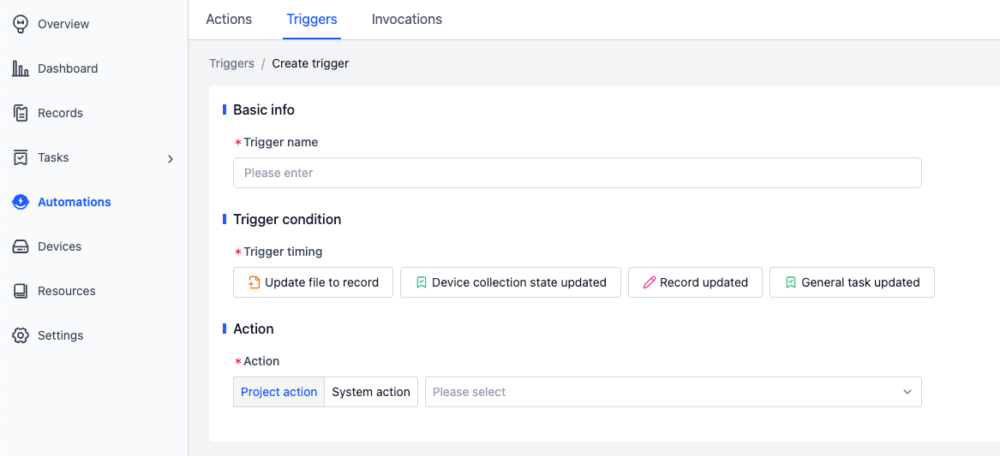
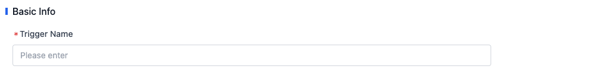
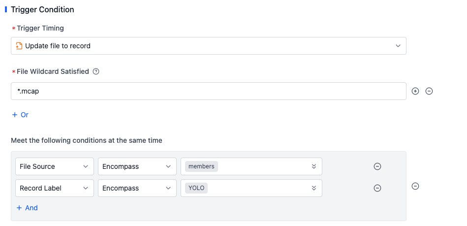
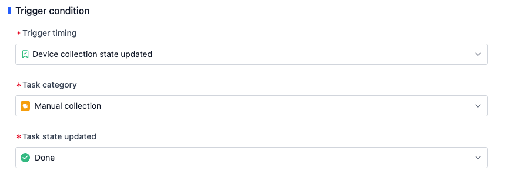
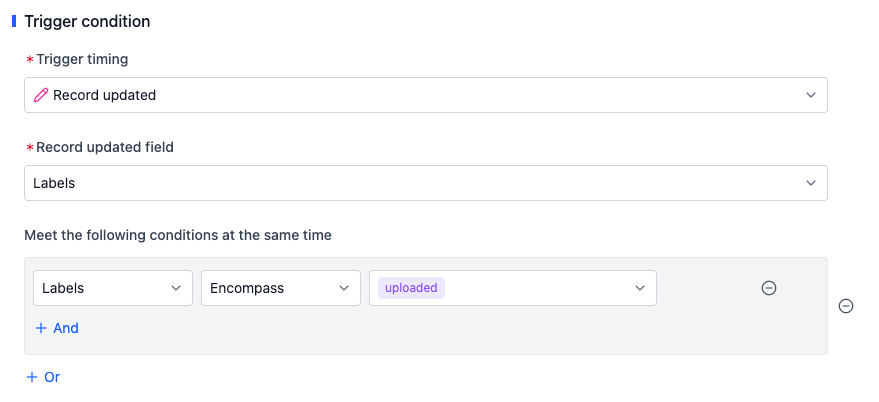
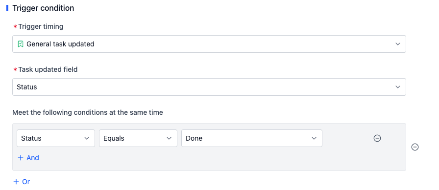
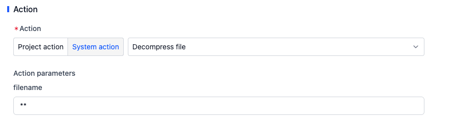

# Triggers

Triggers define the conditions for triggering actions. When the triggering conditions are met, the triggers will perform checks based on the configuration and execute the corresponding actions.

## Trigger Name

Fill in meaningful name information according to business requirements.

## Trigger Conditions

The platform supports the following two triggering moments:

- When update file to record
- When device collection state updated
- When record updated
- When general task updated

### Update file to record

When a new file is uploaded to a record, the trigger will check whether the file wildcard, file source, and record label meet the triggering conditions.

- **File wildcard**: Used to match whether the uploaded file conforms to the relevant format definition. Learn more about the [syntax logic](https://www.malikbrowne.com/blog/a-beginners-guide-glob-patterns/).
- **File source**: Used to match whether the user uploading the file is a member or a device.
- **Record label**: Used to match the tag information of the record. **Note that changes to the record label will not trigger the system to check the relevant triggers**. For example, if you add a new label to a record, the trigger will not check and run the corresponding action. Currently, only file uploads can trigger the execution of the trigger.

For example, if the file wildcard matches `*.mcap`, the file source includes `Members`, and the record tags include `YOLO`, it means that when a file is uploaded to a record, if the file format is `.mcap`, the file uploader is a member, and the record has the `YOLO` label, the trigger will execute the action.

### Device collection state updated

When the status of a "Manual Collection" or a "Rule-based Collection" changes, the trigger will check whether the task status meets the triggering conditions.

For example, when a manual collection is completed, the trigger will execute the action.

### On Record Change

When the tags or custom fields of a record are modified, the trigger will check whether the changes meet the triggering conditions.

For example: when the `uploaded` tag is added to a record, the trigger will execute the associated action.

### On General Task Change

When fields in a **General Task** are modified, the trigger will check whether the changes meet the triggering conditions.

For example: when the task status becomes **Done**, the trigger will execute the associated action.

## Associated Actions

All actions created by the user on the Actions page are project actions and can be selected as needed. Based on common business scenarios of customers, the platform has pre-developed and built-in a series of general system actions, such as the data diagnosis function.

