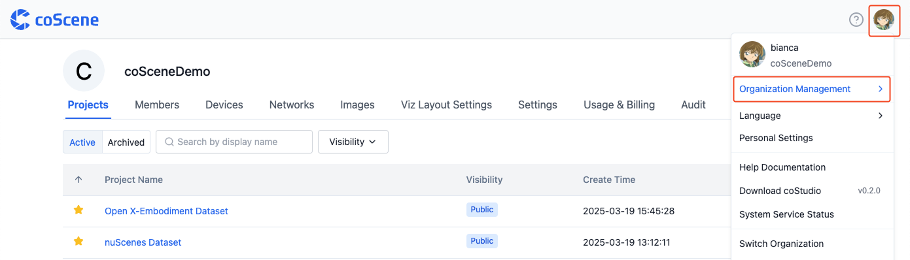
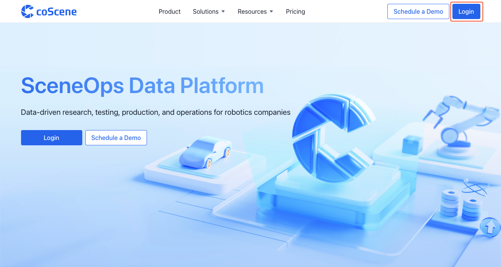
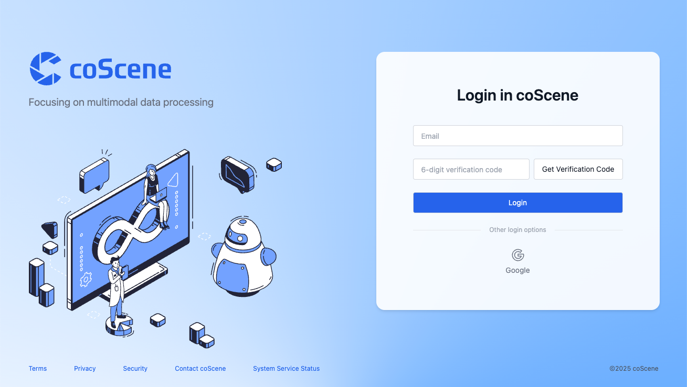
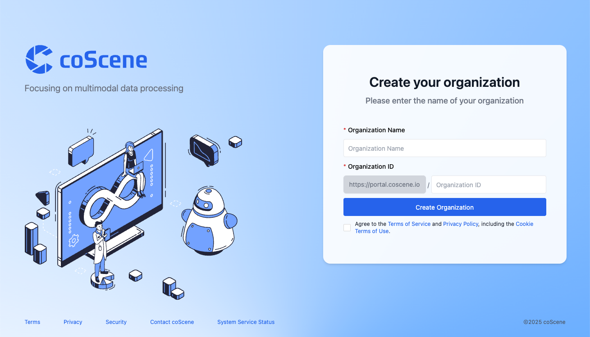
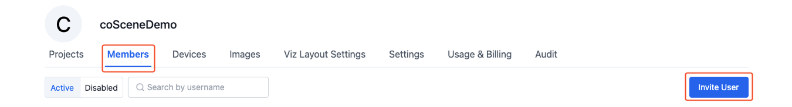
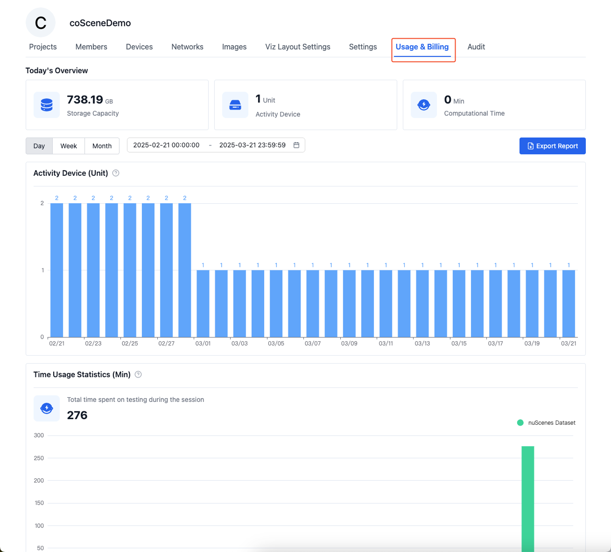
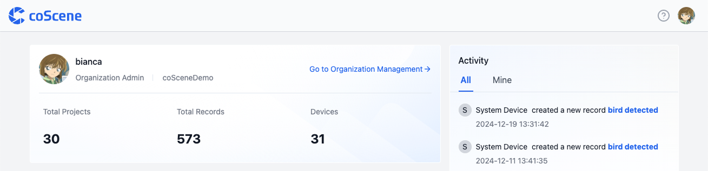

# Organizations
An organization is a logical concept that represents a team or a company. An organization can have multiple projects and members.

## Organization Management Interface
On the "Organization Management" page, you can view information about the organization's projects, members, devices, images, billing, and more.

| Name | Description |
| --- | --- |
| Projects | Manage all projects within the organization in the project list. Projects are the units of data management, see [Projects](../project-collaboration/1-project.md) |
| Members | Manage all users and their permissions within the organization in the member list |
| Devices | Centrally manage all devices within the organization in the organization device list. Devices can establish connections with physical devices, see [Devices](../../device/1-device.md) |
| Images | The platform provides a professional private image registry to centrally manage all images within the organization, see [Images](../../image/1-about-docker-image.md) |
| Usage & Billing | Display information about the organization's storage, number of devices, computation time, etc. |

## Creating an Organization
1. Access [coScene Platform https://www.coscene.io/](https://www.coscene.io) through your browser, click [Login] in the upper right corner to enter the login interface
    
     

2. Choose a login method to enter the platform: Email or Google Workspace

    

3. Fill in "Organization Name" and "Organization ID", check "Agree", and click the [Create Organization] button
    
    

4. After successful creation, you will automatically enter the organization homepage

## Adding Projects

Please refer to the [Projects](../project-collaboration/1-project.md) section

## Adding Organization Members
The method of adding members differs depending on how the organization was created:
- **Organizations created with email login**:
  - Organization administrators can click the [Invite Members] button on the "Organization Management-Members" page to invite members to join the organization via email.

    

- **Organizations created with Google Workspace login**:
  - Enterprise users will automatically join their enterprise's corresponding organization upon login, with "Organization collaborator" permissions.
  - When users are no longer members of the enterprise, they cannot access the corresponding organization, but their operation records are retained.

## Adding Organization Devices

> Devices in the organization can be added to various projects, and the same device can be added to multiple projects for [Data Collection](../../use-case/1-common-task.md) and [Remote Connection](../../device/5-device-remote-control.md).

Please refer to the [Adding Devices](../../device/2-create-device.md) section

## Adding Images
> Images in the organization can be used in various projects for [Automation](../../workflow/1-quick-start-workflow.md) or [Cloud Test](../../sim-and-tests/regression/1-intro.md).

Please refer to the [Images](../../image/1-about-docker-image.md) section

## Usage & Billing
> Only organization administrators can view organization usage information.

Organization usage information includes: organization storage, number of active devices, computation time, etc.

On the "Organization Management-Usage & Billing" page, you can view organization usage information.

On the homepage, you can view the number of organization records, projects, and devices.

