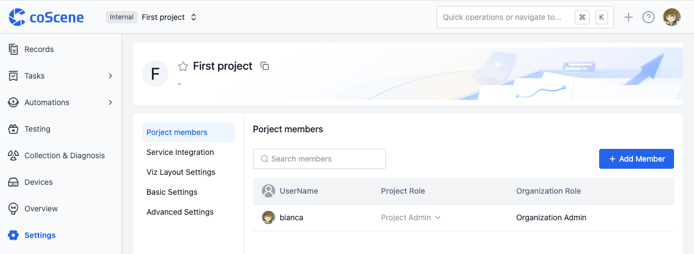
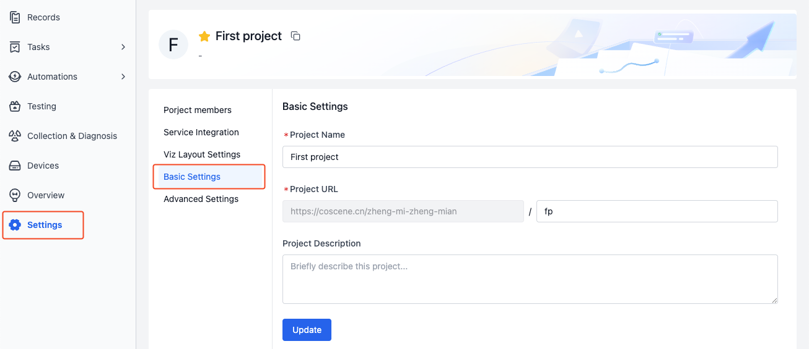
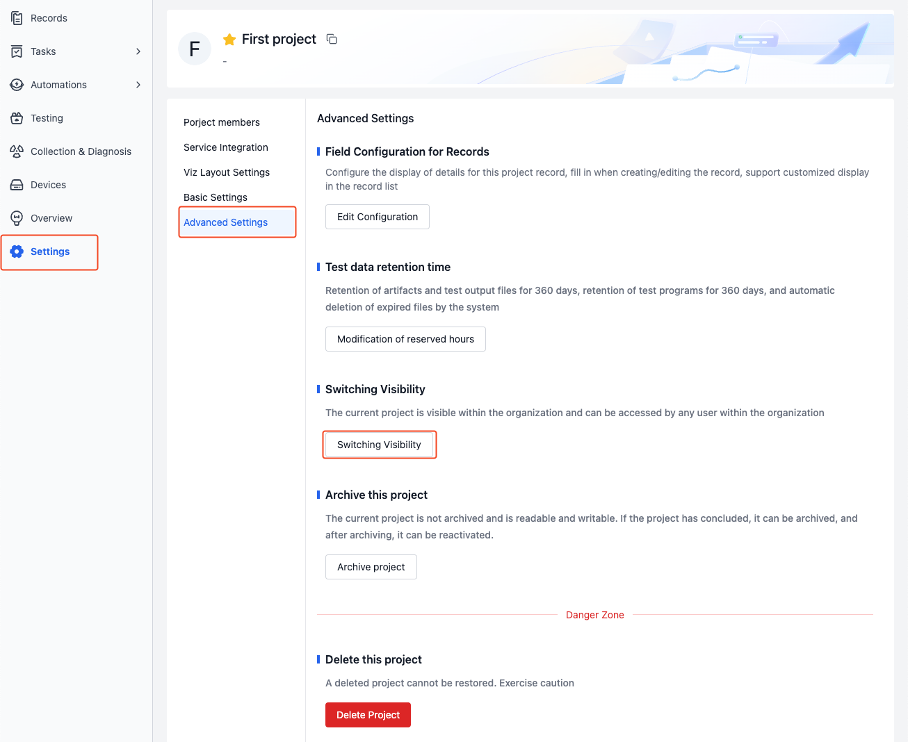
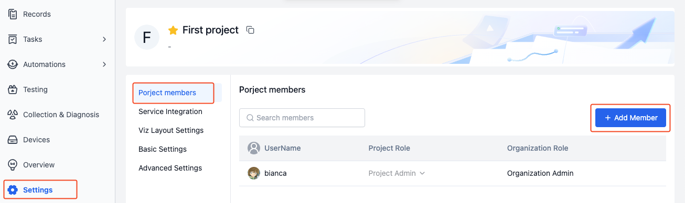
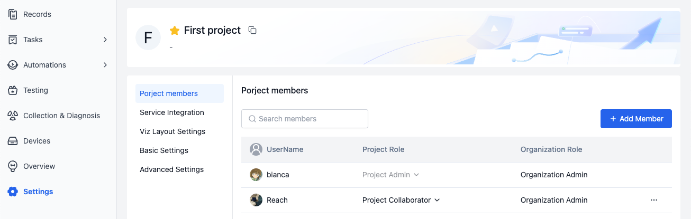
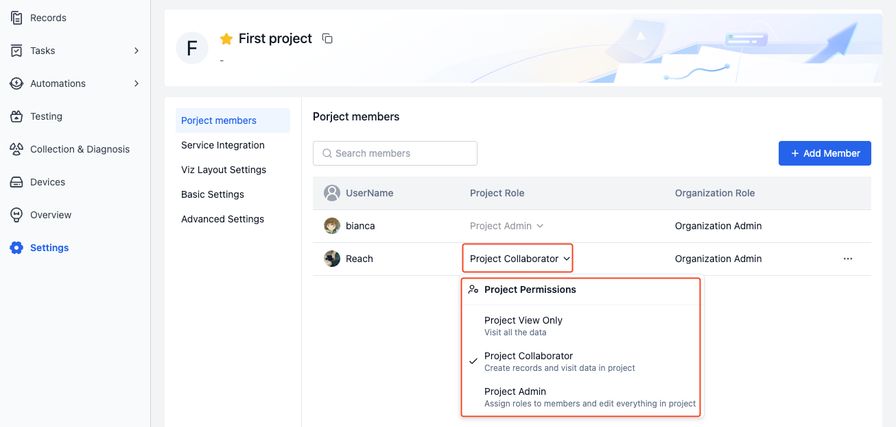
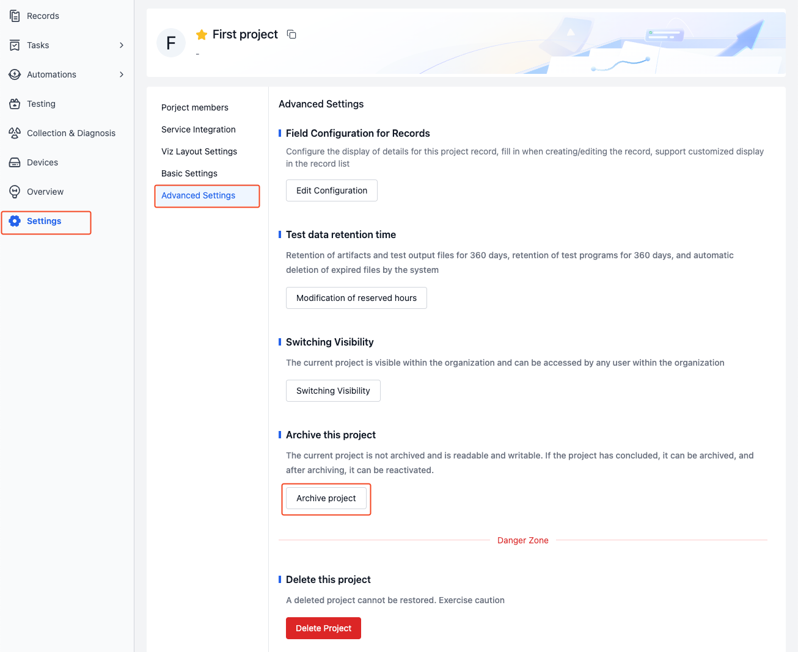
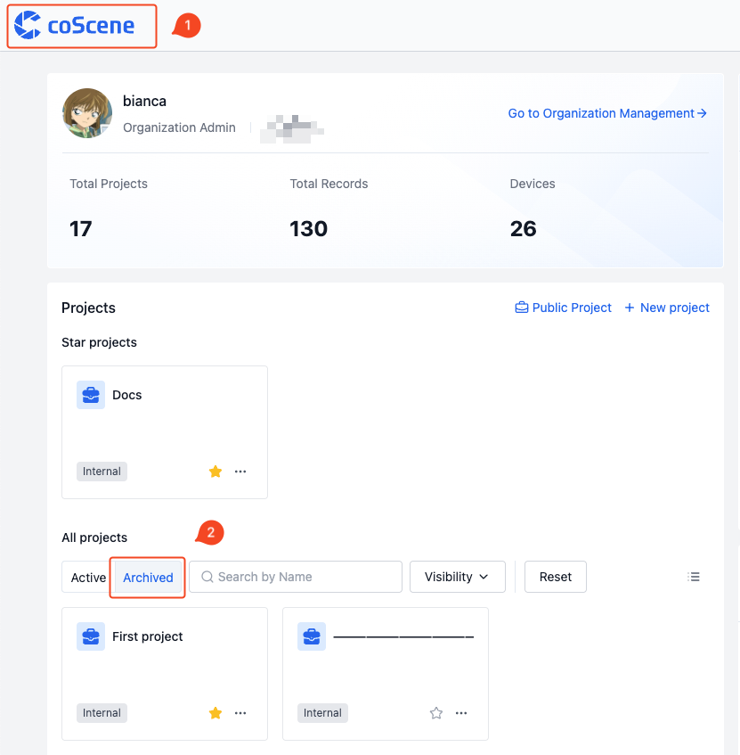
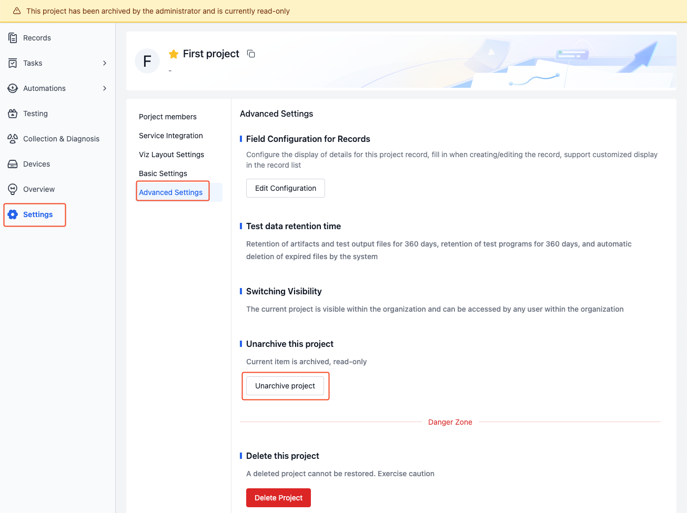

# Project
A project is the basic unit of data management, where data storage, management, isolation, and application take place. A project can represent a department, a project team, or a business line.

## Project Interface
Projects contain modules such as Records, Tasks, Automations, Testing, Collection & Diagnosis, and Devices. Here's an explanation of each module:

| Name | Description |
| --- | --- |
| Records | Records are the basic units for data storage and management. See [Records](../record/1-quick-start-record.md) for details |
| Tasks | Tasks include general tasks, annotation tasks, and collection tasks, used for managing data processing workflows |
| Automations | Automation includes actions, triggers, and action invocation history, used for automated data processing. See [Automation](../../workflow/1-quick-start-workflow.md) for details |
| Testing | Batch testing is an automated solution for parallel execution of multiple test tasks, used for regression testing, simulation testing, and other large-scale testing scenarios. See [Testing](../../sim-and-tests/regression/1-intro.md) for details |
| Collection & Diagnosis | Data Collection & Diagnosis uses defined rules to implement device monitoring, data collection, and automatic diagnosis. See [Collection & Diagnosis](../../use-case/data-diagnosis/1-intro.md) for details |
| Devices | Devices establish connections with physical device endpoints as targets for data collection. All devices are managed centrally in the organization and allocated to projects as needed. See [Devices](../../device/1-device.md) for details |

## Creating a New Project

Click the "Create Project" button on the homepage and follow the guided steps to complete project creation.

## Managing Project Settings
> Only project administrators and organization administrators can manage project settings.

### Editing Project
Enter the project basic settings page to modify the project name, URL, and description:

### Project Visibility
Project visibility determines project access permissions and user rights. 

- **Private Projects**
   - Access Restriction: Only organization administrators and project members can access
   - Permission Control: Project member permissions are determined by project roles

- **Internal Projects**
   - Access Scope: All users within the organization can access
   - Permission Control: For users in the project, permissions are determined by project roles; for users not in the project, they inherit organization roles as project roles
      - Example: When an "Organization Collaborator" accesses an internal project, they automatically receive "Project Collaborator" permissions even if they're not a project member

To switch project visibility:
1. Go to project advanced settings page and click [Switch Visibility]:

    

2. Select visibility and enter the project name to switch project visibility.

    

### Project Members and Roles
Project roles determine user permissions within the project. There are three project roles:
- **Project Admin**
   - Has all project permissions
- **Project Collaborator**
   - Can create and access data within the project
- **Project View only**
   - Can only access data within the project

To add organization members to a project:
1. Go to Project Settings - Project Members page, click [Add Member], and select members in the popup window.

    

2. After adding, view member information in the project member list.

    
   
3. Click the project role in the list to modify member roles.

    

### Project Archiving and Restoration
Archiving a project sets it to read-only status and stops data updates. After restoration, the project returns to read-write status and normal operation. This is used for managing historical data in scenarios such as:
- Data analysis work is complete and results need long-term preservation
- Experimental data needs to be archived by phase
- Historical data needs to be managed separately from active data
- Important data needs protection from accidental operations

To archive and restore projects:
1. Go to project advanced settings page, click [Archive Project], enter the project name to archive the project.

    

2. Click the logo in the upper left to return to homepage, view archived projects in the archive section of the project list.

    

3. In the advanced settings page of an archived project, click [Unarchive Project] to restore the project to read-write status.

   