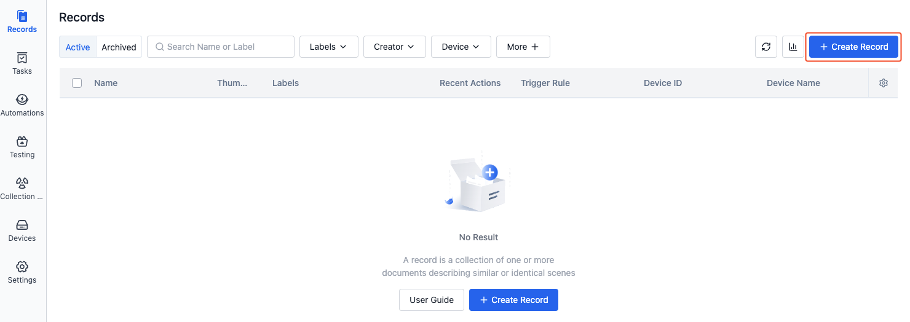
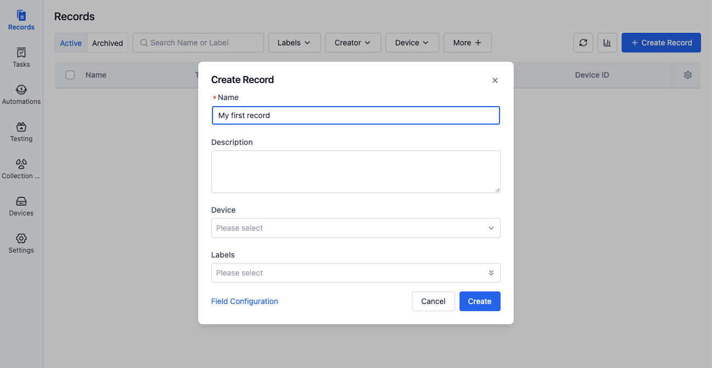
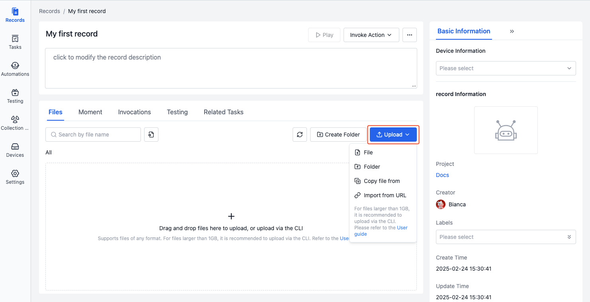
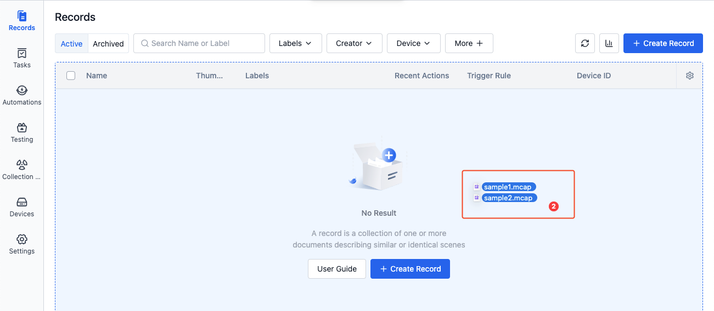
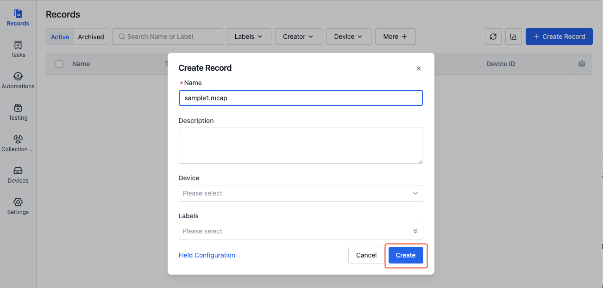
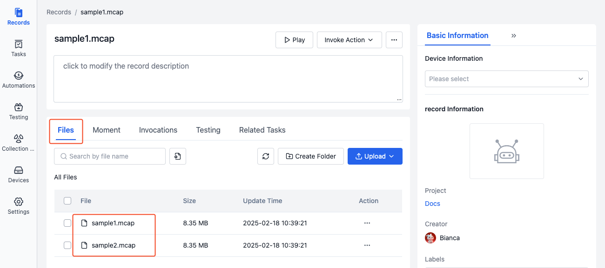
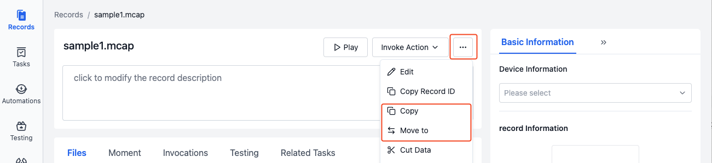
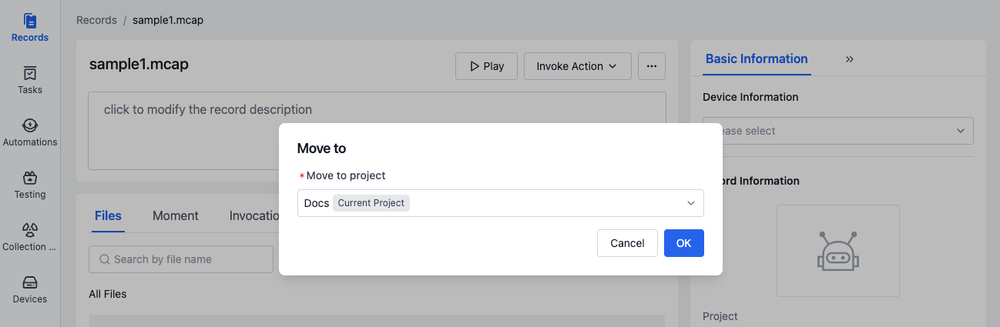

# Create Record

## Introduction
> Only project members and above can create records.

A record is a collection of files describing similar scenarios. When you need to view or process data generated by a device over a period of time, you can create a record in the project and upload the device data to the record. Here are four ways to create a record:
1. Direct creation
2. Create by copying/moving records
3. Create through collection tasks
4. Create using the command-line tool coCLI

## Direct Record Creation
You can directly create a record by clicking the [Create Record] button or dragging files into the record list.

### Create by Clicking Button
1. In the left sidebar of the project, select "Records" and click the [Create Record] button.

2. Enter the record name and other related information in the popup window, then click the [Create] button.

3. After creation, you will automatically enter the record details page. Click the [Upload] button to upload files.

### Create by Dragging Files

1. Select a local file and drag it into the record list area.

2. After releasing the drag, enter the relevant content in the create record popup window and click the [Create] button.

3. After the record is created, the dragged file will be automatically uploaded to the record.

## Create by Copying/Moving Records
Copy or move records to a specified project to achieve data reclassification and organization.

1. In the more operations of the record details, select [Copy to]/[Move to].

2. In the popup window, select the target project to copy/move to, and click the [OK] button. You can then view the corresponding record in the target project.

## Create Records through Collection Tasks
### Manual Collection Task Creation
To collect files from a device over a specified time period, you can manually create a "Collection Task". Once the task is completed, the collected data will be automatically uploaded to the record. See [General Data Collection](../../use-case/1-common-task.md) for details.

### Rule-based Collection Task Creation
To collect data when a device performs key tasks or important events occur, you can add rules in "Data Collection & Diagnosis Rules". When the rule is triggered, a "Collection Task" will be automatically created, and the collected data will be uploaded to the record. See [Data Collection & Diagnosis Rules](../../use-case/data-diagnosis/2-get-started.md) for details.

## Create Records Using coCLI
To batch upload local files to a record, you can use the coCLI tool. See [Command-line Tool coCLI](../../category/cocli) for details.

## Learn More
- [Visualize and Play Records](../../viz/1-about-viz.md)