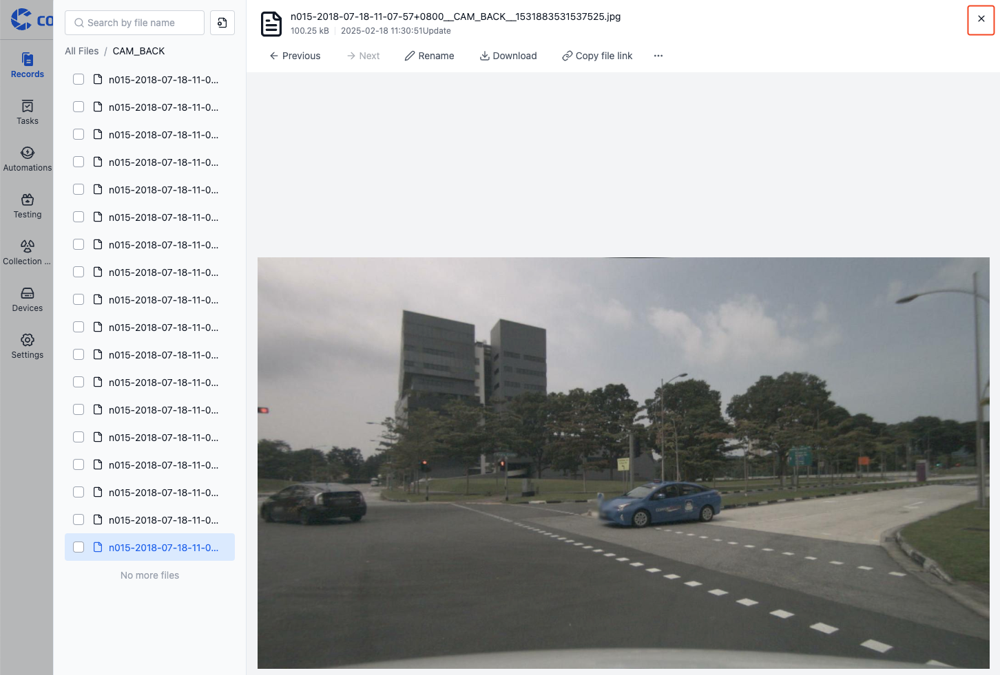
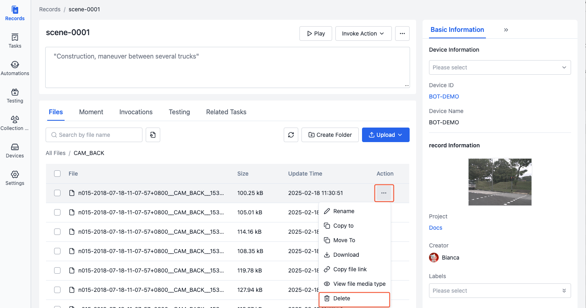

# Managing Files
Files are divided into two categories: "General Files" and "Visualization Files". General files include common text, images, archives, etc.; visualization files support special preview and playback functions, such as Rosbag, log, map, TF files, etc.

## General File Operations
File operations include: preview, search, rename, copy, move, download, copy file link, delete, etc.

### Preview
1. In the "File List", click on the file name to preview the file.

    

2. Click the "Close" button in the upper right corner of the preview interface to close it.
    

3. Click the [Previous] and [Next] buttons at the top of the preview interface, or click the file name in the left sidebar to preview different files.

   

4. Different file types support different preview methods, such as:
    
    - **PCD Preview**

        

        | Parameter | Description |
        | --- | --- |
        | Size | Point size |
        | Color | Point color |
        | Rotation X | Rotation in x direction |
        | Rotation Y | Rotation in y direction |
        | Rotation Z | Rotation in z direction |

    - **Text Preview**

        Supports switching text types, such as: log, yaml, json, xml, etc.

        
        
    - **Table Preview**

        Supports switching table encodings, such as: utf-8, gbk, etc.

        

### Search
Enter keywords in the search box in the "File List" to search for file names.


### Rename
In the "File List", click the [Rename] button in the "More Operations" menu to rename the file.


### Copy
1. In the "File List", click the [Copy To] button in the "More Operations" menu.

    

2. In the popup window, select the target record/create a new record, click [OK] to view the copied file in the corresponding record.

   

### Move
1. In the "File List", click the [Move To] button in the "More Operations" menu.

    

2. In the popup window, select the target record/create a new record, click [OK] to view the moved file in the corresponding record.


### Download
You can directly download files or copy download links to share with others.

- **Direct Download**

    In the "File List", click the [Download] button in the "More Operations" menu to download the file locally.

- **Copy Download Link**
    > The copied file download link is valid for 7 days

    In the "File List", click the [Copy file link] button in the "More Operations" menu to copy the file's download link.


### Delete
In the "File List", click the [Delete] button in the "More Operations" menu. After secondary confirmation, the file can be deleted.



### Batch Operations
In the "File List", select the files you want to operate on to perform batch download, copy, move and delete.


## Visualization File Operations
In addition to general file operations, visualization files also support setting file media types and playback.

### File Media Types
Media types are used to describe how the visualization player should parse the file. Main types include: mcap, bag, static bag, log, map, tf, etc.

- **mcap**

    The system automatically recognizes '.mcap' format files and parses them as 'mcap'.

- **bag**
    
    The system automatically recognizes '.bag' and '.bag.active' format files and parses them as 'bag'.

- **static bag**
    
    Static bags are mainly used in scenarios requiring fixed reference systems. After marking a bag file as static, the system only uses its map and coordinate transformation data as reference, without playing other data streams.

- **log**
    
    The system automatically recognizes files with '.log' extension and standard timestamps as 'log' files. Log files need to be used with bag files and can synchronously display log information at corresponding timestamps when playing bag files.

- **map**

    Supports setting images (.png) as 'map' files. The system will parse them as 2D maps and display robot environment information in the visualization interface.

- **tf**

    Supports setting yaml as 'tf' files. The system will parse these transformation data to correctly display robot posture and motion states in the visualization interface.
    
### Setting Static Bag
> Only '.bag' and '.bag.active' format files can be set as 'static bags'.

Use case: When you need to use 'map' and 'tf' information from a specific bag during record playback but don't want to play that bag, you can set the file as a 'static bag'.

For example: To set a static bag, consider a record containing sample_1.bag (with map and tf data) and sample_2.bag (without map and tf data):

1. In the "File List", click the [Set File Media Type] button in the "More Operations" menu.

    

2. Select "Static Bag" in the popup window, click [OK] to set the file as a static bag.

    

3. Check the file media type to see that the file has been set as a static bag.

    

    

4. When playing the record, only regular bags will be played, not static bags.

    

### Setting Log
> Supports setting unrecognized '.log' files as 'log'.

Use case: When you need to synchronously display log information during record playback, you can set the log file as a log.

For example: To set a log file, consider a record containing sample.log and sample.bag files:

1. In the "File List", click the [Set File Media Type] button in the "More Operations" menu.

    

2. Select "Log" in the popup window, click [OK] to set the file as a log.

    

3. Check the file media type to see that the file has been set as a log.

    

     

4. During record playback, log information will be displayed synchronously. See [Visualization Log Panel](../../viz/4-panel/6-log-panel.md) for details.

### Setting Map
> Only supports 2D maps in PNG format.

Use case: When there is no map information in the ROSbag data being played, you can set an image as a map for display in the visualization interface.

For example: To set a map file, consider a record containing map.png and sample.bag files:

1. In the "File List", click the [Set File Media Type] button in the "More Operations" menu.

    

2. Select "Map" in the popup window, set parameters (x, y, yaw, resolution), then click [OK] to set the file as a map.

    

    You can manually input parameter values or select a yaml file to automatically get parameter values. The supported yaml file format is as follows:
    
    ```yaml
    resolution: 0.05
    origin: [10, -10, 0]  # [x, y, yaw]
    ```

    Parameter descriptions, see [map_server - 1.2 YAML format](https://wiki.ros.org/map_server):
    | Parameter | Description |
    | --- | --- |
    | x | x coordinate of reference point |
    | y | y coordinate of reference point |
    | yaw | Map yaw angle (rotation angle around Z axis) |
    | resolution | Map resolution |

    Note:
    - The default coordinate system for this map is map
    - The default reference point is the lower left corner of the map
    - By default, the entire image is on the z=0 plane

3. Check the file media type to see that the file has been set as a map.

    

    

4. During record playback, the map will be displayed in the visualization interface. See [Visualization 3D Panel - Topics - External Map Import](../../viz/4-panel/5-3d-panel.md) for details.

### Setting TF
> Supports setting .yaml files as tf.

Use case: When playing a record, if tf information is missing and robot posture and motion states cannot be correctly displayed, you can set a yaml file as static tf.

For example: To set a TF file, consider a record containing tf.yaml and sample.bag files:

1. Prepare the yaml file, define coordinate transformation relationships in the following format:
   > Each line format: `frame1,frame2: x y z roll pitch yaw parent_frame child_frame`
   > - x, y, z: represents translation
   > - roll, pitch, yaw: represents rotation
   > - parent_frame, child_frame: represents parent and child coordinate system names respectively

    ```yaml
    base_link,camera_link1: 0.2 0.1 0.0 0.0 0.0 0.5 base_link camera_link4
    base_link,ultrasonic1: 0.4 -0.1 0.0 0.0 0.0 -0.2 base_link ultrasonic1
    ```

2. In the "File List", click the [Set File Media Type] button in the "More Operations" menu.

   

3. Select "Static TF" in the popup window, click [OK] to set the file as tf.

    

4. Check the file media type to see that the file has been set as tf.

   

    

5. During record playback, the corresponding TF information can be used. See [Visualization 3D Panel - Transform](../../viz/4-panel/5-3d-panel.md) for details.

### Playing Files
Click on an mcap or bag file name in the "File List" to open the visualization page, where you can:
- View and play sensor data from the file
- Adjust playback speed and timeline
- Configure various visualization parameters
- Export data or screenshots

For detailed visualization operation instructions, please refer to the [Visualization](../../viz/1-about-viz.md) chapter.