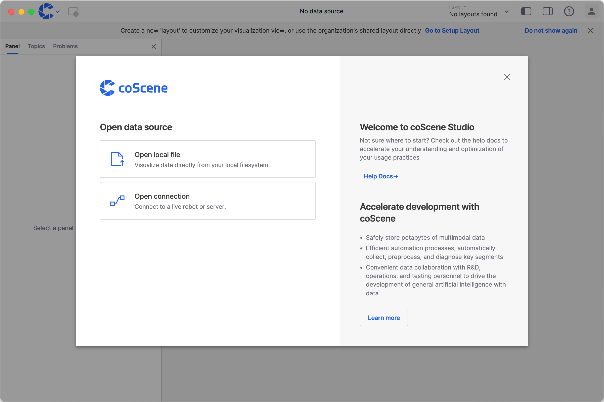
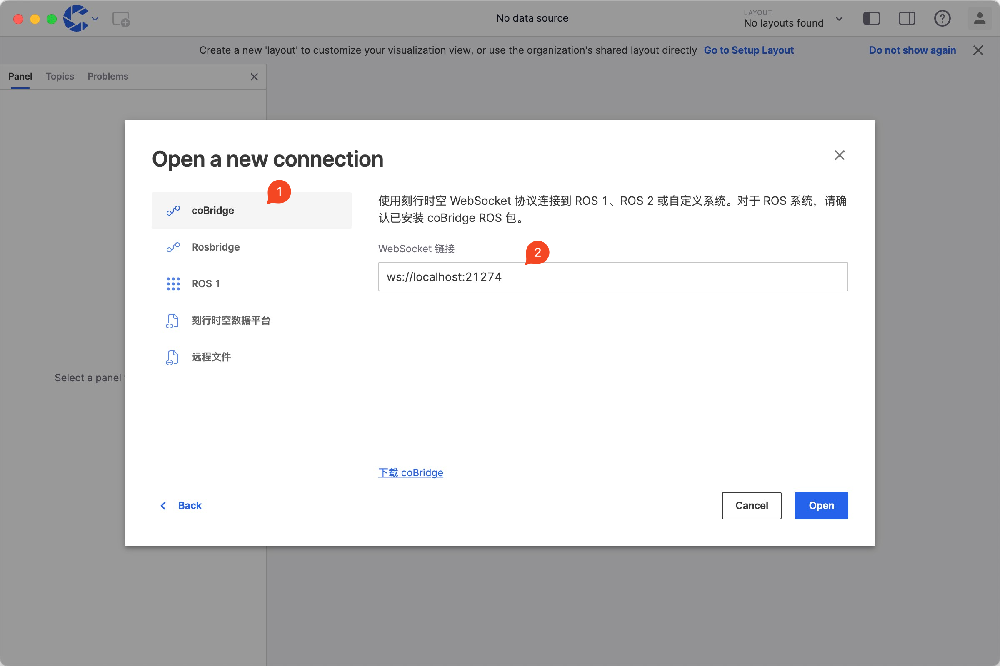
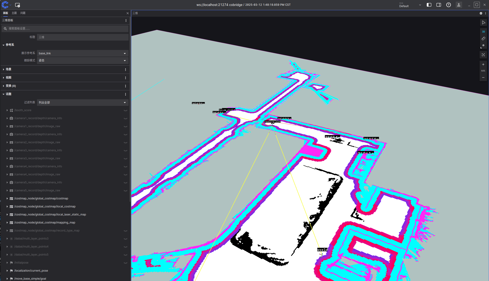

# Connect to Devices coBridge

[coBridge](https://github.com/coscene-io/coBridge) is an open-source edge software provided by coScene, currently supporting **ros1** `noetic`, **ros2** `foxy` and `humble` versions. coBridge runs as a ros node on the robot side and interacts with the cloud through websocket connections. After establishing a connection with the cloud, coBridge can subscribe to ros topics and call ros services based on cloud commands, enabling real-time robot status monitoring, remote command deployment, and other functionalities.

## Install coBridge

Please refer to [Install coScene Software Using APT](./2-apt-source-install.md) to install coBridge.

## Real-time Device Visualization Using coStudio

1. Download [coStudio](https://www.coscene.cn/download).
2. After launching coStudio, select the "Open Connection" feature.
   
3. Choose the coScene Websocket option and enter the connection address in the WebSocket URL field. `ws://localhost:21274` **(21274 is the default port for coBridge)**.
   
4. Once connected, you can use different panels for real-time device data visualization.
   

## Visualization Reference Links

- Panel Settings: [Panel Settings](https://docs.coscene.cn/docs/category/panel)
- Layout Settings: [Layout](https://docs.coscene.cn/docs/viz/layout)
