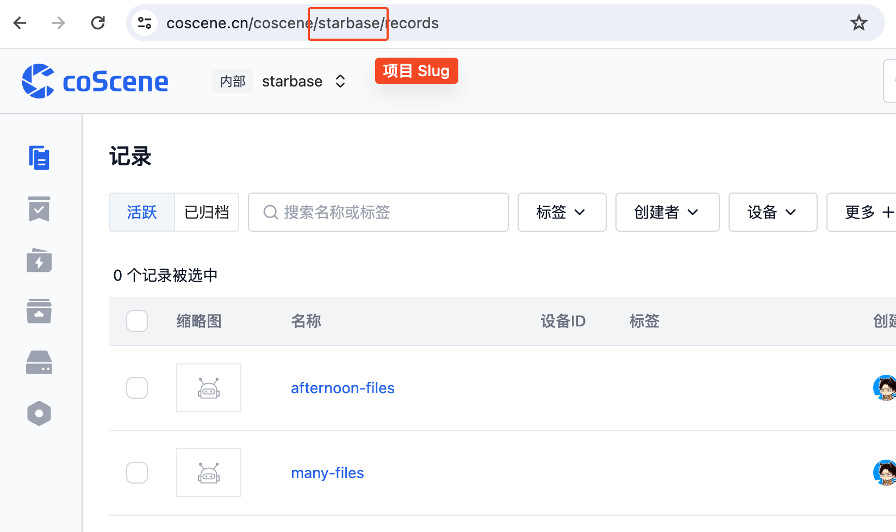

# Install and Init

## Installation

Run the following command in the terminal to install the latest version of the coScene CLI tool:

```Bash
curl -fL https://download.coscene.cn/cocli/install.sh | sh
```

You can use `cocli -h` in the terminal to confirm that the CLI tool has been successfully installed and to see the basic usage of the tool.

```
Usage:
  cocli [command]

Available Commands:
  action      Work with coScene action.
  completion  Generate the autocompletion script for cocli for the specified shell. Supporting Zsh and Bash.
  help        Help about any command
  login       Login to coScene
  project     Work with coScene project.
  record      Work with coScene record.
  registry    Manage coScene container registry access
  update      Update cocli version

Flags:
      --config string      config file path (default "/Users/yujing/.cocli.yaml")
  -h, --help               help for cocli
      --log-level string   log level, one of: trace|debug|info|warn|error (default "info")
  -v, --version            version for cocli

Use "cocli [command] --help" for more information about a command.
```

### Update to the Latest Version

```Bash
cocli update
```

:::tip

Login and initialize coCLI needs the following info:

- A personal access token(Token):
- A default working project's slug(Slug):

:::

## Login

You can generate your access token on the [coScene - My Settings](https://coscene.cn/profile?section=security) page.

The CLI tool also requires you to specify a default project as the default environment for all operations. Please select the project you want to work on and get the project slug from the URL.



### Configure CLI Permissions

```Bash
# Replace <project slug> after -p
# Replace <personal access token> after -t
cocli login set -p <PROJECT_SLUG> -t <TOKEN>
```

:::info
If your are an Enterprise user with an on-premise instance, you will have to
specify your instance's endpoint

eg. https://server2.coscene.cn -> https://openapi.server2.coscene.cn

```bash
cocli login set -p <PROJECT_SLUG> -t <TOKEN> -e <ENDPOINT>
```

:::

## Switch Default Project

After successfully authenticating the CLI, you can use the command line to switch the default working project. First, we can list all the projects in the organization that the user has access to, along with their corresponding project slugs:

```bash
cocli project list
```

```bash
ID                                       SLUG
43f54f09-3164-4e30-80a8-c63e25ca81af     starbase
3f09b8b5-3b31-436e-9232-0a8ffbc298da     mcap
```

After finding the target project, use `cocli login set` to update the default working project. If needed, you can use `cocli login current` to confirm.

```bash
cocli login set -p mcap
```

```bash
Profile set successful.
Current Profile is:
Profile Name:        saas
Endpoint:            https://openapi.coscene.cn
Organization:        coscene-lark
Default Project:     mcap
```

```bash
cocli login current
```

```bash
Current Profile:
Profile Name:        saas
Endpoint:            https://openapi.coscene.cn
Organization:        coscene-lark
Default Project:     mcap
```
