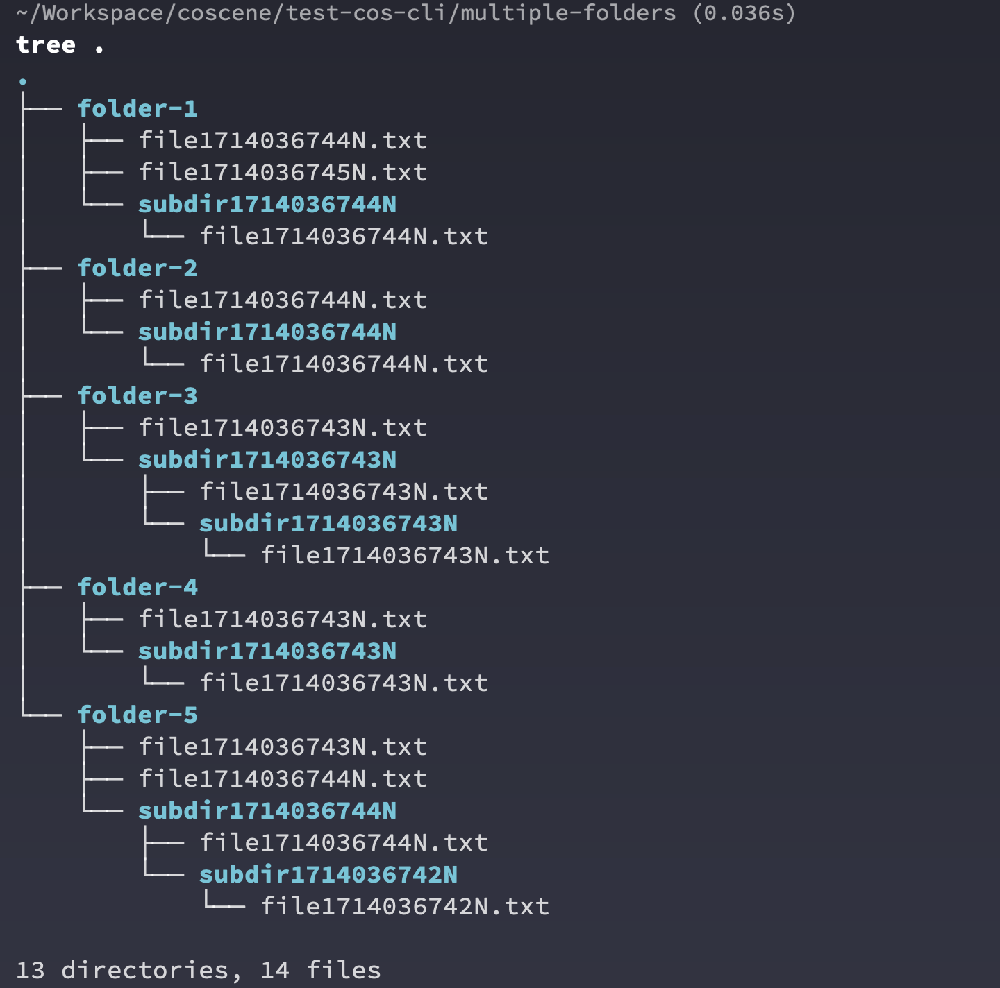
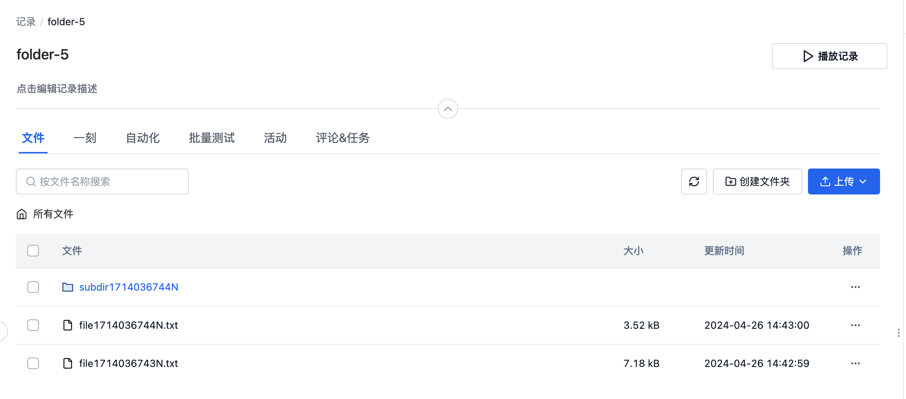

# Examples of Common Batch Operations

:::tip Recommend Using JSON Output
The batch operation examples in this document use the `jq` tool to parse JSON output, which is more reliable and stable than parsing table output.
If your system doesn't have `jq` installed, you can install it with the following commands:
- macOS: `brew install jq`
- Ubuntu/Debian: `sudo apt-get install jq`
- CentOS/RHEL: `sudo yum install jq`
:::

## Upload the Same File to All Records in a Project

```bash
# Use JSON output and jq to extract record names
cocli record list --all -o json | jq -r '.records[].name' | \
  xargs -I {} cocli record upload {} ./FILE_FLAG
```

## Create a Record for Each Folder in the Current Directory and Upload Files

Assume we have the following 5 folders, each containing several random files and folders, as shown in the structure below.



We can use the coScene CLI tool and standard Linux command line tools to create records and upload files all at once.

```bash
# Iterate through all subdirectories in the current directory
for dir in */; do
  # Remove the trailing slash from the directory name and create a new record, getting the full resource name
  record_name=$(cocli record create -t "${dir%/}" -o json | jq -r '.name')

  # Upload the contents of the current subdirectory to the created record
  cocli record upload -R "$record_name" "$dir"
done
```

Open any record on the web interface to see that the command line has uploaded all files and folders from the local directory to the corresponding record.



## Iterate Through All Records and Perform Operations

A common command line operation pattern is to iterate through all records in a user-specified project and perform operations based on a specific pattern.

```bash
# Use JSON output to get all records in the project, iterate and provide the full resource name
cocli record list --all -o json | jq -r '.records[].name' | while read -r record_name; do
    # Use $record_name for subsequent batch operations
    # To extract record ID, you can use: record_id=$(basename "$record_name")
done
```

This pattern can be extended to connect more complex batch operations.

### Find All Empty Records Without Any Files

```bash
cocli record list --all -o json | jq -r '.records[].name' | while read -r record_name; do
    # Get the number of files in the record
    file_count=$(cocli record file list "$record_name" -o json 2>/dev/null | jq '.files | length')

    # Check if the file list is empty
    if [[ "$file_count" -eq 0 ]]; then
        # Extract record ID and output
        record_id=$(basename "$record_name")
        echo "Record $record_id has no files."
    fi
done
```

### Tag All Empty Records

```bash
cocli record list --all -o json | jq -r '.records[].name' | while read -r record_name; do
    # Get the number of files in the record
    file_count=$(cocli record file list "$record_name" -o json 2>/dev/null | jq '.files | length')

    # Check if the file list is empty
    if [[ "$file_count" -eq 0 ]]; then
        # Tag all empty records with empty-record
        cocli record update "$record_name" --append-labels empty-record
    fi
done
```

### Batch Download All Records with a Specific Label

```bash
# Use --labels parameter to filter records with specific labels
cocli record list --labels test-label --all -o json | jq -r '.records[].name' | while read -r record_name; do
    # Download all records with test-label
    cocli record download "$record_name" download-folder
done
```

### Delete All Empty Records

:::danger
Please be very careful with the `delete` operation, as it may delete important data!!
:::

```bash
cocli record list --all -o json | jq -r '.records[].name' | while read -r record_name; do
    # Get the number of files in the record
    file_count=$(cocli record file list "$record_name" -o json 2>/dev/null | jq '.files | length')

    # Check if the file list is empty
    if [[ "$file_count" -eq 0 ]]; then
        # Delete the current record, using the -f flag to skip manual confirmation
        cocli record delete "$record_name" -f
    fi
done
```
