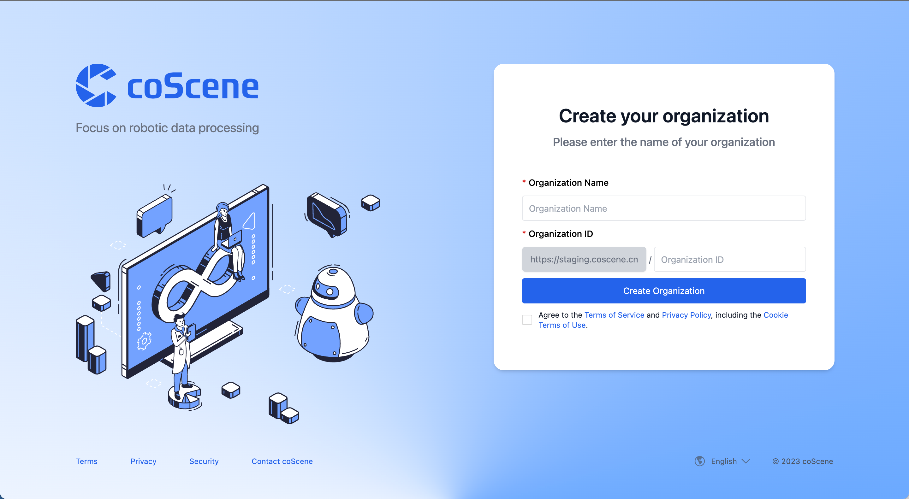

# Data Model

From a data ownership and permissions perspective, the most common coScene hierarchy is: organizations manage members, devices, and image registries; projects contain concrete data and collaboration work; records are data containers inside projects; moments mark key segments on a record timeline.

## Organization

An organization is a logical concept representing a team or a company. An organization can have multiple projects and multiple members.

When logging into the coScene platform, if you are the first user to log in from the selected organization, you will become the administrator of that organization and perform initial settings for the organization. If you are not the first user to log in, you will be a regular member of the organization.

## Device

A device is an organization-level resource. It usually represents a robot, vehicle, data collection host, sensor kit, or test device. It can also be a virtual device used only for data management.

Devices are managed centrally at the organization level. When a device needs to participate in a project's data collection, rule monitoring, remote control, or statistics, add the organization device to that project. One organization device can be added to multiple projects, but those project devices still point to the same real device and the same device ID. For detailed operations on devices, please see [the device operation guide](../../device/1-device.md).

## Project

While an organization acts as a container for resource management, it does not store scenario data generated by users and devices during runtime. Data storage, management, isolation, and application all happen at the project level.

A project is the platform's primary data boundary and permission boundary. Project resources such as records, record files, moments, tasks, automation actions, and triggers all belong to a project. A user's project role determines whether they can read, write, or manage project resources. After a device is added to a project, it can use that project's collection rules and upload data to that project.

## Record

Many existing systems and tools can handle individual or single-sequence files. For instance, WebViz can directly open a Bag file for playback, and Uber XVIZ can restore the scene at the time of an event using a series of GLB and json files. These are impressive engineering capabilities. However, in the development of complex systems like robots and autonomous driving, numerous environmental factors, program interventions, and human interventions mean that a single file or file sequence is often insufficient to fully reconstruct the system's operational state.

Files generated by a device during operation and R&D include not only the sensor data itself, but also related context such as software versions, weather conditions, road conditions, hardware configurations, calibration files, maps, and logs. The purpose of a record is to preserve these complex relationships by storing closely related files in the same container and linking them during later processing.

The content of a record can be continuously iterated and enriched. Users and automation actions can keep adding useful information to a record. A common example is sending raw data to an annotation provider for bounding-box or semantic annotations. These annotations are then used in later machine learning, training, and testing workflows.

Beyond file management, coScene also manages file versions and lineages. You might have heard the famous phrase in the machine learning world: "garbage in, garbage out." On the coScene platform, we ensure data quality through record versioning and lineage management. In the record version, we can see the historical versions of the record and the modification logs for each version. In the record lineage, we can see the upstream and downstream records and the lineage relationships of each record. For detailed information about lineage and version history, please refer to [the explanation about record lineage and version history](../../3-collaboration/record/3-manage-records.md).

## Moment

A moment is a key segment on a record timeline. It marks a fault, anomaly, point of interest, or other time range that is worth reviewing and collaborating on. A moment usually includes a name, description, trigger time, duration, and custom fields. It can also be associated with a task so the team can discuss and resolve work around a specific segment.

A moment is not a comment, and it is not a new record. It is attached to a record in a project and helps users quickly locate important time ranges in that record. For details on creating and managing moments, see [Moments](../../viz/5-create-moment-viz.md).

## Supported Data Formats and Platform Processing Capabilities

| Data Format          | Read         | Write        |
| -------------------- | ------------ | ------------ |
| ROS1                 | ✅           |              |
| MCAP                 | ✅           | ✅           |
| CyberRT              | ✅           |              |
| Non-standard Formats | Customizable | Customizable |
