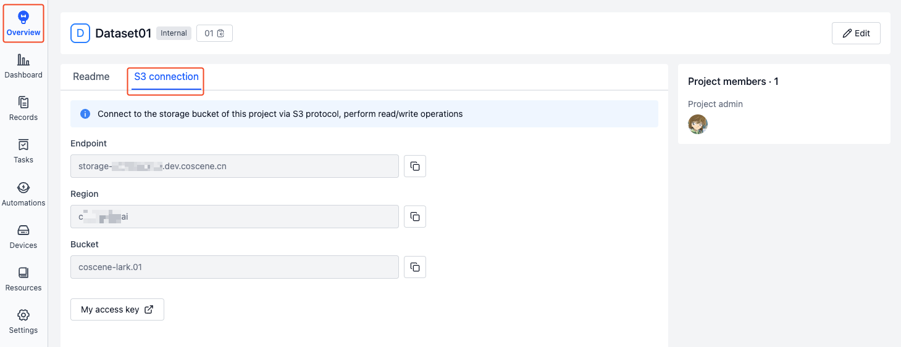
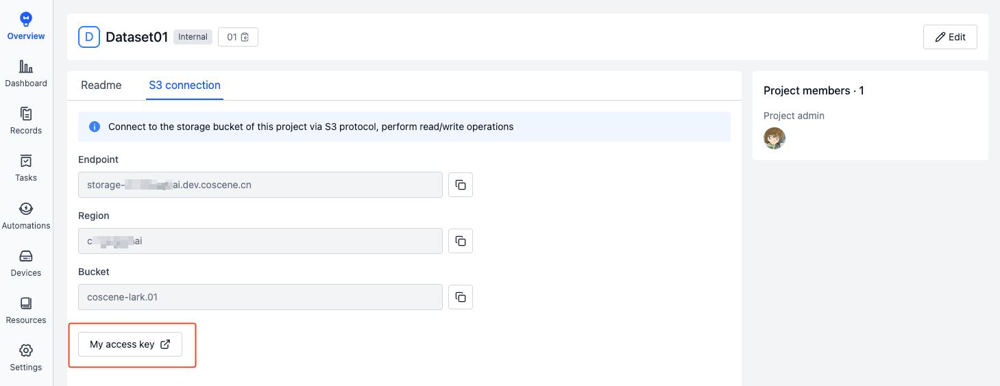
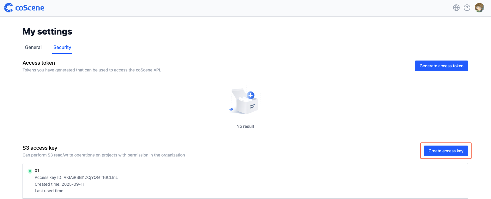

# S3 Authentication

Learn how to use S3 authentication to perform S3 operations on projects within your organization that you have permissions for.

1. Go to the Project Overview - S3 connection page to obtain information such as Endpoint, Region, and Bucket.

    

2. Click on [My access key] to navigate to the Personal settings - Security page and manage your personal S3 access keys.

    

3. Click on [Create access key], enter a description, and create your S3 access key.

    

4. Copy the Access Key ID and Secret Access Key for subsequent S3 operations. For example, use the [AIStor Client(mc)](https://docs.min.io/enterprise/aistor-object-store/reference/cli/) tool for S3 authentication:

    ```bash
    mc alias set coscene <endpoint> <access-key-id> <secret-access-key>
    ```

Note: **Your personal S3 access keys can perform operations on all projects within the organization that you have permissions for. These keys are for personal use only and should not be shared with others.**