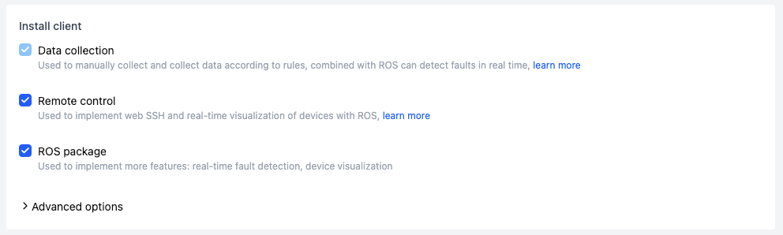
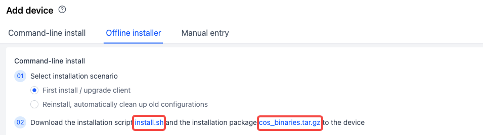

# Add Device

## Permission Description

:::info
🤖 Permission: Only **Organization Members** and higher permissions can add devices
:::

When an organization introduces a new device and wishes to create a device in the platform corresponding to a real offline device, they can go to the organization's device page to add it.

## Overview of Addition Methods

The platform provides the following 3 ways to add new devices to an organization:

| Addition Method | Applicable Scenario |
| --------------- | ------------------- |
| Execute command on device side | Small number of devices individually connecting to the platform |
| Use offline installation package | Factory batch admission for devices to communicate with the platform |
| Fill in information | Quickly create devices only used for data transfer, without platform communication |

## Execute Command on Device Side to Add {#add-device-from-device}

### Applicable Situations and Entry

This method is suitable for adding a small number of devices to the platform one by one. Users need to manually log in to the device via SSH to execute commands. The entry is located on the "Devices" tab of the "Organization Management" page, click the [Add Device] button to enter the add device popup.


### Device System Requirements

1. Currently only supports Linux devices, covering arm64 and x86_64 architectures;

2. Windows devices are not currently supported. If you need to connect Windows devices, please contact the coScene team.

### Device ID Configuration

1. You can fill in the location storing the device's unique identifier (such as ID or SN), supporting txt, json, yaml text file types.

   - For txt files, the system reads the entire file content.

   - For json or yaml files, you need to fill in the variable value of the ID number in the input box below (e.g., if the file contains `id:123`, then enter `id` here).

2. Organization administrators can preset the unified ID storage address configuration in "Organization Devices - Edit Collection Rules" to auto-fill the popup, and secondary changes are supported.

   

   1. If you choose to have the system generate an ID, the platform will generate a default ID number, which cannot be modified after installation.

   

### Client Installation Selection

1. **Data Collection (coScout) Client**

   After installation, the device can collect data according to project rules or collection tasks. Before installation, administrators need to configure data collection monitoring directories and other information. For details, please refer to the Edit Collection Rules documentation.

2. **Remote Control (coLink) Client**

   After installation, it enables web-based SSH and real-time device visualization when combined with [coBridge](https://github.com/coscene-io/coBridge). For detailed functionality, please refer to the Remote Control Device [documentation](https://docs.coscene.cn/en/docs/device/device-remote-control).

3. **Initialize Client Configuration**

   If the device needs to be reinstalled and registered after changing the host computer or ID, check [Initialize Client Configuration]; uncheck it if only upgrading the client version. For more usage methods, please refer to the Machine Replacement, Upgrade, and Uninstallation Process Guide.

   

### Execute Installation Command

1. After completing the device ID and installation client options configuration, the system generates an installation command. Users copy the command to the device's shell terminal to execute.

   

2. When `Installation completed successfully 🎉` appears on the device side, the installation is successful. Due to device performance impacts, there may be a delay in the device list page display after installation completion. At this point, the device has completed registration. For subsequent operations, refer to the [Enable Device](./3-manage-device.md#enable-device-client).

   

   

## Add Using Offline Installation Package

### Applicable Situations and Related Settings

1. This method is equivalent to packaging the data collection and remote control installation packages into the device software version update package, and pre-writing the script permission commands and installation commands in the startup script. It is suitable for large-scale admission, such as devices with these two clients pre-installed in factory settings;

2. The "Device System", "Device ID Configuration", and "Client Installation Selection" in this addition method are the same as the method of executing commands on the device side. You can refer to the corresponding tutorial sections. The following focuses on explaining the installation method differences.

### Installation Steps

1. Assuming the user is in the `/root` directory (pay attention to changing the path when switching directories), download the installation script **coscene.sh** and the offline binary file compression package **cos_binaries.tar.gz** to the device, stored at `/root/coscene.sh` and `/root/cos_binaries.tar.gz` respectively.
   


2. In the root directory, grant execution permission to the installation script:

   ```plain text
   chmod +x /root/coscene.sh
   ```

3. Execute the installation command (using `cos_binaries.tar.gz` located at `/root/cos_binaries.tar.gz` as an example):

   ```plain text
   ./install.sh --use_local=./cos_binaries.tar.gz --mod="default" --org_slug="***" --server_url="***" --coLink_endpoint="***" --coLink_network="***" --sn_file="***" --sn_field="***" --remove_config
   ```

   The `--use_local` parameter indicates the local path to the offline installation package on the target device, which must be adjusted based on your specific environment.

   

## Add by Filling in Information

### Applicable Situations

This method creates virtual device fields in the platform database, which do not correspond to real devices.

### Operation Steps

1. In the "Add Device" popup, enter the device ID and other information (device ID cannot be duplicated), and click [Add] to create the device.

2. If the organization administrator has set custom fields, users need to fill in all required items according to the page prompts (such as the store and model in the example).


## Next Steps
- [Enable Device](./3-manage-device.md#enable-device-client)
- [Add Device to Project](./3-manage-device.md#assign-devices-to-projects)
   - [Manual Data Collection](../use-case/1-common-task.md)
   - [Automatic Data Collection Based on Error Codes](../use-case/data-diagnosis/2-get-started.md)
- [Remote Device Connection](./5-device-remote-control.md)
   - Realtime Viz
   - Web SSH
   - Remote Command
   - Ports