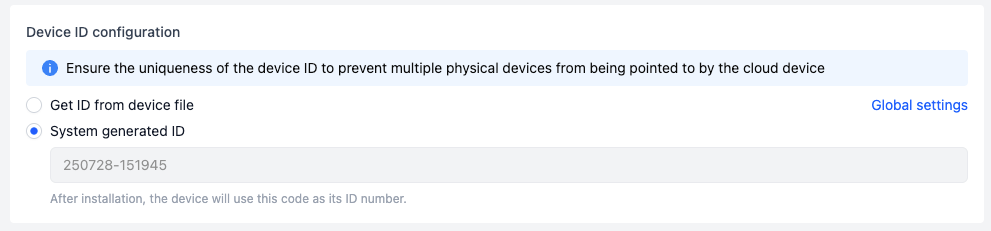
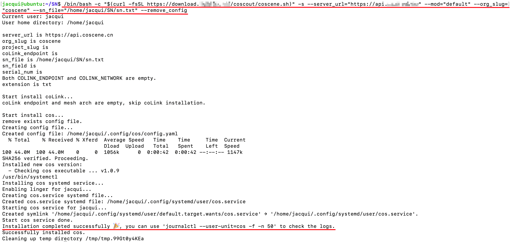
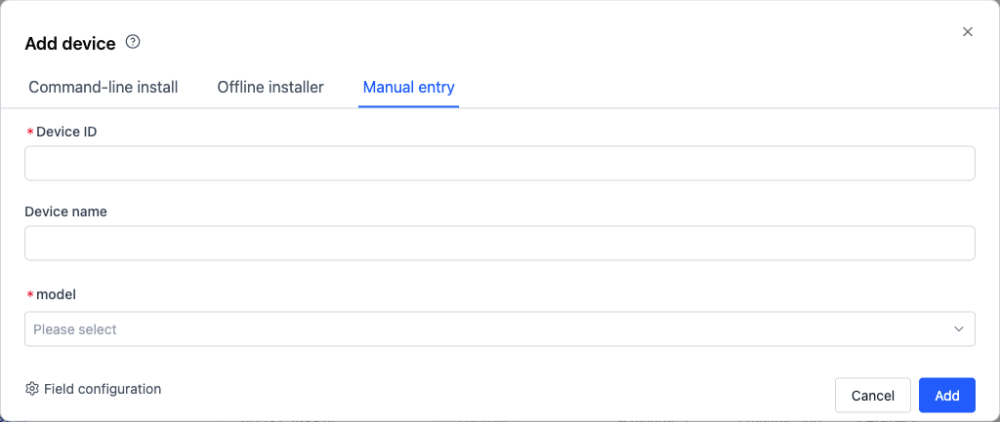

# Add Device
 When enterprises or teams want to achieve remote data collection, real-time visualization, and remote connection capabilities for their devices, they can create a device on the platform that corresponds to a physical device offline.

The platform provides the following 3 methods for adding devices:

| Method | Applicable Scenarios |
| --- | --- |
| Command-line install | Individual installation for a small number of devices |
| Offline installer | Batch installation for factory devices |
| Manual entry | Quick creation of devices for data management only, no platform communication |

## Supported Versions {#supported-versions}
> Currently only supports Linux devices, other operating systems are not yet supported

Execute the following commands on the device for a quick self-check to obtain system information:

```
uname -m # arch
uname -s # os
cat /etc/os-release # dist os
ls -al /opt/ros/ # ros dist
```

| Hardware Architecture | Operating System | ROS Version | Installation Notes |
| -------- | -------- | -------- | -------- |
| AMD64 | Ubuntu 14.04 | ROS1 Indigo | Only supports manual data collection, file/topic monitoring for automatic data collection, and LAN real-time visualization with coStudio |
| AMD64 | Ubuntu 16.04 | Any version | Only supports manual data collection and file monitoring for automatic data collection |
| AMD64 | Ubuntu 18.04 | ROS1 Melodic | Supports manual data collection, file/topic monitoring for automatic data collection, real-time visualization, and remote SSH |
| AMD64 | Ubuntu 20.04 | ROS1 Noetic | Supports manual data collection, file/topic monitoring for automatic data collection, real-time visualization, and remote SSH |
| AMD64 | Ubuntu 20.04 | ROS2 Foxy | Supports manual data collection, file/topic monitoring for automatic data collection, real-time visualization, and remote SSH |
| AMD64 | Ubuntu 22.04 | ROS2 Humble | Supports manual data collection, file/topic monitoring for automatic data collection, real-time visualization, and remote SSH |
| AMD64 | Ubuntu 24.04 | ROS2 Jazzy | Only supports manual data collection, file monitoring for automatic data collection, and real-time visualization |
| AArch64 | Ubuntu 18.04 | ROS1 Melodic | Supports manual data collection, file/topic monitoring for automatic data collection, real-time visualization, and remote SSH |
| AArch64 | Ubuntu 20.04 | ROS1 Noetic | Supports manual data collection, file/topic monitoring for automatic data collection, real-time visualization, and remote SSH |
| AArch64 | Ubuntu 20.04 | ROS2 Foxy | Supports manual data collection, file/topic monitoring for automatic data collection, real-time visualization, and remote SSH |
| AArch64 | Ubuntu 22.04 | ROS2 Humble | Supports manual data collection, file/topic monitoring for automatic data collection, real-time visualization, and remote SSH |
| ARMv7 | Ubuntu 14.04 | ROS1 Indigo | Only supports manual data collection, file/topic monitoring for automatic data collection, and LAN real-time visualization with coStudio |

*Note: Other unofficially supported versions may not function properly after client installation.

## Command-line install {#add-device-from-device}

### Applicable Situations and Entry

This method is suitable for adding a small number of devices to the platform one by one. Users need to manually log in to the device via SSH to execute commands. The entry is located on the "Devices" tab of the "Organization Management" page, click the [Add Device] button to enter the add device popup.


### Device ID Configuration

1. You can fill in the location storing the device's unique identifier (such as ID or SN), supporting txt, json, yaml text file types.

   - For txt files, the system reads the entire file content.

   - For json or yaml files, you need to fill in the variable value of the ID number in the input box below (e.g., if the file contains `id:123`, then enter `id` here).

2. Organization administrators can preset the unified ID storage address configuration in "Organization Devices - Edit Collection Rules" to auto-fill the popup, and secondary changes are supported.

   

   - If you choose to have the system generate an ID, the platform will generate a default ID number, which cannot be modified after installation.

   

### Client Installation Selection

1. **Data Collection**

   After installation, you can manually collect data or automatically collect it based on rules. Before use, you need to configure the data collection watch directory and other settings. For details, refer to the [Device configuration guide](./4-device-collector.md).

2. **Remote Control**

   Once installed, you can access the device via web-based SSH and visualize the device in real time using the ROS Suite. For details, see the [Remote device access guide](./5-device-remote-control.md).

3. **ROS Suite**

   Enables additional functions such as rule-based real-time topic listening for automatic data collection, and device visualization.

   

### Execute Installation Command
> Note:
>
> - When running the installation command on the device, using the root user or adding `sudo` before the command will install coScout under the root user. Running the command as the current user without sudo will install it under that user.
>
> - To directly add the device to a project, go to the Project > Devices page.

1. Select Installation Scenario
By default, this option is for first installation or client upgrade. If you select "Reinstall", it will automatically clear the existing device configuration, and the client must be re-enabled after installation. See the [Device Replacement, Upgrade, and Uninstallation Guide](./7-change-device-guide.md) for details.

2. Run the Installation Command on the Device Terminal

   

   When `Installation completed successfully 🎉` appears on the device side, the installation is successful. Due to device performance impacts, there may be a delay in the device list page display after installation completion. 

   

3. Contact the organization administrator to enable the client in the "Organization-Device" page

 

4. Enable the ROS node on the device

   This step is optional. Enabling it allows real-time fault detection and device visualization. If skipped, you can still manually collect data, automatically collect data based on file monitoring rules, and remotely SSH into the device.

   - Before starting the ROS node, make sure to source the workspace environment that includes custom messages.  
   - It's recommended to add the ROS node startup command to the device's startup script.

   For ROS1 devices, run the following command to enable the ROS node:

   ```bash
   roslaunch cobridge cobridge.launch
   ```

   ```bash
   roslaunch colistener colistener.launch
   ```

   For ROS2 devices, run the following command to enable the ROS node:

   ```bash
   ros2 launch cobridge cobridge_launch.xml
   ```  

   ```bash
   ros2 launch colistener colistener.launch.xml
   ```     

## Offline installer

### Applicable Situations and Related Settings

1. Add a device using the offline installation package: Integrate the offline installation package into the device's software update package.

   - Suitable for mass deployment during device manufacturing
   - Enables out-of-the-box usage without separately installing the client

2. Configuration instructions:

   - The basic configuration items (e.g., device ID setup, client installation options) are the same as in Command Line Installation. Please refer to the previous section for details.
   - The following section focuses on installation steps specific to offline installation.

### Installation Steps

1. Download the installation script **install.sh** and the offline binary file compression package **cos_binaries.tar.gz** to the device, stored at `/root/coscene.sh` and `/root/cos_binaries.tar.gz` respectively.

   

2. In the root directory, grant execution permission to the installation script:

   ```plain text
   chmod +x /root/coscene.sh
   ```

3. Execute the installation command (using `cos_binaries.tar.gz` located at `/root/cos_binaries.tar.gz` as an example):

   

   The `--use_local` parameter indicates the local path to the offline installation package on the target device, which must be adjusted based on your specific environment.

4. Enable the ROS node on the device
> To integrate the offline installation package into the software version, it is strongly recommended to add the ROS node startup command to the device's startup script.

   This step is optional. Enabling it allows real-time fault detection and device visualization. If skipped, you can still manually collect data, automatically collect data based on file monitoring rules, and remotely SSH into the device.

   - Before starting the ROS node, make sure to source the workspace environment that includes custom messages.  
   - It's recommended to add the ROS node startup command to the device's startup script.

   For ROS1 devices, run the following command to enable the ROS node:

   ```bash
   roslaunch cobridge cobridge.launch
   ```

   ```bash
   roslaunch colistener colistener.launch
   ```

   For ROS2 devices, run the following command to enable the ROS node:

   ```bash
   ros2 launch cobridge cobridge_launch.xml
   ```  

   ```bash
   ros2 launch colistener colistener.launch.xml
   ```  

## Manual entry

### Applicable Situations

This method creates virtual device fields in the platform database, which do not correspond to real devices.

### Operation Steps

1. In the "Add Device" popup, enter the device ID and other information (device ID cannot be duplicated), and click [Add] to create the device.

2. If the organization administrator has set custom fields, users need to fill in all required items according to the page prompts (such as model in the example).

   

## Next Steps
- [Enable Device](./3-manage-device.md#enable-device)
- [Add Device to Project](./3-manage-device.md#assign-devices-to-projects)
   - [Manual Data Collection](../use-case/1-common-task.md)
   - [Automatic Data Collection Based on Error Codes](../use-case/data-diagnosis/2-get-started.md)
- [Remote Device Connection](./5-device-remote-control.md)
   - Realtime Viz
   - Web SSH
   - Remote Command
   - Ports

## FAQ
1. **Q: After executing the installation command on the device, it does not appear in the "Organization Management - Devices" page.**

   **A:** If the device has a stable network connection：

   - Wait for about 1–5 minutes and refresh the device list. The newly registered device should appear
   - Make sure the file (yaml/txt) corresponding to the device ID contains content

2. **Q: After executing the device installation command, an error appears: `curl: (60) SSL certificate problem`**

   ```
   curl: (60) SSL certificate problem: unable to get local issuer certificate
   More details here: http://curl.haxx.se/docs/sslcerts.html

   curl performs SSL certificate verification by default, using a "bundle"
   of Certificate Authority (CA) public keys (CA certs). If the default
   bundle file isn't adequate, you can specify an alternate file
   using the --cacert option.
   If this HTTPS server uses a certificate signed by a CA represented in
   the bundle, the certificate verification probably failed due to a
   problem with the certificate (it might be expired, or the name might
   not match the domain name in the URL).
   If you'd like to turn off curl's verification of the certificate, use
   the -k (or --insecure) option.
   ```

   **A:** This is usually caused by outdated certificates on the device. You can skip SSL certificate verification by modifying the installation command:

   * Replace `fsSL` with `kfsSL` before `https`
   * Add `--skip_verify_cert` at the end of the command with a space

     Example:

     ```bash
     /bin/bash -c "$(curl -kfsSL https://*/install.sh)" -s --mod=* --org_slug=* --server_url=* --serial_num=* --skip_verify_cert
     ```

3. **Q: Unable to install and enable the client successfully when testing in a virtual machine or Docker.**

   **A:** This is usually because `systemd` is not supported in the environment. You can disable the systemd service by adding the `--disable_service` parameter at the end of the command.

   Example:

   ```bash
   /bin/bash -c "$(curl -fsSL https://*/install.sh)" -s --mod=* --org_slug=* --server_url=* --serial_num=* --disable_service
   ```

   After installation, manually start the client with the following command:

   ```
   ~/.local/bin/cos daemon
   ```

4. **Q: The device uses a 32-bit operating system, but the correct version was not installed automatically.**

   **A:** You can install the 32-bit version manually by adding the `--use_32bit` parameter at the end of the command.

   Example:

   ```bash
   /bin/bash -c "$(curl -fsSL https://*/install.sh)" -s --mod=* --org_slug=* --server_url=* --serial_num=* --use_32bit
   ```


