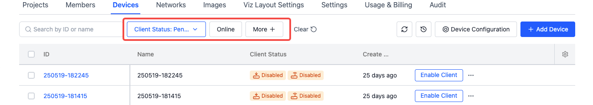
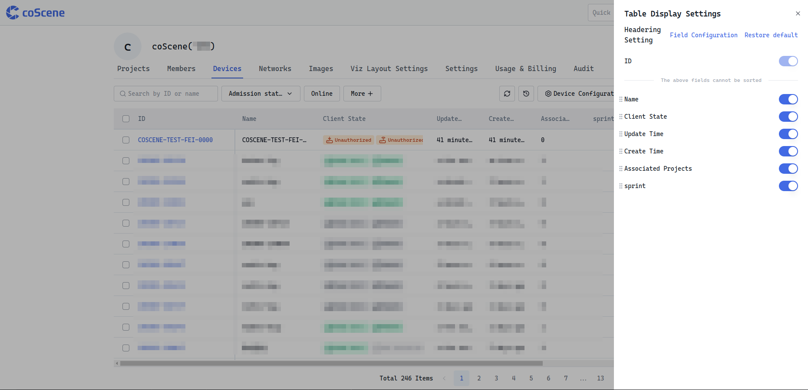
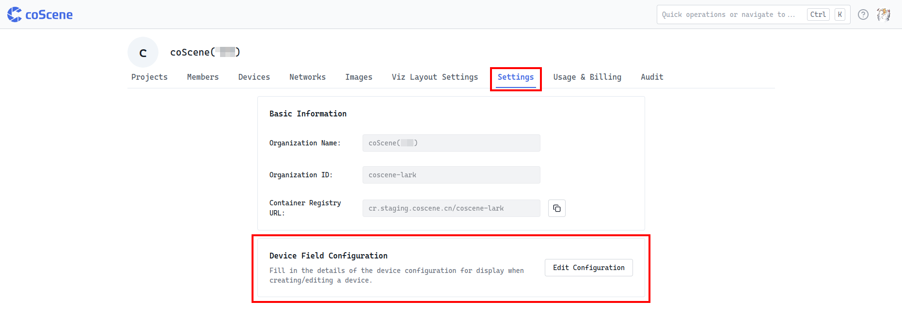
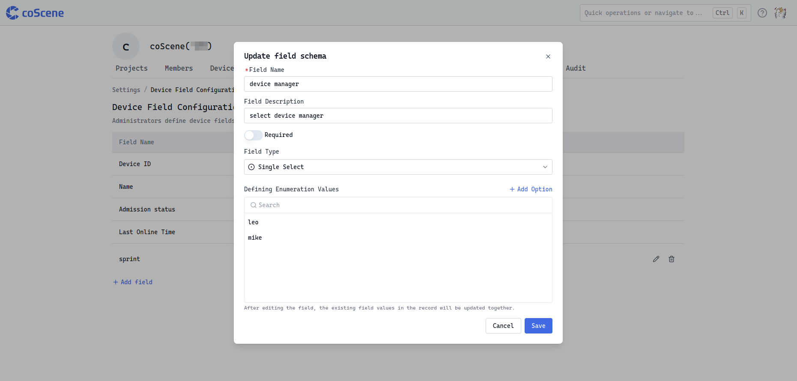
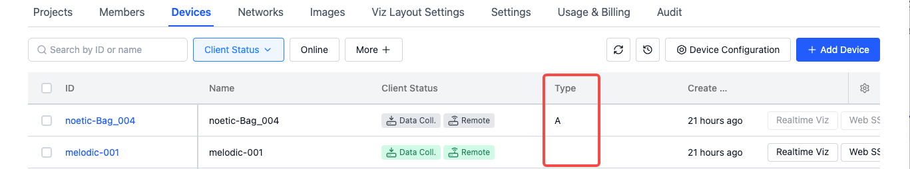
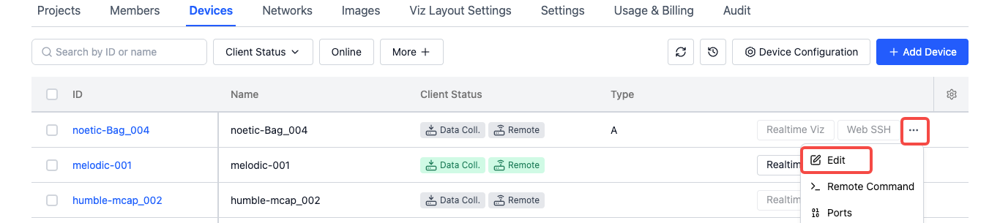
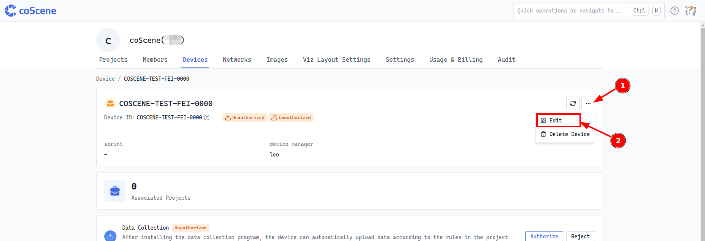
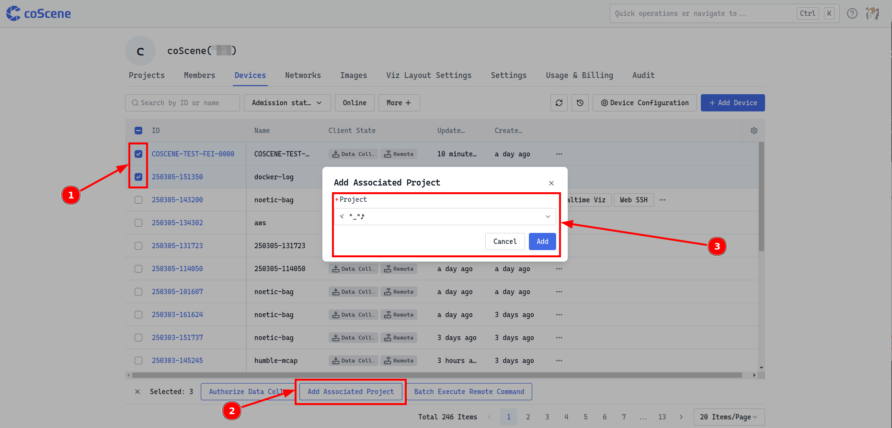
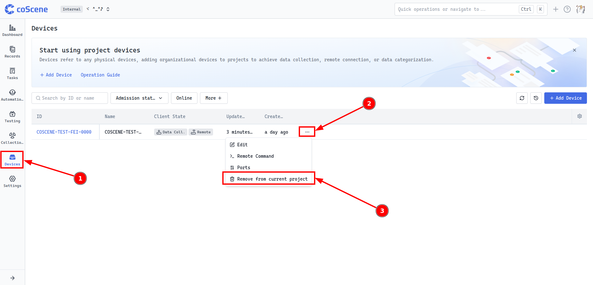

# Managing Devices

## Device Management Basics

Devices are managed at the organization level, and only users with organization member permissions or above can perform related operations. You can view the existing device list on the "Organization Management - Devices" page.

## Device Information Filtering and Table Settings

:::info
🤖 Permission: All **organization users** can view and filter device information
:::

### Filter Device Information

The system by default supports filtering by "Device ID", "Client Status", and "Online Status" - these 3 fields. In the "More" option, you can also select custom device fields for filtering operations to meet more personalized information search needs.



### Table Settings

When there are many device fields, you can use the settings button in the upper right corner of the table to sort, hide, and perform other operations on the table display fields according to personal preferences, making it easier for users to focus on key information. At the same time, you can also use [Restore Default] to restore the table to its initial display state.



## Device Custom Field Management

:::info
🤖 Permission: Only **organization administrators** have the authority to set device custom fields
:::

1. Define organization-wide fields in Organization Management → Settings → Custom Fields

    

2. Select fields for devices in Device Field Configuration

    

3. These custom fields will appear when creating/viewing devices
    
    

- **Notes:** If an administrator deletes a device custom field, all data for that field will be deleted and cannot be recovered, so operation must be done with caution.

## Edit Device Information

:::info
🤖 Permission: **Organization members and above roles** can edit and update device information
:::

You can modify various information about the device by selecting the device you want to operate in the device list and clicking the [Edit] button, or by clicking the [Edit] button on the device details page.





## Device and Project Association Operations

:::info
🤖 Permission: **Organization members and above roles** can assign devices to projects
:::

### Assign Devices to Projects

After a device is added to a project, if a data collection client is installed, the client will pull the rules that have been enabled in the project for automatic monitoring and diagnosis, and data collection tasks can also be created in the project to collect data.

Select a device in the device list and click the [Add Associated Project] button;



Or click the [Add Device] button in the project to pull devices from the organization, both of which can complete the association between devices and projects.


### Remove Devices from Projects

If a project no longer needs a certain device, you can [Remove from this Project] in the project. After removal, the device is still retained in the organization project, but the project no longer receives data collected by the device. If needed in the future, the device can be added back to this project for data collection.



## Device Admission {#device-admission}

:::info
🤖 Permission: **Only organization administrators** can perform enable device operations
:::

After completing device addition, an [Enable Client] action button will appear in the device list.


Once the client is enabled:

- If Data Collection is online:
    The machine-side program will collect data according to configured rules and automatically upload to the corresponding project.

- If Remote Control is online:
    Users can:
    - Establish SSH connections to the machine
    - Perform real-time device visualization using [coBridge](https://github.com/coscene-io/coBridge)

### View Client Information


On the device side, execute the following command to view the client version and log information.
| Name | View Version | View Logs |
| ---- | -------- | -------- |
| Data Collection (coScout) ≥ v1.1.2 | `~/.local/bin/cos --version` | `tail -f ~/.local/state/cos/logs/cos.log` |
| Data Collection (coScout) ＜ v1.1.2 - | `~/.local/bin/cos --version` | `journalctl -fu cos` |
| Remote Control (coLink) | `colink --version` | `journalctl -fu colink` |

### Uninstall Data Collection and Remote Control Clients

On the device side, execute the following command to uninstall the data collection and remote control clients. During execution, observe the output until the uninstallation process is complete.

Note: If the coScout client is installed under the root user, you need to switch to the root user when uninstalling.

```yaml
/bin/bash -c "$(curl -fsSL https://download.coscene.cn/coscout/uninstall_en.sh)"
```


## Delete Devices

:::info
🤖 Permission: When a device **has been admitted, only organization administrators** can delete it; if a device **has no admission information, organization members and above roles** can delete it
:::

Select the device you want to delete in the device list and click [Delete Device], and confirm twice to delete. After deleting the device:

1. All requests from the device will be removed from the organization.
2. The device will be removed from the records.
3. In the records, the detailed information of this device will not be viewable.
4. Unable to add this device to the project.
5. Already added devices in the project will be synchronized and removed from the project devices.


<br />

---

Through the above steps and operation instructions, you can comprehensively manage device operations to ensure the effective application and maintenance of devices in organizations and projects.

If you have any questions, please feel free to contact us for support.
