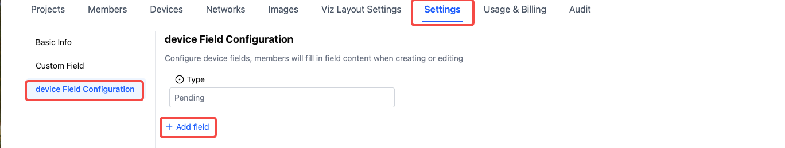
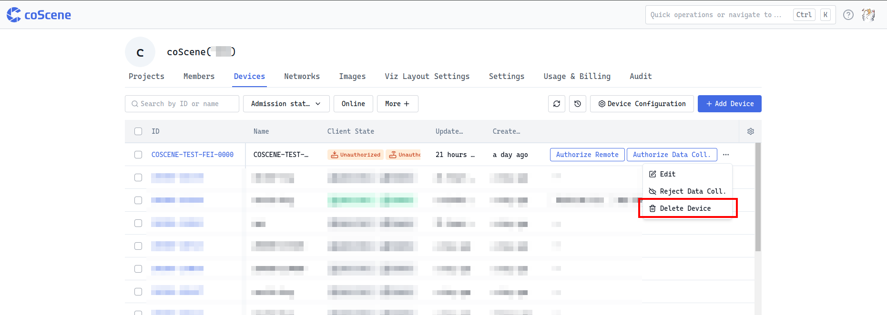

# Managing Devices

## Device Management Basics

Devices are managed at the organization level, and only users with organization member permissions or above can perform related operations. You can view the existing device list on the "Organization Management - Devices" page.

## Device Information Filtering and Table Settings

:::info
 Permission: All **organization users** can view and filter device information
:::

### Filter Device Information

The system by default supports filtering by "Device ID", "Access Status", and "Online Status" - these 3 fields. In the "More" option, you can also select custom device fields for filtering operations to meet more personalized information search needs.


### Table Settings

When there are many device fields, you can use the settings button in the upper right corner of the table to sort, hide, and perform other operations on the table display fields according to personal preferences, making it easier for users to focus on key information. At the same time, you can also use [Restore Default] to restore the table to its initial display state.


## Device Custom Field Management

:::info
 Permission: Only **organization administrators** have the authority to set device custom fields
:::

- **Entry:** Through the "Organization Management - Settings - Device Field Configuration - Edit Configuration" path to enter the settings page, administrators can add relevant device fields according to actual needs. After saving the settings, these custom fields will appear in the device information display.

- **Notes:** If an administrator deletes a device custom field, all data for that field will be deleted and cannot be recovered, so operation must be done with caution.





## Edit Device Information

:::info
 Permission: **Organization members and above roles** can edit and update device information
:::

You can modify various information about the device by selecting the device you want to operate in the device list and clicking the [Edit] button, or by clicking the [Edit] button on the device details page.


## Device and Project Association Operations

:::info
 Permission: **Organization members and above roles** can assign devices to projects
:::

### Assign Devices to Projects

After a device is added to a project, if a data collection client is installed, the client will pull the rules that have been enabled in the project for automatic monitoring and diagnosis, and data collection tasks can also be created in the project to collect data.

Select a device in the device list and click the [Add Associated Project] button;


Or click the [Add Device] button in the project to pull devices from the organization, both of which can complete the association between devices and projects.


### Remove Devices from Projects

If a project no longer needs a certain device, you can [Remove from this Project] in the project. After removal, the device is still retained in the organization project, but the project no longer receives data collected by the device. If needed in the future, the device can be added back to this project for data collection.


## Device Admission

:::info
 Permission: **Only organization administrators** can perform device admission operations
:::

After completing device addition, the [Admit] operation button will appear in the device list. On the device details page, you can separately admit the "Data Collection" and "Remote Control" modules.


After "Data Collection" admission, the machine-side program will collect data according to rules and automatically upload it to the corresponding project;

After "Remote Control" admission, users can perform SSH connections, real-time visualization, and other operations on the machine through the coScene platform.

### View Data Collection Client Logs

Execute the following command on the device side to view the log information of the data collection client, making it convenient for users to understand the situation during the data collection process.

```go
journalctl --user-unit=cos -f -n 50
```

### Uninstall Data Collection and Remote Control Clients

On the device side, execute the following command to uninstall the data collection and remote control clients. During execution, observe the output until the uninstallation process is complete.

```yaml
/bin/bash -c "$(curl -fsSL https://download.coscene.cn/coscout/uninstall.sh)"
```


## Delete Devices

:::info
 Permission: When a device **has been admitted, only organization administrators** can delete it; if a device **has no admission information, organization members and above roles** can delete it
:::

Select the device you want to delete in the device list and click [Delete Device], and confirm twice to delete. After deleting the device:

1. Admitted devices will have their admission canceled and will not be able to automatically upload data

2. The device and requests from the device side will be cleared in the organization

3. The device cannot be added to records

4. Detailed information about the device cannot be viewed in records



<br />

---

Through the above steps and operation instructions, you can comprehensively manage device operations to ensure the effective application and maintenance of devices in organizations and projects.

If you have any questions, please feel free to contact us for support.
