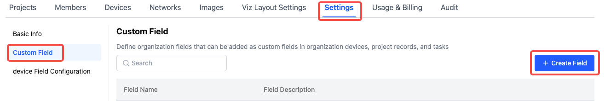
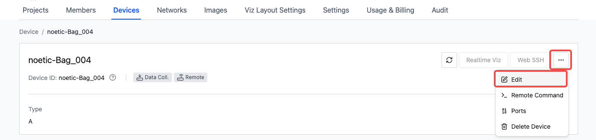

# Manage Devices

## Device Management Basics

Devices are managed uniformly at the organization level, and only users with organization member permissions or above can perform related operations. You can view the existing device list on the "Organization Management - Devices" page.

## Device Information Filtering and Table Settings

:::info
 Permission: All **Organization Users** can view and filter device information
:::

### Filter Device Information

The system supports filtering by "Device ID", "Access Status", and "Online Status" by default. In the "More" option, you can also filter by custom device fields to meet more personalized information search needs.


### Table Settings

When there are many device fields, you can use the settings button in the top right corner of the table to sort, hide, or perform other operations on table display fields according to personal preferences, making it easier for users to focus on key information. You can also use [Restore Default] to return the table to its initial display state.


## Custom Device Field Management

:::info
 Permission: Only **Organization Administrators** have the authority to set custom device fields
:::

- **Entry:** Through the "Organization Management - Settings - Device Field Configuration - Edit Configuration" path, administrators can add relevant device fields based on actual needs. After saving the settings, these custom fields will appear in the device information display.

- **Note:** If an administrator deletes a custom device field, all data for that field will be deleted and cannot be recovered, so please proceed with caution.




## Edit Device Information

:::info
 Permission: **Organization Members and above** can edit and update device information
:::

You can modify device information by either selecting the device in the device list and clicking the [Edit] button, or by clicking the [Edit] button on the device details page.




## Device and Project Association Operations

:::info
 Permission: **Organization Members and above** can assign devices to projects
:::

### Assign Devices to Projects

After adding a device to a project, if the data collection client is installed, it will pull enabled rules from the project for automatic monitoring and diagnostics. You can also create collection tasks in the project to collect data.

Select the device in the device list and click the [Add Associated Project] button;


Or click the [Add Device] button in the project to pull devices from the organization, both methods can complete the association between devices and projects.


### Remove Device from Project

If a project no longer needs a device, you can [Remove from This Project]. After removal, the device remains in the organization project, but the project will no longer receive data collected from that device. You can add the device back to this project for data collection if needed later.


## Device Access

:::info
 Permission: Only **Organization Administrators** can perform device access operations
:::

After adding a device, the [Grant Access] operation button will appear in the device list. On the device details page, you can separately grant access to the "Data Collection" and "Remote Control" modules.


After granting "Data Collection" access, the machine-side program will collect data according to rules and automatically upload it to the corresponding project;

After granting "Remote Control" access, users can perform SSH connections and real-time visualization operations on the machine through the coScene platform.

### View Data Collection Client Logs

Execute the following command on the device to view the data collection client's log information, helping users understand the data collection process.

```go
journalctl --user-unit=cos -f -n 50
```

:::info
 Permission: Only **Organization Administrators** can perform device access operations
:::

After adding a device, the [Grant Access] operation button will appear in the device list. On the device details page, you can separately grant access to the "Data Collection" and "Remote Control" modules.


After granting "Data Collection" access, the machine-side program will collect data according to rules and automatically upload it to the corresponding project;

After granting "Remote Control" access, users can perform SSH connections and real-time visualization operations on the machine through the coScene platform.

### View Data Collection Client Logs

Execute the following command on the device to view the data collection client's log information, helping users understand the data collection process.

```go
journalctl --user-unit=cos -f -n 50
```

### Uninstall Data Collection and Remote Control Clients

On the device, execute the following command to uninstall the data collection and remote control clients. Monitor the output during execution until the uninstallation process is complete

```yaml
/bin/bash -c "$(curl -fsSL https://download.coscene.cn/coscout/uninstall.sh)"
```


## Delete Device

:::info
 Permission: When a device **has been granted access, only Organization Administrators** can delete it; if the device **has no access information, Organization Members and above** can delete it
:::

Select the device to delete in the device list and click [Delete Device], confirm twice to delete. After deleting a device:

1. Devices with granted access will have their access revoked and cannot automatically upload data

2. The organization will clear the device and requests from the device end

3. The device cannot be added to records

4. Detailed device information cannot be viewed in records


<br />

---

Through these steps and operation instructions, you can comprehensively manage devices, ensuring their effective application and maintenance in organizations and projects.

If you have any questions, please contact us for support.
