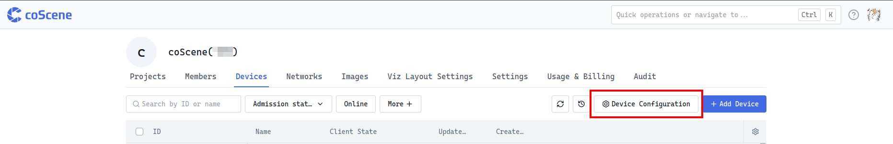
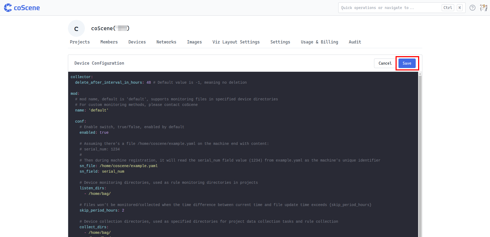

# Data Collection Client Configuration

> Devices with granted access can automatically upload data to projects according to data collection rules. Collection rules apply to all devices using a shared configuration. If you need to divide collection rules by project, please refer to [About Automatic Data Collection and Diagnostics](../use-case/data-diagnosis/1-intro.md) to use the rule engine to meet your requirements.

## About Data Collection Client Configuration

<div style={
{ 
    padding: '12px 16px', backgroundColor: '#EFF6FF', borderRadius: '4px',  border: '1px solid', borderColor: '#2563EB', color: '#111827' }
}>
<p style={{margin: 0}}>🤖 Permission: Only **Organization Administrators** can edit collection rules, which apply uniformly to all organization devices</p>
</div>
<br />
Data collection configuration is managed by organization administrators and applies to devices with installed data collection clients within the organization. These devices automatically monitor data based on collection rules, and all organization devices share one set of collection configurations.

If you need to divide collection rules by project, please refer to [About Automatic Data Collection and Diagnostics](../use-case/data-diagnosis/1-intro.md) to use the rule engine to meet your requirements.

During collection configuration, you need to define key information such as device ID location, device monitoring directory, client initialization monitoring time range, collection directory, rule trigger topics, and client auto-update mechanism. After device access is granted, it will actively pull the organization's configured collection rule information and run dynamically on the machine end accordingly.

## Entry

On the "Devices" tab of the organization management page, click the [Device Configuration] button to enter the data collection client configuration editing interface. YAML language is used for editing here.



After completing the configuration, click [Save], and the configuration will take effect immediately for all organization devices with granted collection client access.



## Collection Rule Format Details

Collection rules primarily configure 5 modules:

| Module Name | Function Description |
| ----------- | ------------------- |
| Data Collector Settings (collector) |  Check if the same file exists in the cloud before uploading data |
| Storage Settings (mod) | Device ID storage location; monitoring directory; client initialization monitoring time range; collection directory |
| Device Event Properties (device) | Event attribute values |
| Rule Trigger Topics (topic) | Rule trigger topics |
| Upload Manager (upload) | Upload manager |                                            |

Example template as follows:

```yaml
collector:
  skip_check_same_file: false # By default, checks if a file with the same sha256 exists in the cloud. If it exists, skips upload and directly references the cloud file to avoid duplicate uploads

mod:
  # mod name, default is 'default'
  name: 'default' 

  conf:
    # Enable switch, true/false, enabled by default
    enabled: true 
    
    # Assuming there's a file /home/coscene/example.yaml on the machine side with content:
    # serial_num: 1234
    #
    # The corresponding configuration will read the value of the serial_num field (1234) from example.yaml as the machine's unique identifier during the machine registration phase
    sn_file: /home/coscene/example.yaml
    sn_field: serial_num
    
    # (Used for rule-based collection) Monitoring directories on the device side, used as the monitoring directories for rules in the project
    listen_dirs: 
      - /home/bag/

    # (Used for rule-based collection) When the current time exceeds the file update time by more than {skip_period_hours} hours, the file will not be monitored
    skip_period_hours: 2

    # (Used for rule-based & manual collection) Collection directories on the device side, used as specified directories for data collection tasks and rule collection in the project
    collect_dirs: 
      - /home/bag/
      - /home/log/

    # (Used for rule-based collection) Recursive directory traversal setting - whether to traverse all nested subdirectories for listen_dirs and collect_dirs, defaults to false
    recursively_walk_dirs: false

    # (Used for manual collection) Additional files to upload during manual collection tasks - supports both folders and files with absolute paths; supports time variable templates
    additional_files:
      - /home/just2004noetic/Downloads/testcase
      - /additional_files/{{start_time.format('YYYY-MM-DD')}}/log/

# (Used for rule-based collection) Assuming the machine has a /home/coscene/device.yaml file with the following content:
# soft_version: v1.0
#
# When the device triggers a rule, it will read the value of soft_version: v1.0 from the device.yaml file as an attribute for the generated event.
# To view the event statistics panel, please contact coScene
device:
  extra_files:
    - /home/coscene/device1.yaml
    - /home/coscene/device2.yaml

# (Used for rule-based collection) Topics, used as the source of options for rule trigger topics in the project to narrow down the scope of rule matching
# Assuming there's an /error_code topic
topics:
  - /error_code

# Upload Manager Configuration
upload:
  rate_limit: 5MB
```

Let's go through each function and its usage:

### Data Collector Settings (collector)

This module is used to set whether to check the data to be uploaded. Files with the same sha256 will be skipped and directly referenced to the cloud file, reducing the amount of data uploaded and improving data collection efficiency.

```yaml
collector:
  skip_check_same_file: false # By default, checks if a file with the same sha256 exists in the cloud. If it exists, skips upload and directly references the cloud file to avoid duplicate uploads
```

### Storage Settings (mod)

Mainly responsible for configuring device-end data storage location information:

- `name`: Default name is `default`, supports monitoring files in specified device directories. For custom monitoring methods, please contact coScene.

- `enabled`: Enable switch, `true/false`, enabled by default.

- `sn_file`: Assuming there's a corresponding file on the machine end (e.g., `/home/coscene/example.yaml`) containing a unique device identifier (e.g., `serial_num: 1234`), during machine registration, it will read the specified field value (`1234`) as the machine's unique identifier.

- `sn_field`: Corresponding identifier field name.

- `listen_dirs`: (Used for rule-based collection) Device monitoring directories, used as rule monitoring directories in projects.

- `skip_period_hours`: (Used for rule-based collection) Files won't be monitored when the time difference between current time and file update time exceeds `{skip_period_hours}`.

- `recursively_walk_dirs`: (Used for rule-based collection) Whether to traverse files in nested subdirectories when monitoring and collection directories contain subdirectories. Defaults to false, only reads files in the current directory level.

- `collect_dirs`: Device collection directories, used as specified directories for project data collection tasks and rule collection.

- `additional_files`:
  - Used for manual collection
  - Optional field
  - During manual collection tasks, supports collecting additional file information (such as maps, logs, etc.). Supports both folder and file absolute paths. Folders will be recursively traversed for all subfiles.
  - Paths support template variables, such as `/home/{{start_time.format('YYYY-MM-DD')}}/log/`. Template variables will be replaced with corresponding collection task time information during collection tasks. Variables will be dynamically updated based on the selected collection start and end times. For specific syntax, please refer to [Template Syntax Usage](#template-syntax-usage)


```yaml
mod:
  # mod name, default is 'default'
  name: 'default'

  conf:
    # Enable switch, true/false, enabled by default
    enabled: true

    # Assuming there's a file /home/coscene/example.yaml on the machine end with content:
    # serial_num: 1234
    #
    # Then during machine registration, it will read the serial_num field value (1234) from example.yaml as the machine's unique identifier
    sn_file: /home/coscene/example.yaml
    sn_field: serial_num

    # (Used for rule-based collection) Device monitoring directories, used as rule monitoring directories in projects
    listen_dirs:
      - /home/bag/

    # (Used for rule-based collection) Files won't be monitored/collected when the time difference between current time and file update time exceeds {skip_period_hours}
    skip_period_hours: 2

    # Device collection directories, used as specified directories for project data collection tasks and rule collection
    collect_dirs:
      - /home/bag/
      - /home/log/

    # (Used for rule-based collection) Recursively traverse all subdirectories under /home/bag/ and /home/log/
    recursively_walk_dirs: false

    # (Used for manual collection) For manual collection task starting at 2025-06-27 14:00:00, additionally upload all files from /home/just2004noetic/Downloads/testcase and /home/2025-06-27/log directories, including subdirectories
    additional_files:
      - /home/just2004noetic/Downloads/testcase
      - /home/{{start_time.format('YYYY-MM-DD')}}/log/
```

### Device Event Properties (device)

Assuming there's a specific file on the machine end (e.g., `/home/coscene/device.yaml` with content `soft_version: v1.0`), after device rule triggering, it will read the specified content (e.g., `soft_version: v1.0`) as the generated event's attribute value. Additional related files can be configured through `extra_files`.

```yaml
# (Used for rule-based collection) Assuming there's a file /home/coscene/device.yaml on the machine end with content:
# soft_version: v1.0
#
# After device rule triggering, it will read soft_version: v1.0 from device.yaml as the generated event's attribute value
# To view the event statistics panel, please contact coScene
device:
  extra_files:
    - /home/coscene/device1.yaml
    - /home/coscene/device2.yaml
```

### Rule Trigger Topics (topic)

Topics serve as options for rule trigger topics in projects, helping narrow down rule matching scope and improve monitoring efficiency. For example, assuming there's an `error_code` topic:

```yaml
# (Used for rule-based collection) Topics serve as options for rule trigger topics in projects to narrow down rule matching scope
# Assuming there's an error_code topic
topics:
  - error_code
```

### Upload Manager (upload)

Used to control certain functions during upload, such as upload rate limiting.

```yaml
upload:
  # Controls the maximum upload speed. 0MB means no limit. Units supported: MB, MiB, KB, KiB
  rate_limit: 5MB
```

---

## Template Syntax Usage
Template syntax is a powerful tool for dynamically generating strings, particularly suitable for dynamically generating file paths and filenames based on time ranges. Based on the [Handlebars](https://handlebarsjs.com/) template engine, integrated with the [Day.js](https://day.js.org/) time processing library.

By mastering these template syntaxes, you can easily create dynamic file paths and filenames, greatly improving the flexibility and automation of data management.

### Supported Variables

Currently supports the following two time variables:

- `start_time` - The start time of the current collection task
- `end_time` - The end time of the current collection task

Basic template format:

```
{{variable_name.format('format_string')}}
```

Examples:

```javascript
// Basic usage
'{{start_time.format("YYYY-MM-DD")}}'
// Output: "2021-01-01"

// Combined usage
'data/{{start_time.format("YYYY")}}/{{start_time.format("MM")}}/file.log'
// Output: "data/2021/01/file.log"
```

### Time Formatting
Based on [Day.js formatting documentation](https://day.js.org/docs/en/display/format), supports the following formats:

| Format | Output | Description |
|--------|--------|-------------|
| `YYYY` | 2021 | 4-digit year |
| `YY` | 21 | 2-digit year |
| `MM` | 01-12 | Month (zero-padded) |
| `M` | 1-12 | Month |
| `DD` | 01-31 | Date (zero-padded) |
| `D` | 1-31 | Date |
| `HH` | 00-23 | Hour (zero-padded) |
| `H` | 0-23 | Hour |
| `mm` | 00-59 | Minute (zero-padded) |
| `m` | 0-59 | Minute |
| `ss` | 00-59 | Second (zero-padded) |
| `s` | 0-59 | Second |

Formatting examples:

```javascript
// Date formats
'{{start_time.format("YYYY-MM-DD")}}'          // 2021-01-01
'{{start_time.format("YYYY/MM/DD")}}'          // 2021/01/01
'{{start_time.format("MM-DD-YYYY")}}'          // 01-01-2021

// Time formats
'{{start_time.format("HH:mm:ss")}}'            // 10:30:00
'{{start_time.format("HH-mm")}}'               // 10-30

// Combined formats
'{{start_time.format("YYYY-MM-DD HH:mm:ss")}}' // 2021-01-01 10:30:00
'{{start_time.format("YYYYMMDD_HHmmss")}}'     // 20210101_103000

// Folder structure organized by year/month/day
'logs/{{start_time.format("YYYY")}}/{{start_time.format("MM")}}/{{start_time.format("DD")}}'
// Output: logs/2021/01/01

// Time range folders
'data/{{start_time.format("YYYY-MM-DD")}}_to_{{end_time.format("YYYY-MM-DD")}}'
// Output: data/2021-01-01_to_2021-01-02
```

### Reference Documentation

- [Handlebars Official Documentation](https://handlebarsjs.com/guide/)
- [Day.js Official Documentation](https://day.js.org/docs/en/display/format)
- [Day.js Formatting Options](https://day.js.org/docs/en/display/format#list-of-all-available-formats)

---

Through these detailed steps and instructions, administrators can comprehensively and accurately configure the device data collection client, ensuring efficient operation of device data collection.

If you have any questions, please feel free to contact us for support.

