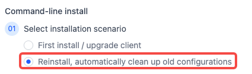
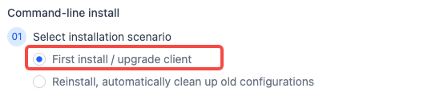
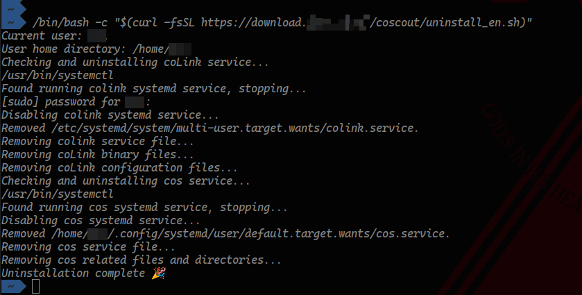
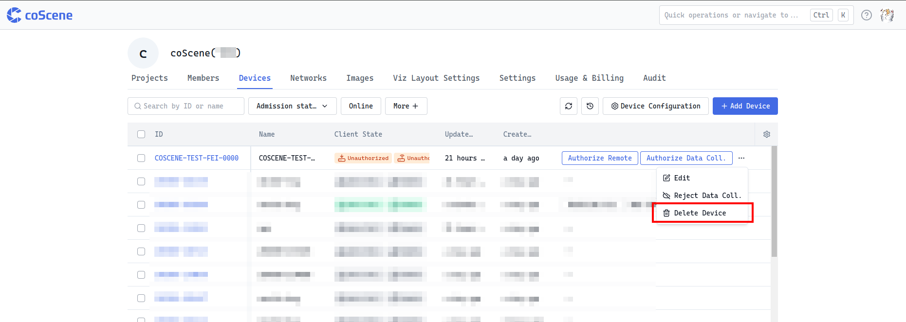

# Device Replacement, Upgrade, and Uninstallation Guide

## Overview

This guide is applicable when devices need to change their host computer, modify device ID, upgrade client, or uninstall client. It provides detailed operational steps and troubleshooting methods for operations, technical support, and development personnel to ensure stable operation and effective management of devices on the platform.

## Device Replacement Process

### Applicable Scenarios

When replacing a device's host computer or modifying device ID, follow this process to re-execute commands for device installation and registration.

### Operation Steps

1. Click the [Add Device] button on the "Organization Devices" page

   

2. Get Installation Command

- Ensure the device ID information is correct

- Select required client installation options

- Check "Initialize Program Configuration" to clear old configuration files

  

3. Execute Command on Device Terminal

   Open the device terminal, paste and execute the copied command. Ensure stable network connection and proper terminal environment during execution

   

4. Re-grant Device Access. After installation, contact the organization administrator to re-grant device access on the platform's device management page to restore normal device operation.

   

## In-place Version Upgrade Process

### Applicable Scenarios

When only software version upgrade is needed, without changing the host computer or device ID, follow this in-place version upgrade process.

### Operation Steps

1. Click the [Add Device] button on the "Organization Devices" page

   

2. Get Installation Command

3. Ensure the device ID information is correct

4. Select required client installation options

5. In the program configuration area of the Add Device page, uncheck [Initialize Program Configuration] to avoid affecting ongoing collection tasks.



3. Execute Command on Device Terminal

1. Open the device terminal, paste and execute the copied command. Ensure stable network connection and proper terminal environment during execution


4. Re-grant Device Access. After installation, contact the organization administrator to re-grant device access on the platform's device management page to ensure normal operation of the upgraded device.

   

## Client Uninstallation Process

1. Execute the following command in the terminal

```yaml
/bin/bash -c "$(curl -fsSL https://download.coscene.cn/coscout/uninstall.sh)"
```

2. Closely monitor the output during execution until the uninstallation process is complete, ensuring that coLink service, cos service, and their related configuration files and directories are successfully removed

   

3. The device data is still retained in the backend database. If the device is no longer needed on the platform, click the [Delete] button in the organization devices to remove it

   

## FAQ

1. **Cloud collection task created but device not uploading data**

- Check if the device is connected to the network, ensuring stable connectivity for data upload.

- Verify if data is being generated on the device during the specified time period, confirming normal data generation functionality.

- Check if two devices are using the same device ID. If so, change the SN of one device and reinstall to avoid data conflicts.

- Check if a replaced host computer is being directly used on another machine. If so, execute the uninstallation command or reinstall on that host computer to ensure proper device environment isolation.
