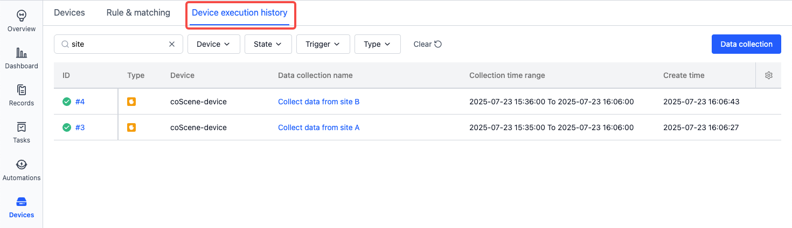
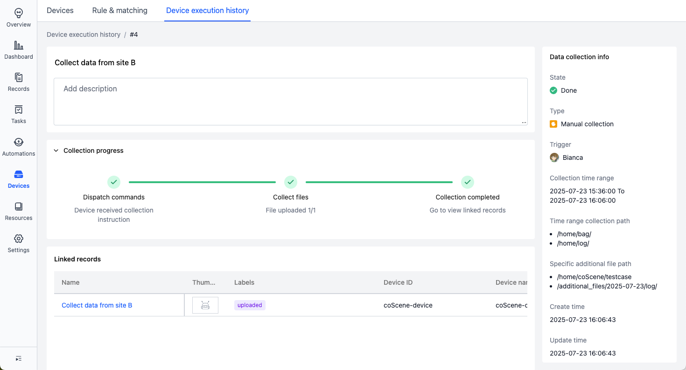
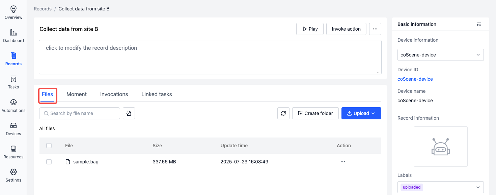
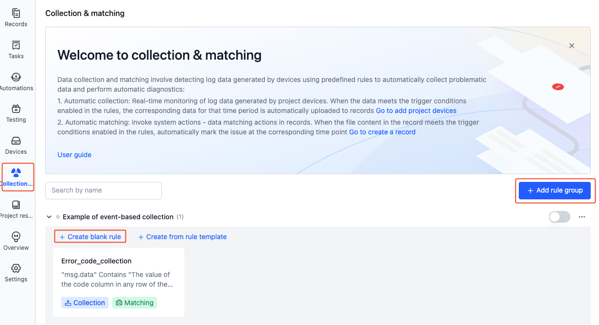

# Device Data Collection

The platform provides multi-mode data collection capabilities to meet various operational scenarios:

1. **Manual Collection**
   - Specify time ranges and target paths freely
   - Use cases: Troubleshooting, targeted data capture, ad-hoc analysis

2. **Rule Engine Driven Collection**
   - Real-time monitoring of device message streams with dynamic triggers
   - Use cases: Event codes, threshold alerts, anomaly detection for unattended automation

3. **Visualization Integrated Collection**
   - Start/stop collection via real-time 3D visualization interface
   - Use cases: Scenario-based coordinated collection

## Manual Collection {#manual-collection}

> Prerequisite: Device registration and enabled, added to project (see [Add Device](./2-create-device.md))

Collect existing files from devices including logs, images, and configurations.

1. Navigate to Project Devices → Select device → Click "Collect Data"

   
   

2. Configure parameters:

   

    - **Time Range**
      - Based on file creation/modification timestamps (Note: Some filesystems may not provide creation time)

    - **Collection Path**
      - Absolute path (e.g., `/home/bag/`)
      - Recommend pre-configuring in [Device configuration](./4-device-collector.md#collection-rule-format-details)

    - **Additional Files**
      - Paths to collect regardless of time (files/directories)
      - Pre-configure in [Device configuration](./4-device-collector.md#collection-rule-format-details)

    - **Naming Convention**
      - Collection Name: Identifier for collection job
      - Record Name: Target storage record

3. During the collection process, you can view the progress in the device execution history.

    
    

4. After the collection is complete, the data will be automatically uploaded to the record.

   
   

## Rule-Driven Collection

> Prerequisite: Device registration and enabled, added to project (see [Add Device](./2-create-device.md))

The system will monitor device message streams according to rules in the device's project, collecting data for a period before and after rule trigger points, such as:

- **Topic Monitoring Collection**: Real-time monitoring of device topics, automatically uploading data when messages trigger rules
- **Bag/MCAP Monitoring Collection**: When bag/mcap writing is complete, matching rules against file content, automatically uploading data

### Data Format

See [Specific Data Format](../use-case/data-diagnosis/3-add-rule.md#specific-data-format)

### Configure Monitoring/Collection Directories

> Only organization administrators can configure

In Organization Management - Devices - Device Configuration, enter directories for monitoring and collection: `listen_dirs`, `collect_dirs`. To monitor topics for collection, add `topics` definition. See [Device Configuration](./4-device-collector.md#collection-rule-format-details)

### Topic Monitoring Collection

Taking monitoring device topic `/error_status` as an example, when event codes `1001 ~ 1005` appear in the `data` field of this topic, automatically collect data from 5 minutes before to 1 minute after this time point, saving to a record. Message content as follows:

1.  Make sure the topic listener ([coListener](https://github.com/coscene-io/coListener/tree/cpp)) is installed and enabled on the device. This node is part of the ROS suite. If the ROS node is already installed and running, you do not need to install it again:

  - See the [coListener installation guide](../client/2-apt-source-install.md)
  - Enable coListener

      ROS1:

      ```
      roslaunch colistener colistener.launch
      ```

      ROS2:

      ```
      ros2 launch colistener colistener.launch.xml
      ```

2.  Add and enable rules in the project
    - On the project's "Rule & matching" page, add rules

      
      

    - Enter event detection information
      - Topic of interest: Select the topic to monitor `/error_status`
      - Event code table: Upload a csv/json file in the correct format, used to determine if topic messages contain content from the `code` column, as shown below:

        

      - Rule trigger condition: msg.data contains any value from the code column in the event code table
        - If the data field is an array, switch to "Code mode" and enter: msg.data.exists(x, x.code.contains(scope.code)).E.g.:

          ```
           {
           	"events_count": 3,
           	"events_info": [{
           			"code": "10031",
           			"msg": "camera disconnected",
           			"level": "p1"
           		},
           		{
           			"code": "20256",
           			"msg": "navigate to workstation failed",
           			"level": "p2"
           		},
           		{
           			"code": "30221",
           			"msg": "low battery",
           			"level": "p1"
           		}
           	]
           }
          ```

      The above information means: Monitor topic `/error_status`, determine if keywords `1001 ~ 1005` are present in its `data` field messages

    - Collect data
      - Time range:
        - Collect files from `collect_dirs` from 5 minutes before to 1 minute after the trigger point
        - Time determination basis: Get start and end times from file content
      - Record: Used to identify the record where each collection's data will be saved
        - E.g.: `code: {scope.code}-name: {scope.name}`, when event code `1002` is triggered, this collection's data will generate a record named "code:1002-name:Target point unreachable! Please assist"
    - Key moment positioning
      - When data is uploaded to the record, automatically "create a moment" at the trigger point, marking the key moment for subsequent problem analysis

3.  View collection results
    When messages from the monitored topic on the device trigger rules, data will be automatically uploaded to records

        

### Bag/MCAP Monitoring Collection

Same as steps 2-3 of topic monitoring collection, no need to use coListener.

Note: Only complete bag/mcap files are supported for monitoring. Real-time monitoring and collection of `.bag.active` files is currently unavailable. To collect complete bag files, set the data collection time range to "n minutes after collection" and initiate collection after the bag file writing process is completed.

## Visualization-Linked Collection

See [Heterogeneous Robot Data Collection Factory](../use-case/5-heterogeneous-robot-data-factory.md)

## Learn More

- [Adding Rules](../use-case/data-diagnosis/3-add-rule.md)
- [Visualize data playback](../viz/1-about-viz.md)
