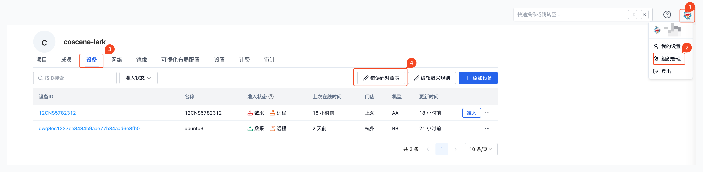

# Error Code Reference Table

> Configure as needed. Only devices with event error codes can use the error code reference table feature, and only administrators can configure it.

The error code reference table manages the mapping between error codes and error messages. It is mainly used for:

- Assisting in viewing event whitelist settings in data collection rules
- Mapping error codes to error messages in records created by automated data collection

## Edit Error Code Reference Table

Go to the "Device" tab in the organization management page and click the [Error Code Reference Table] button to edit.



## Error Code Reference Table Format

The error code reference table format is as follows:

```yaml
msg:
  - code: '1001'
    messageCN: Machine cannot move # Error code: 1001, Error message: Machine cannot move
  - code: '1002'
    messageCN: Task ended abnormally # Error code: 1002, Error message: Task ended abnormally
```

Note: When using a custom version (i.e., mod name is not "default"), the error code format may be customized. Please contact Coscene for specific details.
