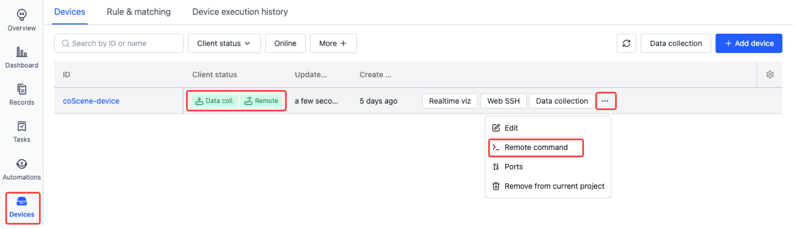
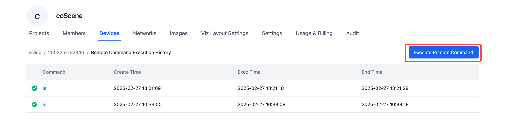
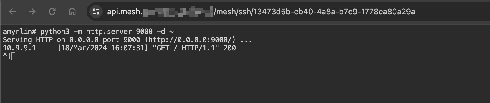

# Remote Device Control

The coScene platform enables real-time remote device operations, such as remote command execution and SSH connections, enhancing operational capabilities.

## Prerequisites

1. The device has coScene client programs installed. For details, please refer to [Device Installation](./2-create-device.md#add-device-from-device).
2. The organization administrator has granted device access and permitted remote control operations. For details, please refer to [Enable Device](./3-manage-device.md#enable-device-client).

## Real-time Visualization

Before device visualization, you need to install the coBridge component on the target machine. This component will run as a separate ROS node and transmit subscribed data to the frontend through the WebSocket protocol.

coScene provides [coBridge source code (C++)](https://github.com/coscene-io/coBridge), which currently supports ROS distributions including ROS1 <u>Noetic Ninjemys</u>, <u>Melodic Morenia</u>; ROS2 <u>Foxy Fitzroy</u>, <u>Galactic Geochelone</u>, <u>Humble Hawksbill</u>. For other version requirements, please contact the coScene team.

We strongly recommend users to compile the executable using the source code provided by coScene [compilation process documentation](https://github.com/coscene-io/coBridge/blob/main/README.md)), integrate it into the robot software, and add the command `ros2 launch cobridge cobridge_launch.xml` (or `roslaunch cobridge cobridge_launch.xml`) to the robot startup script.

After the coBridge node starts, combined with the public network address and port mapped by virmesh, you can subscribe to robot topics and issue services through the web interface, achieving remote real-time visualization of the robot.

After device access is granted, you can view devices in the "Devices" page under "Organization Management". A [Real-time Visualization] button will appear, which allows you to connect and view the device's real-time status.

## Web SSH

After device access is granted, you can view devices in the "Devices" page under "Organization Management". A [Web SSH] button will appear, which opens a new browser tab to establish an SSH connection to the device.

The page comes with [Trzsz file transfer tool](https://trzsz.github.io/cn/) by default. Users can upload local files to the remote device using the `trz file1` command, and download files from the remote device using `tsz file1 file2 file3`. For more advanced usage, please refer to the [detailed documentation](https://trzsz.github.io/cn/).

## Remote Command

When a device is online remotely, users can execute specific tasks by sending commands through the Remote Command feature. You can also perform [batch operations](./6-batch-device-operations.md) on multiple devices simultaneously.

Click the [Execute Remote Command] button, enter the command you want to execute in the popup window, and click the [Confirm] button to execute the command on the device.

After the command executes successfully, you can view the log results.

## Port Forwarding

When a device doesn't have a public IP, users cannot directly access its ports. The port forwarding feature allows device ports to be forwarded, making them accessible over the public network. This is useful for temporarily exposing device services or debugging local connections.

Here's a simple example. Using the [Web SSH] feature, we connect to the remote device and run `python3 -m http.server 9000 -d ~` to start a simple HTTP Server that serves files from the `~` directory. The server listens on port 9000, which we then configure for forwarding. After this, we can access the forwarded address from our local browser to reach the device.

1. Configure port 9000 forwarding in the web interface
   

2. Start a simple HTTP Server using Web SSH by executing `python3 -m http.server 9000 -d ~`
   

3. Access the forwarded address in the browser to see all files in the device's `~` directory
   

4. Check the device logs to confirm that browser requests are being forwarded and returning 200 status codes
   