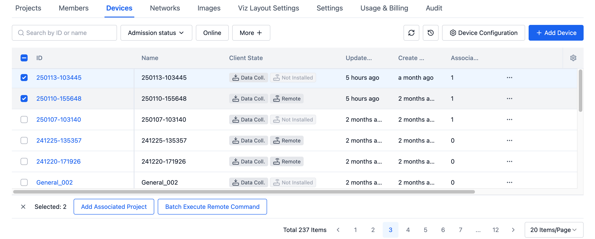
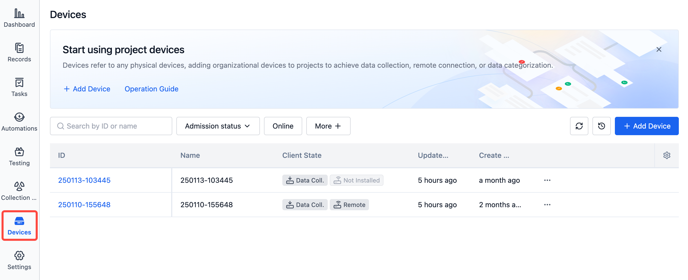
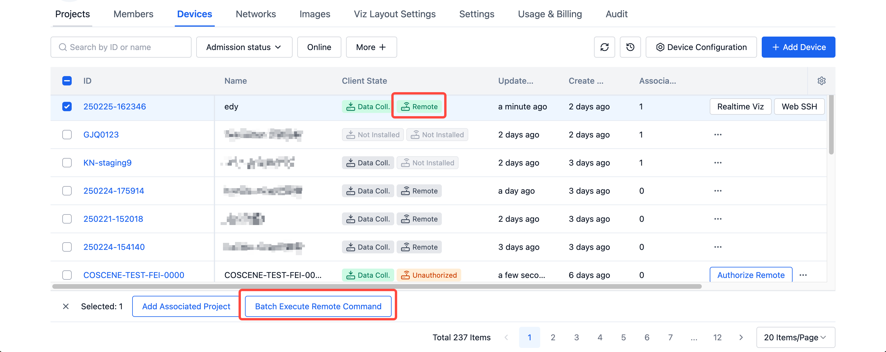
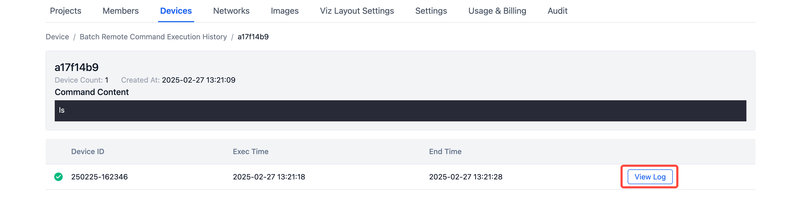
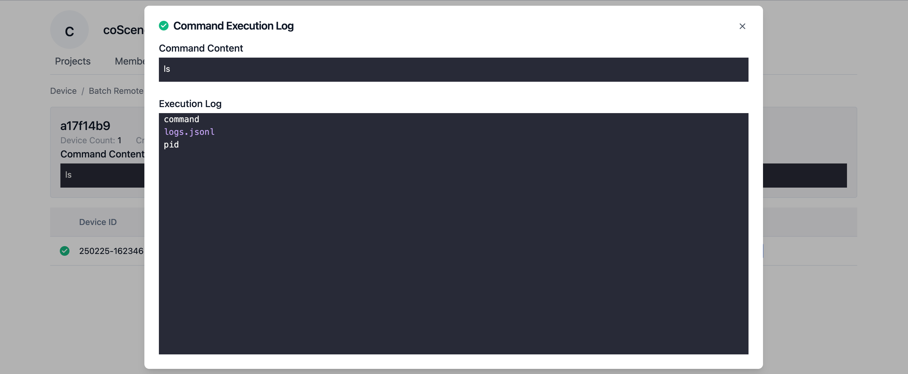
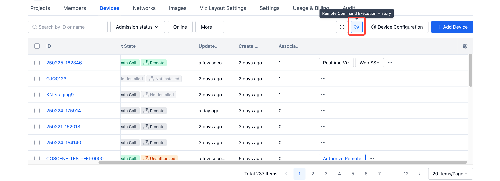
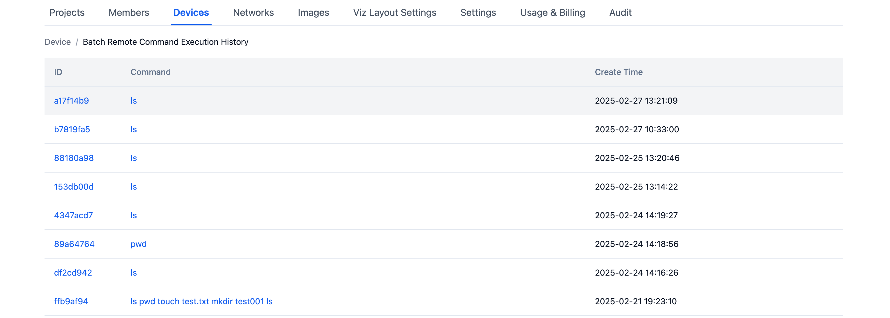

# Batch Device Operations
You can select multiple devices simultaneously for batch operations.

## Data Collection Access {#data-collection-access}
Administrators can select multiple devices that do not have the client enabled and click the [Enable Client] button to enable the devices in batches.

## Add Associated Projects {#add-associated-projects}
Select the devices you want to add, click the [Add Associated Projects] button, choose the projects you want to add, and click the [Add] button to add the devices to the projects.

After successful addition, you can view it in the project devices.

## Execute Remote Commands in Batch {#batch-remote-command}
Select online devices, click the [Batch Execute Remote Command] button, enter the commands you want to execute, and click [OK] to execute commands in batch.
If the command is not delivered to the device within 10 minutes, it will automatically timeout and terminate.

After the execution is complete, click the [View Logs] button to check the execution results.

View Batch Remote Command Execution History

