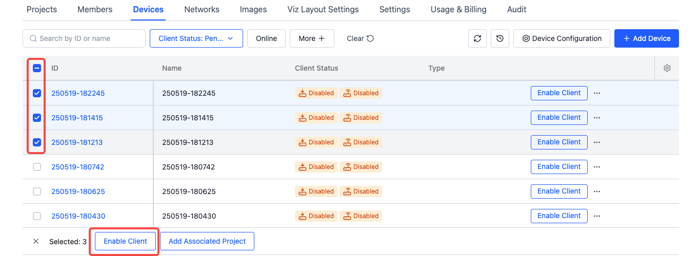

# Batch Device Operations
可以同时选择多台设备，进行批量操作。

## Data Collection Access {#data-collection-access}
管理员可以选择多台未准入数据采集的设备，点击【准入数采】按钮，批量准入设备。

## Add Associated Projects {#add-associated-projects}

## Execute Remote Commands in Batch {#batch-remote-command}
