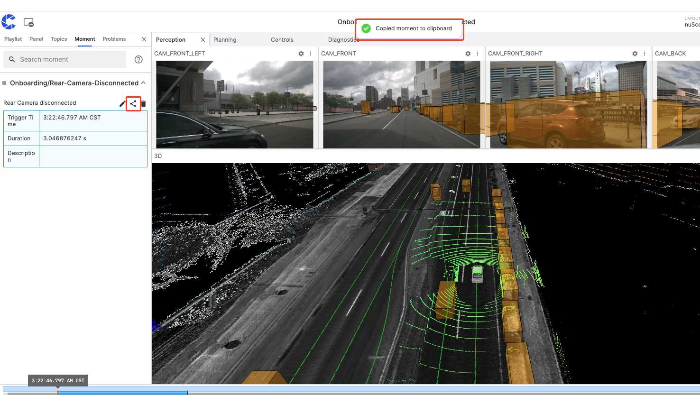

# Quick Start

## Login to coScene

coScene has two types of users: administrators and regular users. You can create or join an organization based on your role.

### Administrator

1. Visit [coScene Platform https://www.coscene.io/](https://www.coscene.io/) through your browser, click the【Login】button in the top right corner to enter the login page.

   

2. Choose a login method: Email or Google Workspace.

   

3. Fill in the "Organization Name" and "Organization ID", check "Agree", and click the【Create Organization】button.

   

4. After successful creation, you will automatically enter the organization homepage. You can start [managing your organization](../collaboration/organization/1-organizations.md) now.

### Regular User

> First, please contact your organization administrator to invite you to join the organization.

1. Visit [coScene Platform https://www.coscene.io/](https://www.coscene.io/) through your browser, click the【Login】button in the top right corner to enter the login page.

   

2. Choose the login method that matches your organization (Email or Google Workspace).

   

3. Select your organization to begin your data journey.

   

## Managing Multimodal Data

### Create Project

A project is the unit of data management, where data storage, management, isolation, and application take place. A project can represent a department, a project team, or a business line. For more information about projects, please refer to [Project](../collaboration/project-collaboration/1-project.md).

Click the "Create Project" button on the homepage and follow the guided steps to complete project creation.


### Create Record and Upload Files

A record is a collection of files describing similar scenarios, used for storing, managing, and visualizing data. A record can contain data generated during device failures, task execution data, small datasets for annotation, such as ROS Bags, logs, maps, configuration files, images, and videos. For more information about records, please refer to [Record](../collaboration/record/1-quick-start-record.md).

1.  In the project's left sidebar, select "Records" and click the【Create Record】button.

        

2.  Enter the record name and related information in the popup window, then click the【Create】button.

        

3.  After creation, you will automatically enter the record details page. Click the【Upload】button to upload bag/mcap files, or click [download sample file](https://coscene-download.s3.us-east-1.amazonaws.com/docs/example/viz/scene-0001.mcap) first.

        

### Visualize and Play Records

The data visualization interface uses configurable "panels" and "layouts" to present device data in an intuitive visual way, helping users efficiently analyze and diagnose various issues. For more information about visualization, please refer to [Visualize Data](../viz/1-about-viz.md).

1.  After uploading a bag/mcap file to the record, click【Play】to enter the visualization page.

        

2.  In the layout bar of the visualization page, select【Import from File】and import the <a href="https://coscene-download.s3.us-east-1.amazonaws.com/docs/example/viz/nuScenes.json" download="nuScenes.json">sample layout</a>.

        

3.  Click the【Play】button at the bottom to start playing the data. You can switch between different panels (such as 3D view, line chart, state transition diagram, table, etc.) to view the data. For more panel instructions, please refer to [Panel Introduction](../viz/4-panel/1-panel-overview.md).

        

### Create and Share Moments

While playing data in the visualization interface, you can create "moments" to mark important time points or periods. Moments help you track key data changes (such as device anomalies, performance fluctuations) and other noteworthy information for later review and analysis. For more information about moments, please refer to [Moment](../viz/5-create-moment-viz.md).

1.  While playing a record in visualization, click【Create Moment】in the lower left corner to mark the start point of a moment.

        

2.  Click【Create Moment】again to mark the end point. A moment creation window will automatically pop up, with the blue area indicating the moment's time range.

        

3.  Fill in the relevant information and click【Create Moment】to complete. View all moments of the current record in the moment panel on the left.

    

4.  Click the share button to share the current moment's link with other members for collaborative analysis.

        

## Remote Device Connection

Devices can establish connections with real devices, see [Device](../device/1-device.md) for details.

### Add Device

> Prerequisites: Supports Linux devices, arm64 and x86_64 architectures

1.  Through the top-right "My Account", enter the "Organization Management-Devices" page and click the【Add Device】button.

        

2.  In the popup window, select【System Generated ID】, check【Remote Control】, click the【Copy】button to copy the installation command.
    - To use a custom ID, see [Device ID Configuration](../device/2-create-device.md#device-id-configuration)
      

3.  Open a shell terminal on the real device, execute the installation command. When the device shows `Installation completed successfully 🎉`, the installation is successful.

4.  Wait for 1-2 minutes, the device will automatically appear in the device list. Contact the organization administrator to grant device usage permissions.

    

### Web SSH

After the device is granted access, find the device on the "Organization Management-Devices" page and click the【Web SSH】button to open a new tab in the browser for remote device connection. For more details, please refer to [Web SSH](../device/5-device-remote-control.md#web-ssh).


### Real-time Visualization

> Prerequisites:
>
> 1. Install coBridge component
>    - coBridge is a standalone ROS node that transmits device data to the frontend in real-time via WebSocket protocol
>    - Supported ROS versions:
>      - ROS1: <u>Noetic Ninjemys</u>, <u>Melodic Morenia</u>
>      - ROS2: <u>Foxy Fitzroy</u>, <u>Galactic Geochelone</u>, <u>Humble Hawksbill</u>
>    - [View coBridge source code (C++)](https://github.com/coscene-io/coBridge)
> 2. After starting the coBridge node, you can view real-time device data on the web

After the device is granted access, find the device on the "Organization Management-Devices" page and click the【Realtime Viz】button to view the device's operating status and data in real-time through the browser. For more details, please refer to [Real-time Visualization](../device/5-device-remote-control.md#real-time-visualization).


In the real-time visualization page, you can debug devices more intuitively by configuring panels such as 3D view, raw messages, service calls, and remote control. For more details, please refer to [Panel Introduction](../viz/4-panel/1-panel-overview.md).


## Collect Device Data

Devices can establish connections with real devices as data collection targets. In related records, you can add device information to achieve precise retrieval and comprehensive statistics of data uploaded from that device, see [Device](../device/1-device.md) for details.

### Add Device

> Prerequisites: Supports Linux devices, arm64 and x86_64 architectures.

1.  Through the top-right "My Account", enter the "Organization Management-Devices" page and click the【Add Device】button.

        

2.  In the popup window, select【System Generated ID】, click the【Copy】button to copy the installation command.
    - To use a custom ID, see [Device ID Configuration](../device/2-create-device.md#device-id-configuration)
      

3.  Open a shell terminal on the real device, execute the installation command. When the device shows `Installation completed successfully 🎉`, the installation is successful.

4.  Wait for 1-2 minutes, the device will automatically appear in the device list. Contact the organization administrator to grant device usage permissions.

    

### Manual Data Collection

1. **Add Device to Project**: Enter the "Project Devices" page, click the【Add Device】button to select the device for data collection.

   

2. **Configure Collection Directory**: Enter the organization device configuration page, set `collect_dirs` as the directories for storing data on the device, such as: `/home/bag/` and `/home/log/`.

   

   ```yaml
   mod:
     name: 'default'
     conf:
       enabled: true
       # Device collection directories, used as specified directories for project data collection tasks and rule collection
       collect_dirs:
         - /home/bag/
         - /home/log/
   ```

3. **Create Collection Task**: Enter the "Project-Tasks-Collection Tasks" page to create a collection task.
   - Select the device for data collection
   - Select the time range: collect files whose "file update time" is within the specified time period in the target data path
   - Target data path: default value is taken from `collect_dirs` in device configuration, or you can customize the path. If set to a folder, collect files within the time range in that folder; if set to a file, collect that file.
   - Task name: custom name

     

4. **View Collection Results**: Enter the "Project-Tasks-Collection Tasks" page, click the task name to view collection results. Collected data will be automatically saved to records.

   
   

### Automatic Data Collection

Automatic data collection uses predefined rules to continuously monitor device logs and automatically collect relevant data when specific conditions are triggered, enabling automatic analysis of device failures and early warning of potential risks. For more details, please refer to [Data Collection & Diagnosis](../use-case/data-diagnosis/3-add-rule.md).

1. **Add Device to Project**: Enter the "Project Devices" page, click the【Add Device】button to select the device for data collection.

   

2. **Configure Monitoring and Collection Directories**: Enter the organization device configuration page, set `listen_dirs` and `collect_dirs`

   

   ```yaml
   mod:
     name: 'default'
     conf:
       enabled: true
       # Device collection directories, used as specified directories for project data collection tasks and rule collection
       collect_dirs:
         - /home/bag/

       # Device monitoring directories, used as monitoring directories for project rules
       listen_dirs:
         - /home/bag/

       # Set file monitoring effectiveness: if a file's last update time is more than 2 hours from the current time, it will not be monitored by the system
       skip_period_hours: 2
   ```

3. **Create Rule**: Enter the "Project-Data Collection & Diagnosis" page to create a rule.

   

4. **Define Rule**: Define the rule's trigger conditions and collection behavior. Here's an example rule that automatically uploads data when detecting that the /spawn_entity node status is inactive in the mcap file:
   - Message in mcap file:

     

   - Rule name: Monitor /spawn_entity node status
   - Event matching condition: msg["nodes"][3]["state"] contains INACTIVE
   - Trigger actions: Collect data, Diagnose data
     - Collect data: Collect data before and after the trigger time point, save to record; collection directory is from `collect_dirs` in device configuration; file time is taken from file timestamp, if the time period to be collected overlaps with the file, the entire file will be uploaded.
     - Diagnose data: Create a moment at the trigger time point

     
     

5. **Confirm Rule**: Confirm that the rule is enabled and the target device has pulled the latest rule configuration.
   - Enable rule group: Click the enable button on the right of the rule group

     

   - Execute the following command on the device to check if the latest rule configuration has been pulled, looking for keywords `Updated rules`, `listen_dirs`, `collect_dirs`

     ```bash
     # View data collection client logs
     tail -f ~/.local/state/cos/logs/cos.log
     ```

     

6. **Trigger Rule**: Create mcap file in the device's `listen_dirs` and `collect_dirs` directories to trigger the rule
   - On the device, enter `listen_dirs` and `collect_dirs` directories, execute command to download [mcap file](https://coscene-download.s3.us-east-1.amazonaws.com/sample_data/rule_sample.mcap)

     ```bash
     # Enter listen_dirs directory
     cd /home/bag/
     # Download mcap file
     wget https://coscene-download.s3.us-east-1.amazonaws.com/sample_data/rule_sample.mcap
     ```

   - Execute command to view data collection client logs, check if the rule is triggered and data is uploaded, looking for keywords `triggered`, `upload all files successfully`

     ```bash
     # View data collection client logs
     tail -f ~/.local/state/cos/logs/cos.log
     ```

     

7. **View Collection Results**: On the "Project-Records" page, view the records automatically created by the device. Click the record name to enter details and view file and moment information. Play the record to view the collected data in the [Visualization](../viz/1-about-viz.md) page.

   
   | Content | Example |
   | :---: | :---: |
   | Files |  |
   | Moments |  |

## Learn More

- [Automate Data Processing](../6-automation/1-quick-start-workflow.md)
- [Changelog](https://docs.coscene.io/changelog)
