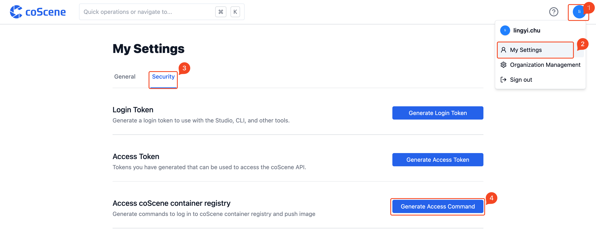
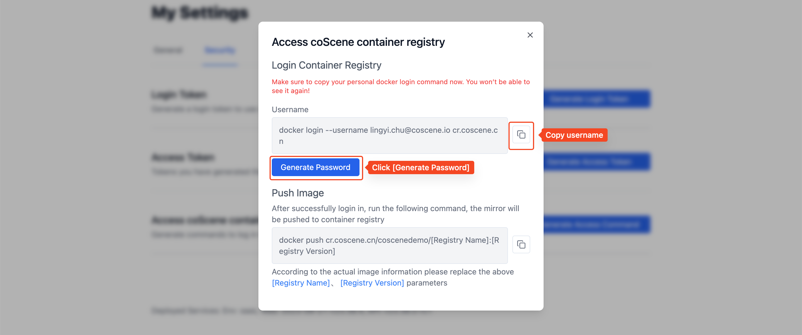
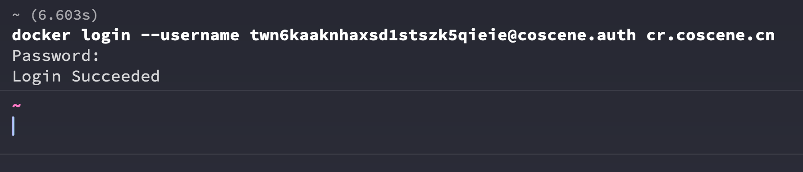

# Push Images

This article demonstrates how to push your images to the coScene container registry.

## Prerequisites

You should have a built image or have created a test image following the [Build Image](./2-build-image.md) process.

## Push Images to Docker Hub

You can refer to the documentation [Pushing a Docker container image to Docker Hub](https://docs.docker.com/docker-hub/repos/#pushing-a-docker-container-image-to-docker-hub).

## Push Images to coScene Container Registry

Each organization is automatically assigned a coScene image registry, usually in the form `cr.coscene.cn/<org-slug>`. Before pushing an image, authenticate local Docker against that registry.

### 1. Log in with coCLI (Recommended)

After completing [coCLI login](../developers/cocli/1-cli-install.md#login), run:

```bash
cocli registry login
```

`cocli` infers the image registry host from the current profile's OpenAPI endpoint and calls local Docker to complete the login. After login, tag the image with your organization registry path and push it:

```bash
docker tag local-image:latest cr.coscene.cn/<org-slug>/local-image:latest
docker push cr.coscene.cn/<org-slug>/local-image:latest
```

### 2. Generate Login Credentials in the Web UI

Log in to coScene platform, access [Profile Settings] from the user settings dropdown menu in the top right corner, then navigate to the [Security](https://coscene.cn/profile?section=security) page in [Profile Settings].

Click to generate access command to get the login command and password for the coScene container registry





Enter the login command with your username in the command line and authenticate using the credentials obtained earlier



### Push Images

After completing the build, you can use `docker push` to push the image to the coScene container registry.
