# Test Suite

## Introduction

A test suite is a collection of related test cases that provides a unified configuration management interface. It supports setting test names, runtime environments (images), test data (records), and other parameters to achieve standardized management of test cases.

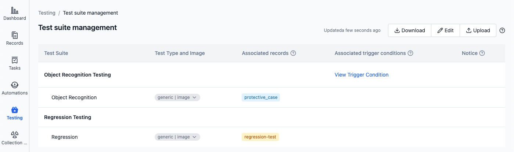

## Managing Test Suites

### Prerequisites

1. Ensure that test data has been stored as [records](../../collaboration/record/1-quick-start-record.md) and each record has been labeled

   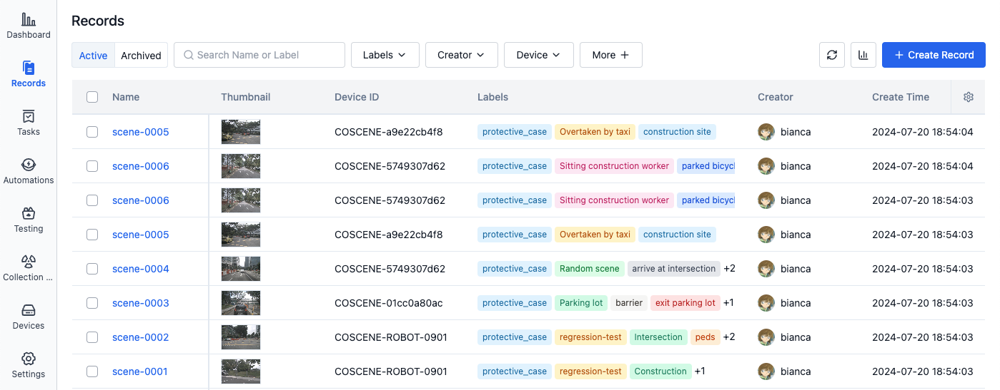

2. Ensure that the test environment (image) is ready and has been pushed to a public platform or [coScene Image Registry](../../image/1-about-docker-image.md).
   It is recommended to define test cases in the image:
   - Test cases support parsing, see [Defining Test Results](./6-status-and-output.md#defining-test-results)
   - Input and output directories for batch testing, see [System Directories](./1-intro.md#system-directories)

### Creating Test Suites

1. In the project's left sidebar, select "Testing" and click to enter the "Test Suite Management" page:

- First time editing test suite

  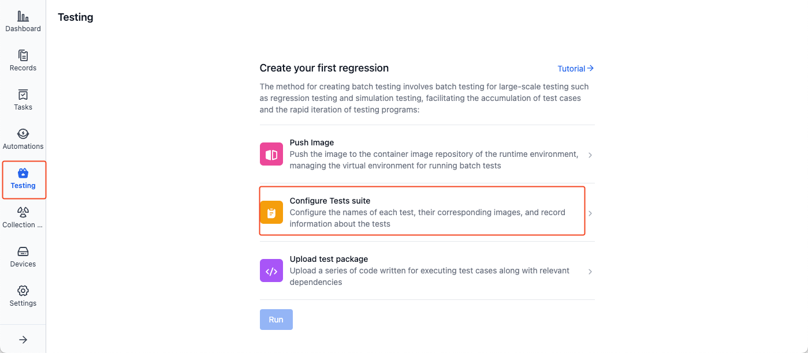

- Subsequent editing of test suite

  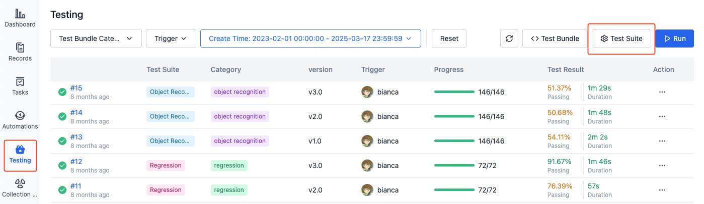

2. Click [Edit] to enter the test suite editing page:

   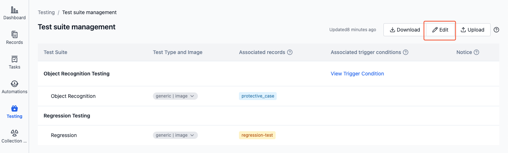
   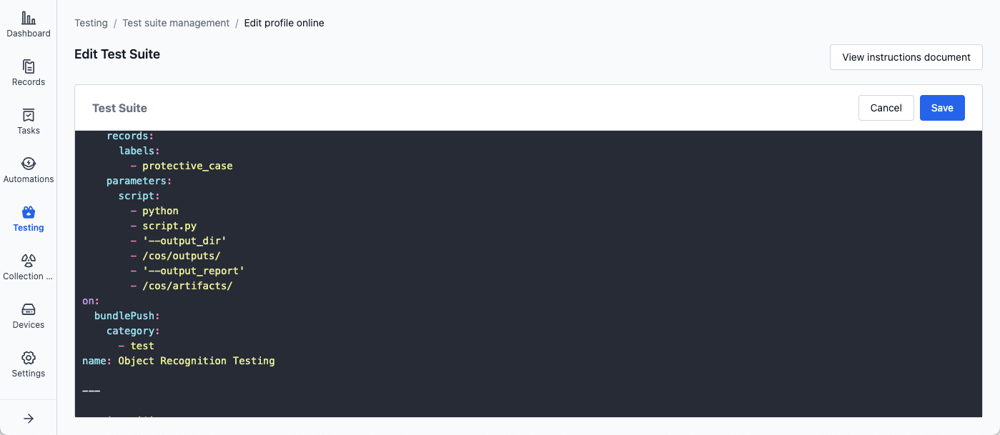

3. Fill in the test suite name, runtime environment, test data, and other information:

   ```yaml
   # Example file

   # Version number, currently supported version is "1"
   version: '1'

   # Test name is workflow name
   name: 'workflow name'

   # A job consists of one or more test suites that can be tested in parallel
   jobs:
     # First test suite named "test-1"
     - name: 'test-1'
       # Test type is "generic"
       type: 'generic'

       # Image address
       images:
         # Enter image address according to test type
         base: /coscene-hello/position:v1.0.0

       # Associated records
       records:
         # This test suite's associated record label is "sample"
         labels:
           - 'sample'

       # Run commands for this test suite
       parameters:
         script:
           - /bin/sh
           - -c
           - 'echo hello'

       # Message notification template for test suite "test-1"
       notifications:
         # Notify to DingTalk group
         - dingTalkBot:

     # Second test suite named "test-2"
     - name: 'test-2'

   # Control when to automatically trigger this test
   on:
     # Trigger when uploading test bundle that meets the following conditions
     bundlePush:
       # Condition: test bundle category is "test"
       category:
         - test
   ```

   - **version**: Version number, currently supported version is `'1'`
   - **name**: Test name
   - **jobs**: List of test suites
     - **name**: Test suite name
     - **type**: Test type, currently supported type is `'generic'`
     - **images**: Images for running test suite, supports using coScene Image Registry or public platform images
     - **records**: Records used when running this test suite, associated through labels
     - **parameters**: Parameters used when running this test suite
     - **notifications**: Message notification template sent after test suite completion
   - **on**: Automatic test triggering
     - **bundlePush**: Triggers when uploading test bundle whose "category" meets conditions

   For specific format details, see [Configuration Yaml Sample](./9-yaml-sample.md).

4. Click [Save] to save the test suite configuration file.

   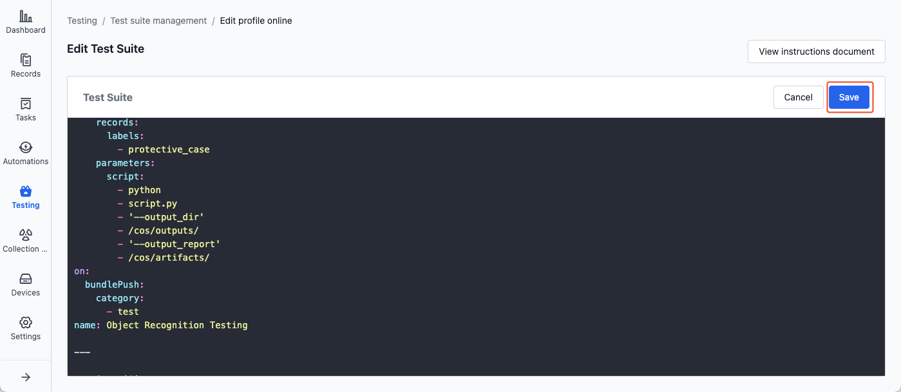

### Upload, Download, and Edit

> The test suite configuration file is cos.yaml, supporting direct upload, download, and editing.

1. In the project's left sidebar, select "Testing" and click to enter the "Test Suite Management" page:

   

2. Upload, download, or directly edit the configuration file:

   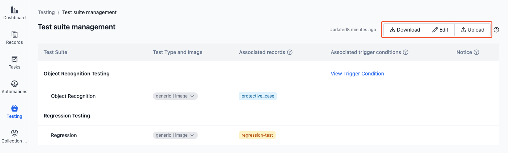

3. Click [Save] to save the test suite configuration file.

   

### View

After configuration file validation passes, the test suite management page will display the parsing results, including basic information, runtime environment, data associations, and trigger conditions of the test suite.

- Test name and test suite name

  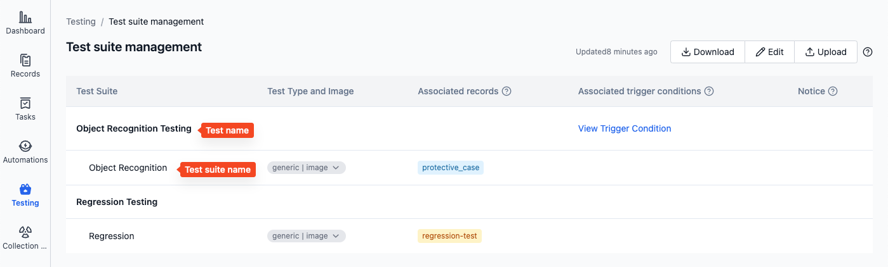

- Test type and image

  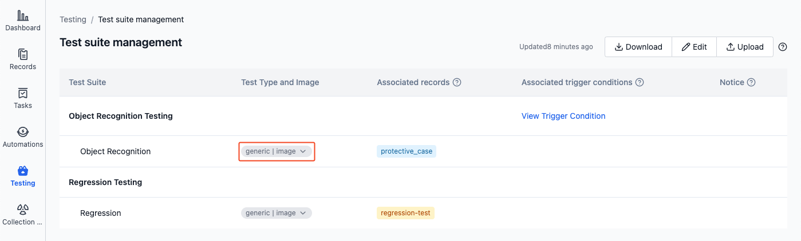

- Associated records

  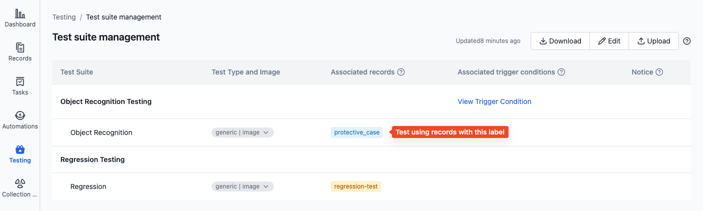

- Associated trigger conditions

  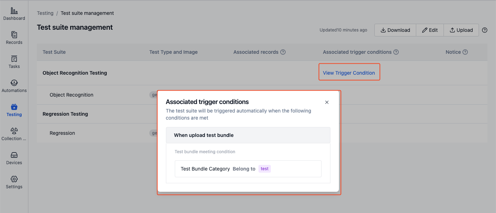

### Usage

When running batch tests, you can select a test suite, and the system will run tests according to the test suite configuration information.


## Learn More

- [Configuration Yaml Sample](./9-yaml-sample.md)
- [Test Bundle](./4-test-bundle-management.md)
- [Managing Test Results](./6-status-and-output.md)
- [Run a Cloud Test](./5-run.md)

## FAQ

1. **Q: Cannot save test suite, error message "Record error: Label does not exist: sample"**

   A: Please check if the test suite named "sample" has incorrect labels, such as non-existent or incorrectly written labels. Only existing labels are supported here. Learn [how to add labels to records](../../collaboration/record/3-manage-records.md#edit)

2. **Q: Cannot save test suite, error message "Please check yaml file format"**

   A: Please check if the test suite configuration file format is correct. If the configuration file format is incorrect, refer to [Configuration Yaml Sample](./9-yaml-sample.md)
