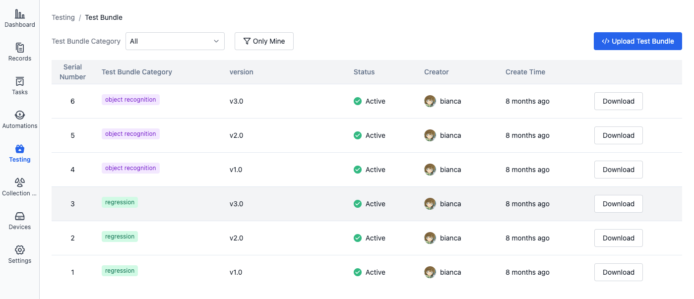
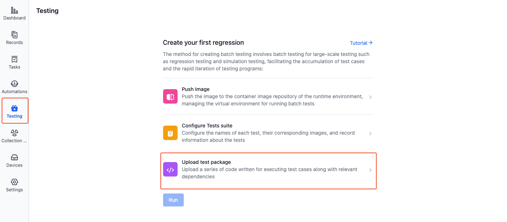
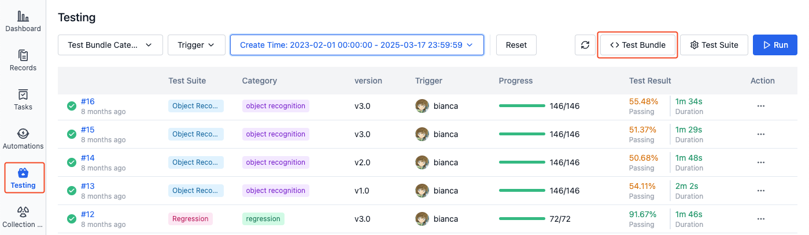
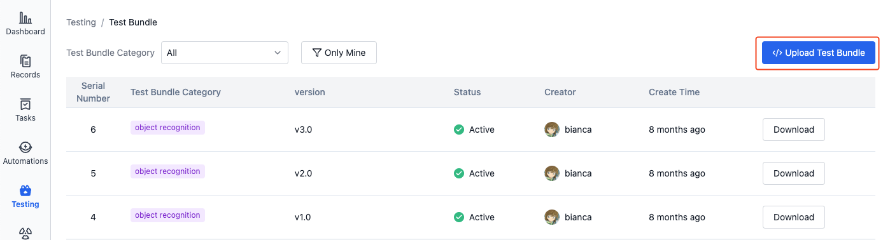
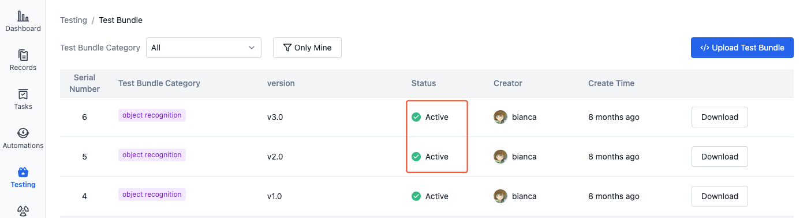
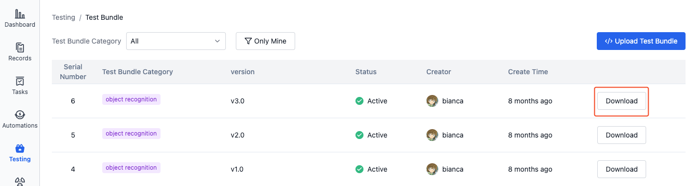

# Test Bundle
## Introduction
A test bundle is the code file being tested, which can be a .deb format file or a compressed file in .zip/.tgz/.tar.gz format.

## Managing Test Bundles
### Upload Test Bundle
1. In the project's left sidebar, select "Testing" and click to enter the "Test Bundle Management" page:

- First time uploading test bundle

  

- Subsequent uploads of test bundle

  

2. Click [Upload Test Bundle]:

    

3. Upload test bundle, fill in test category and version:

    

  - **Test Bundle Category**: Enter custom category information or select from existing test categories.

  - **Test Bundle Version**: Enter custom version information, such as `v0.1`
  
    Test category and version information can be used for automatic test triggering. See [Configuration Yaml Sample - Auto-Triggering Tests](./9-yaml-sample.md#auto-triggering)

4. After uploading the test bundle, when the "Status" column in the list shows "Active", it indicates that the test bundle has been successfully uploaded:

    

### Download
1. In the project's left sidebar, select "Testing" and click to enter the "Test Bundle Management" page:

    

2. Click the "Download" button for the test bundle in the list to download it:

    

### Usage
When running batch tests, you can select a specific version of the test bundle to execute test tasks. Test bundles can be identified by their sequence number, category, and version number.

## Learn More
- [Run a Cloud Test](./5-run.md)
- [Configuration Yaml Sample](./9-yaml-sample.md)
- [Managing Test Results](./6-status-and-output.md)
- [Test Suite](./3-config-management.md)