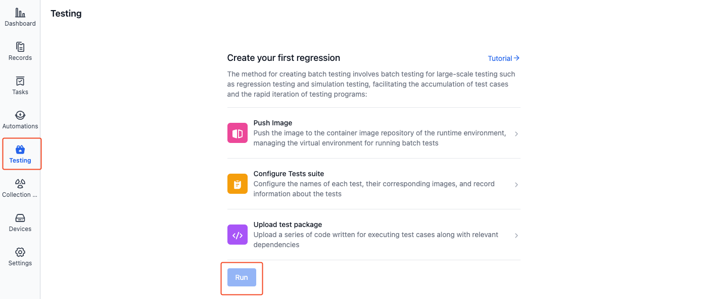
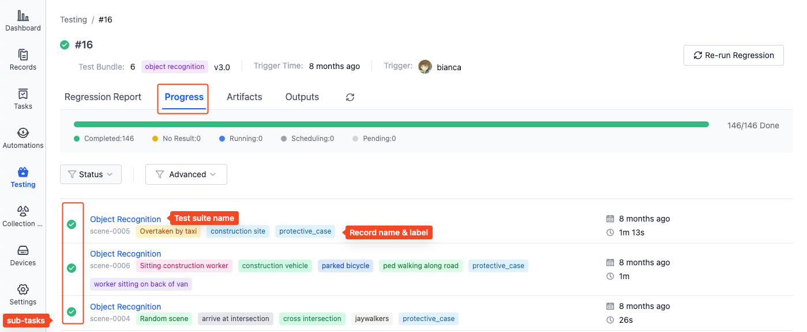
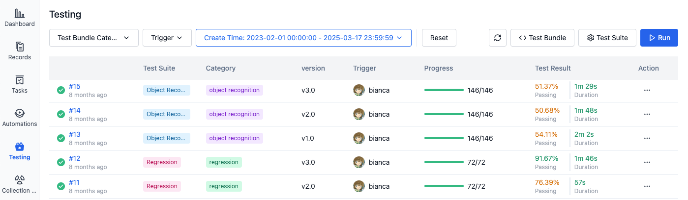
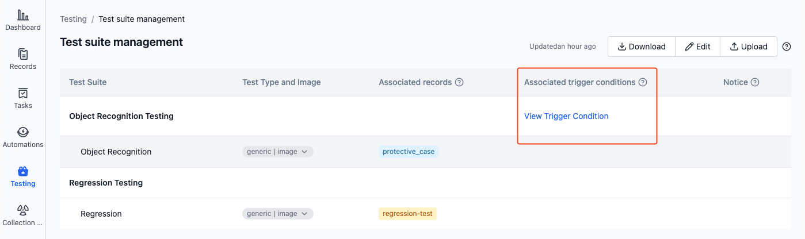

# Run a Cloud Test

> Learn how to run batch tests, including manual triggering and automatic triggering.

## Prerequisites
1. Created [Test Suite](./3-config-management.md)
2. Uploaded [Test Bundle](./4-test-bundle-management.md)

## Manual Execution

1. In the project's left sidebar, select "Testing" and click the [Run Batch Test] button

- First time running batch test

  

- Subsequent runs of batch test

  

2. In the Run Batch Test dialog, select the test bundle and test suite, then click [Confirm] to run the batch test.

    

3. The system will create independent test tasks for each record associated with the test suites. For example, when a test suite is associated with 10 records, the system will create 10 sub-tasks, each using the selected test bundle and test suite configuration to test a single record.

    

4. After completion, you can view the test results in the test list. See [Managing Test Results](./6-status-and-output.md) for details.

    

## Automatic Triggering
When the uploaded "Test Bundle" meets the [preset trigger conditions](./9-yaml-sample.md#auto-triggering) in the test suite, the system will automatically execute the relevant test suites.

To view the automatic trigger conditions for a test suite:
1. Go to the "Testing - Test Suite Management" page and find the test suite with "Associated Trigger Conditions" indicator:

    

2. Click [View Trigger Conditions] to see the specific trigger rules for that test suite:

    

## Learn More
- [How to Output Test Results](./6-status-and-output.md)
- [How to View Run Information](./6-status-and-output.md#viewing-test-results)
- [Managing Test Suites](./3-config-management.md)
- [Managing Test Bundles](./4-test-bundle-management.md)
- [Automatic Test Triggering](./9-yaml-sample.md#auto-triggering)