# Test Metadata and Test Results

Batch testing provides comprehensive test result management capabilities, including test case parsing, run status tracking, log collection, and artifact management. The platform offers standardized result parsing engines, visualized report displays, and rich data analysis functions.

## Defining Test Results

### Defining Test Reports

Batch testing supports parsing JUnit XML format files. Output test result files in [Artifacts](./1-intro.md#system-directories), and the system will automatically parse and display the test results. Examples:

- Output .xml files in the Artifacts of each record's test run:

  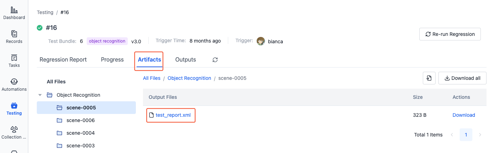

- The system will automatically parse and display the test report:

  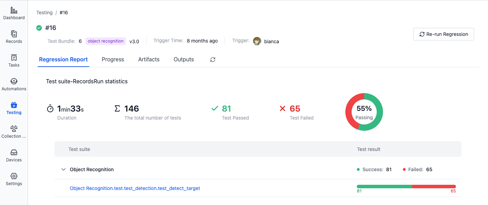

There are two methods to create JUnit XML format files:

- Use the `pytest_junit` plugin of the `pytest` library in your code
- Use commands in the configuration file to output xml files. See [Configuration Yaml Sample - Output Test Result Files](../regression/9-yaml-sample.md#save-artifacts).

Example of supported test result file:

> For mapping of result data to JUnit XML format, refer to [JUnit Mapping](https://www.ibm.com/docs/en/developer-for-zos/14.1?topic=formats-junit-xml-format#junitschema__table_junitmap)

```xml
<?xml version="1.0" encoding="UTF-8" ?>
  <testsuites id="20140612_170519" name="New_configuration (14/06/12 17:05:19)" tests="225" failures="1262" time="0.001">
    <testsuite id="codereview.cobol.analysisProvider" name="COBOL Code Review" tests="45" failures="17" time="0.001">
      <testcase id="codereview.cobol.rules.ProgramIdRule" name="Use a program name that matches the source file name" time="0.001">
        <failure message="PROGRAM.cbl:2 Use a program name that matches the source file name" type="WARNING">
          WARNING: Use a program name that matches the source file name
          Category: COBOL Code Review – Naming Conventions
          File: /project/PROGRAM.cbl
          Line: 2
        </failure>
      </testcase>
    </testsuite>
  </testsuites>
```

### Defining Output Charts

In JUnit XML format test result files, you can add custom attributes prefixed with "cos\_" (e.g., `cos_customer_name`). The system will automatically parse these attributes and their corresponding metric values to generate visualization charts (bar charts, box plots).

Currently supported data types are: boolean and float. Here's an example of outputting charts in the test code file:

```python
def test_romeo(record_xml_attribute):
    for i in (1, 2, 3):
        rand_float = random.uniform(1, 100)
        record_xml_attribute("cos_test_romeo_val" + str(i), rand_float)
    for i in (1, 2, 3):
        rand_bool = random.choice([True, False])
        record_xml_attribute("cos_test_romeo_bool" + str(i), rand_bool)

    assert __count('romeo') > 0
```

### Custom Output Files

Files generated during testing can be output to the following directories:

- Artifacts: /cos/artifacts
- Test Output: /cos/outputs

File preview and playback support:

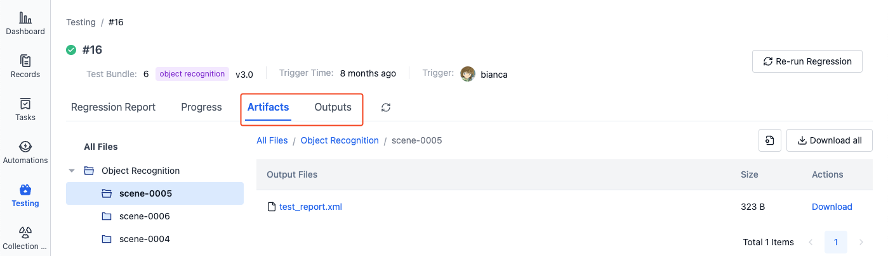

- Files in the "Artifacts" directory only support preview
- Files in the "Outputs" directory support both preview and playback. ROSbag files will automatically enter "Shadow Mode" during playback for synchronized comparison with the original record

### Creating Moments

Batch testing supports creating moments at key time points (such as when machine offset is abnormal or device failures occur) for quick problem location and analysis later. Moments can:

- Mark important time points
- Record when problems occur
- Extract key segments for analysis

Use the built-in `cos` command line tool in the batch testing environment to create moments. The specific command is:

```
/cos/bins/cos moment create \
    --display-name "Emergency Stop" \ # moment name
    --description "Machine emergency stop" \ # moment description
    --trigger-time 1532402940 \ # moment trigger time
    --duration 10 \ # moment duration
    --customized-fields '{"key1": "value1"}' # moment custom fields
```

To view moments in the visualization page, see [Moments](../../viz/5-create-moment-viz.md)

## Viewing Test Results

The batch testing list page displays the execution history of all tests, including test status, progress, and other information. Click on the test sequence number to view complete information on the details page:

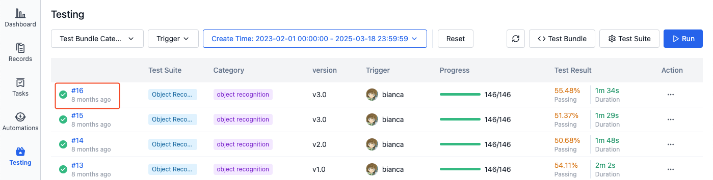

### Viewing Progress and Artifacts

1. In the "Progress" section of the batch test details page, you can view the running status and execution progress of all subtasks:

   

2. Click on the subtitle of a subtask to view its details page:

   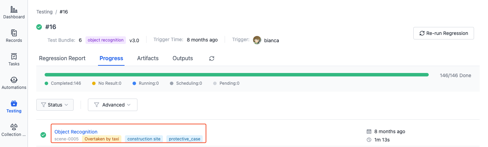

3. On the subtask details page, you can view the running status, progress, execution logs, test artifacts, and other information:

   - **Records**: Click on the record name to view record details
   - **Steps**: Click on the step name to view execution logs
   - **Artifacts**: View or download result files generated during testing, such as test reports
   - **Outputs**: Play files that need visualization, such as ROSbag files

   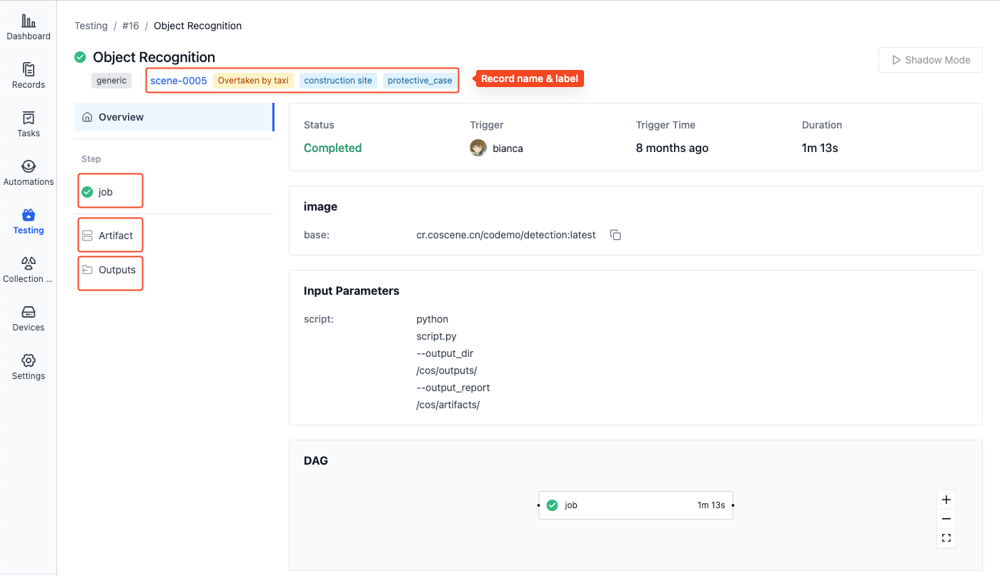

4. In the "Artifacts" section of the batch test details page, you can view and download all Artifacts for this batch test. The file hierarchy is as follows:

   ```plaintext
   All Artifacts
   ├── Test Suite A
   │   ├── Record 1
   │   │   ├── report.xml
   │   │   └── ...
   │   └── Record 2
   │       └── ...
   └── Test Suite B
       └── ...
   ```

   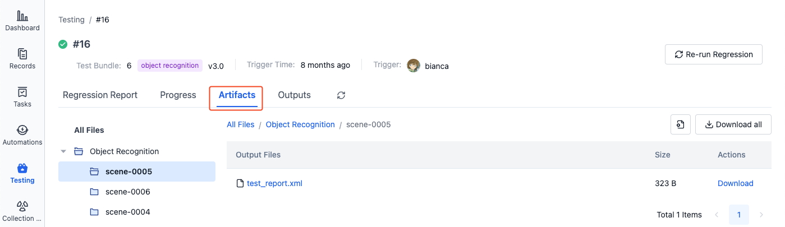

5. In the "Test Output" section of the batch test details page, you can view and download all test outputs for this batch test. The file hierarchy is as follows:

   ```plaintext
   All Test Outputs
   ├── Test Suite A
   │   ├── Record 1
   │   │   ├── test.bag
   │   │   └── ...
   │   └── Record 2
   │       └── ...
   └── Test Suite B
       └── ...
   ```

### Viewing Test Reports

After the batch test is completed, you can view test suite execution result statistics in the "Test Report" section, including running information and test cases parsed from each test suite:

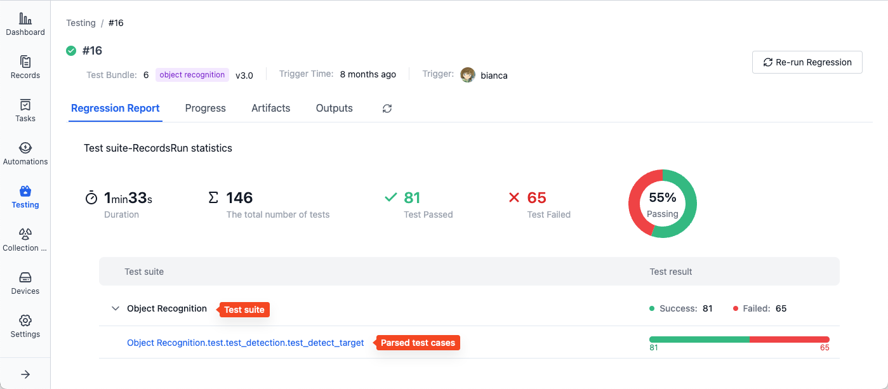

Click on an individual test case name to view its execution report, including test detail lists and output charts:

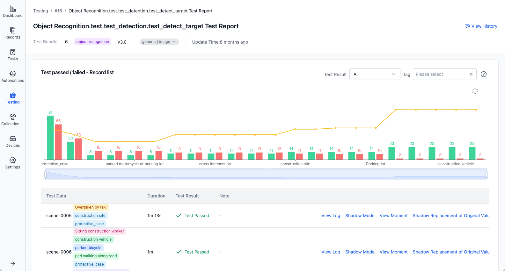

Click "View History" in the upper right corner to view historical result statistics for this test case, including test result matrix and metric statistics charts:

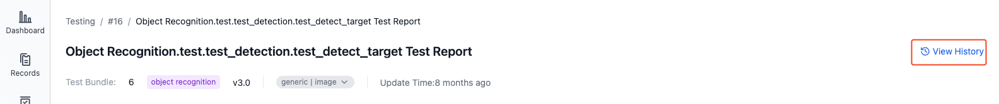

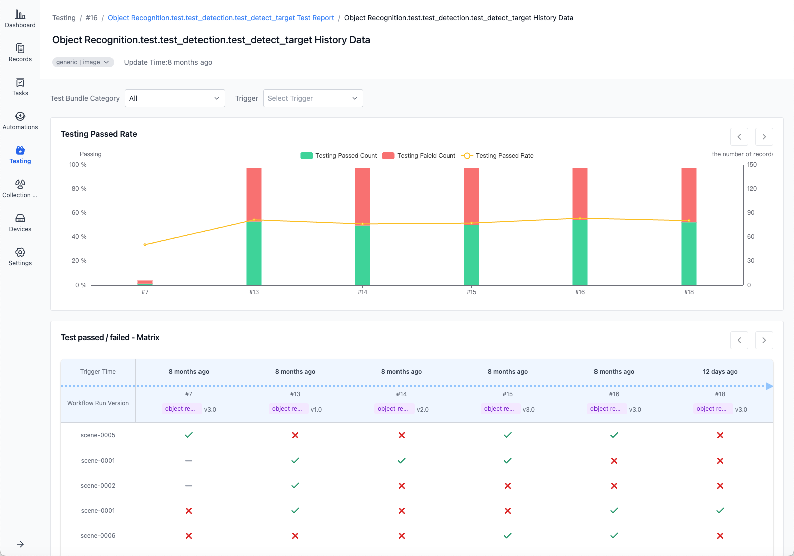

### Playing Shadow Mode

If there are ROSbag files in the test output, they can be played back in comparison with the original record.

1. In the "Test Output" section of the test details page, select the corresponding record level and click the "Shadow Mode" button in the upper right corner to enter the visualization interface:

   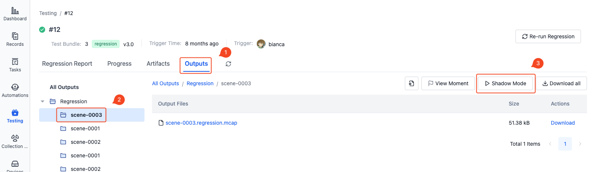

2. The test output files will be played back together with the files from the original record in the visualization interface.

   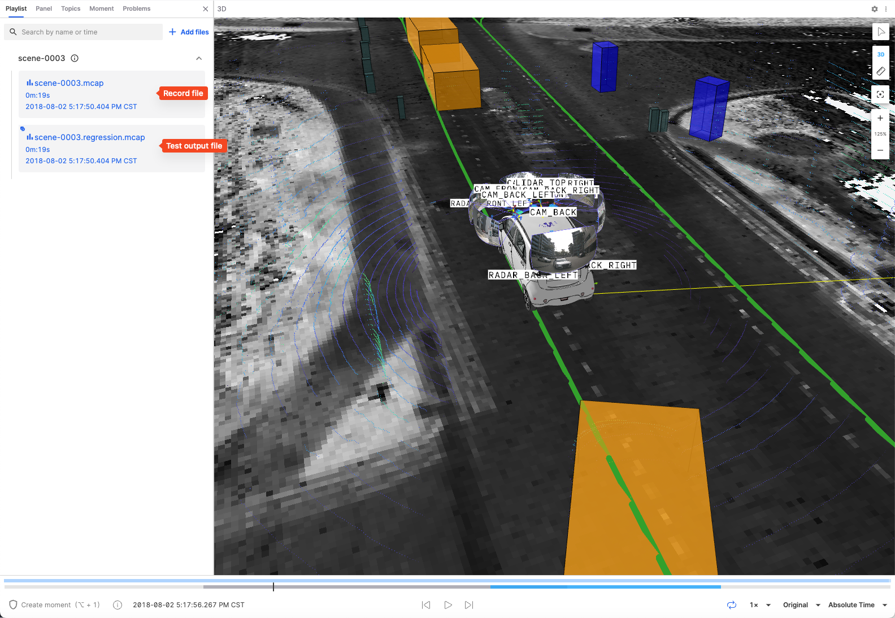

## Learn More

- [Test Bundle](./4-test-bundle-management.md)
- [Test Suites](./3-config-management.md)
- [Run a Cloud Test](./5-run.md)
- [Records](../../3-collaboration/record/1-quick-start-record.md)
- [Visualization](../../viz/1-about-viz.md)
