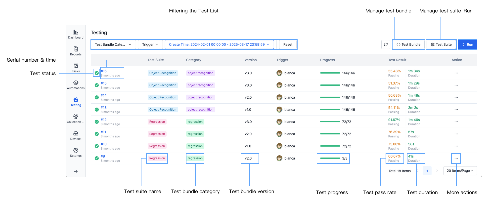
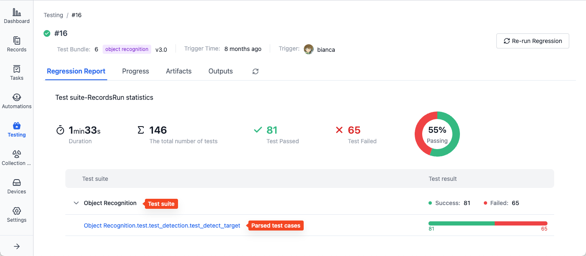
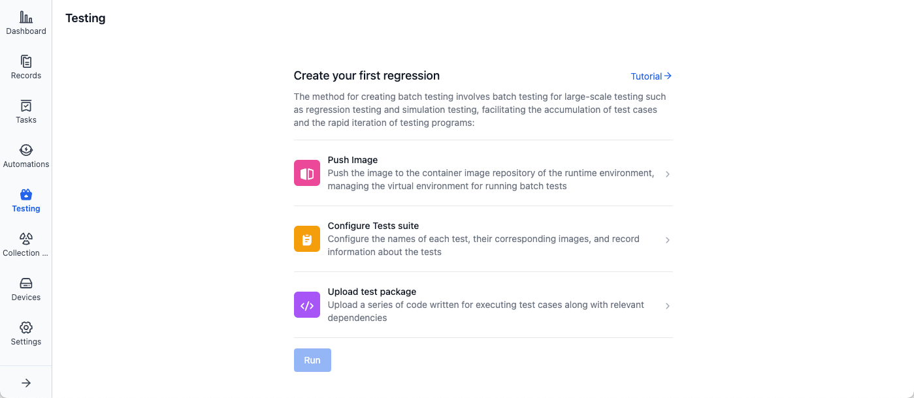

# About Cloud Test

Batch testing is an automated solution for parallel execution of multiple test tasks, primarily used in large-scale testing scenarios such as regression testing and simulation testing. The platform provides comprehensive test resource management capabilities, supporting unified management of images, datasets, test suites, and test bundles, enabling one-stop test execution, status monitoring, and result analysis within projects.

## Basic Information
### Key Concepts

| Name | Description |
| --- | --- |
| Image | Virtual environment for running batch tests |
| Test Suite | A collection of related test cases, typically testing specific functions or scenarios |
| Test Bundle | A series of code and related dependencies written to execute test cases |
| Test Case | Specific tasks executed during batch testing, usually parsed from corresponding test reports |

The execution flow of batch testing tasks is as follows:
1. Select a test suite and use its preset image as the test environment
2. Import test bundles, test data ([records](../../collaboration/record/1-quick-start-record.md)), and test suite configuration parameters into the test environment
3. The system creates independent sub-test tasks for each record associated with the test suite
4. After all sub-test tasks are completed, the system automatically aggregates results and generates test reports

### System Directories
Batch testing supports the following directory structure:
| Name | Directory |
| -------- | -------------- |
| Test Bundle | /cos/bundles |
| Records | /cos/files |
| Artifact | /cos/artifacts |
| Test Output | /cos/outputs |

## Batch Testing Interface
### Batch Testing List Page

- **Test serial number**: Unique identifier for tests, incrementing sequentially, click to view details
- **Test time**: Test start time, hover to view specific time
- **Test status**: Current test status, including queued, running, completed, no results. Where:
   - "Completed" indicates the test is finished (regardless of test case execution success)
   - "No Results" indicates no results were parsed, see [how to output test results](./6-status-and-output.md)
- **Test suite name**: Name of the selected test suite, see [Test Suite](./3-config-management.md)
- **Test bundle category, version**: Selected test bundle category and version, see [Test Bundle](./4-test-bundle-management.md)
- **Test progress**: One test contains multiple sub-test tasks, hover to view specific progress
- **Test pass rate**: Ratio of passed tests to total tests.
   - Calculation formula: Values used for calculating pass rate per test suite = Number of parsed cases × Number of associated records
- **Test duration**: Total test duration
- **Actions**:
   - Cancel Running
   - Re-run Regression
   - Download Artifacts
   - Download test outputs

### Batch Testing Details Page
- **Regression Report**: Displays test duration, test count, pass rate, test results, and other information

   

   - Test cases parsed from test suite: One test suite can parse multiple cases, each with corresponding execution results
   - Click test case name to view specific results

- **Test Progress**: Shows execution status of each sub-test task, view corresponding execution logs, Artifacts, and test outputs in sub-test task details
- **Artifacts**: Result files generated during testing, such as test reports
- **Test Output**: Files needing visualization generated during testing, such as ROSbag

## Usage Process Overview
Enter the project's "Batch Testing" page and create a batch test following the prompts:

1. Prepare Test Environment and Data

   - Prepare [Docker image](../../image/1-intro.md) for running batch tests
   - Push image to public platform or [coScene Image Registry](../../image/3-push-image.md)
   - Upload test data to project and store as [records](../../collaboration/record/1-quick-start-record.md)

2. Configure Test Content

   - Set up test suites and corresponding configuration parameters on the "[Test Suite Management](./3-config-management.md)" page
   - Upload test programs on the "[Test Bundle Management](./4-test-bundle-management.md)" page

3. Execute and Monitor
   - Select test bundle version and test suite in the "[Run a Cloud Test](./5-run.md)" dialog
   - Start batch test
   - Monitor test progress in real-time and [view test results](./6-status-and-output.md#view-test-results)

For details, please refer to the following chapters.