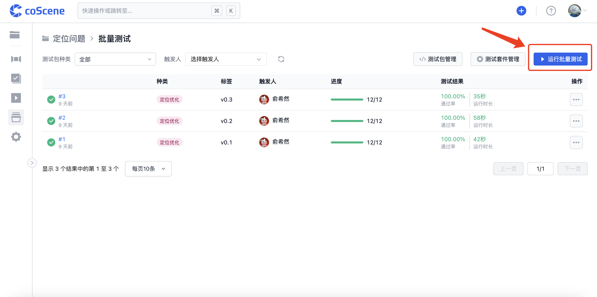

# Run a Cloud Test

> Learn how to execute batch tests, including triggering them on the website by specifying related conditions, automatically triggering through configuration files, and running batch tests locally using the command line.

## Running Batch Tests via Web Interface

1. On the "Batch Tests" page, click the "Run Batch Test" button in the top right corner:

   

2. After selecting the test package version and the test suites to be executed, click "Confirm" to run the batch tests. The associated records that meet the conditions will be used as test data to execute the test suites:

   

 

## Automatically Trigger Batch Tests

When the uploaded test package type or tag meets the preset conditions in the configuration file, the batch test will be automatically triggered upon completion of the test package upload. The full test suite that meets the conditions will be executed using that test package file.

You can set automatic trigger conditions for test suites in the "on" field of the configuration file. For the specific format and rules, please refer to [Configuration File Format and Sample - Automatic Test Triggering](../regression/9-yaml-sample.md#auto-triggering).

On the "Batch Tests - Test Suite Management" page, for test suites with automatic trigger conditions configured, the "Associated Trigger Conditions" column will display the "View Trigger Conditions" button:

You can click the "View Trigger Conditions" button to view the test package conditions that automatically trigger the test suite:

