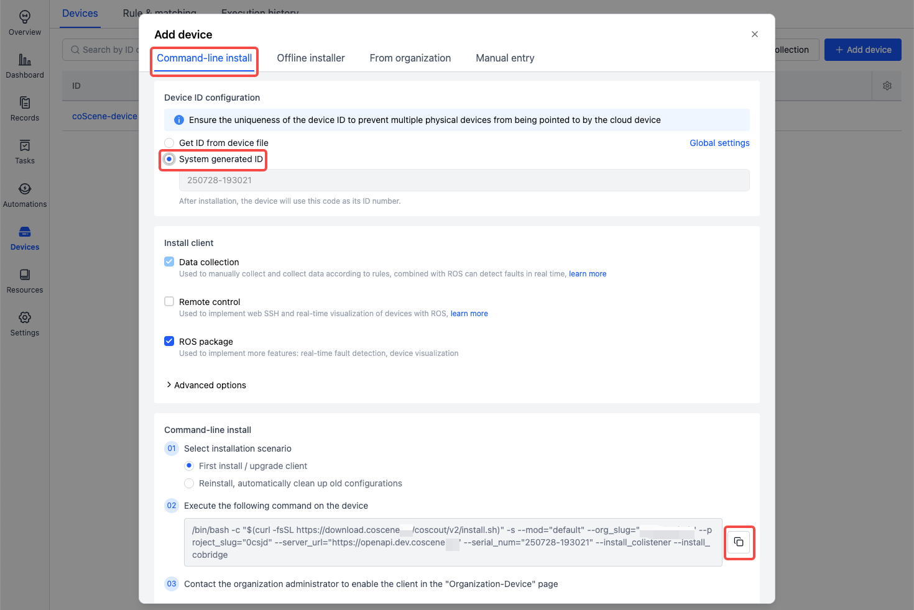

# General Data Collection

## Background

In the robotics industry, devices often encounter environmental, software, and hardware failures. It usually takes significant time and effort for operations personnel to **gather data** to troubleshoot problems. The CoScene Platform provides a general data collection solution based on **time ranges and file paths**, allowing users to quickly access machine-side data.

This guide illustrates how to collect and automatically process remote data using the CoScene Platform, using the example of **an operations engineer collecting on-site data remotely**.

Assume that a device named `coScene-device` at Site A encountered a failure on 2025-07-25 at 16:00. The operations team needs to collect the bag, log, and additional map data from approximately 30 minutes before the failure. The main steps are:

1. Configure collection directories  
2. Add device to the project  
3. Collect device data  
4. Track file upload progress  
5. Process the data

## Preparation

First, log into the CoScene Platform and create a project:

1. Visit [https://www.coscene.io/](https://www.coscene.io/), click **Login** in the upper right corner, and choose a login method to access the platform.

   

2. Create a **Project** on the platform. Projects are the unit of data management, handling data storage, management, isolation, and access control.

   

3. Confirm your role is **Organization Administrator**. For data security, only organization admins have permissions to **enable devices** and **configure global collection directories**. If you are not an admin, please contact one to update your role.

   

4. Prepare a robot device.

## Collecting Data

### Configure Collection Directory

1. Go to **Organization Management → Devices → Device Configuration** and set up the global collection directories under `collect_dirs`.

   

2. Suppose the bag files are stored at `/home/bag` and log files at `/home/log`, configure as follows:

   ```yaml
   mod:
   name: 'default'
   conf:
     enabled: true
     collect_dirs: 
       - /home/bag/
       - /home/log/
   ```

3. For more configuration details, refer to the [Device Configuration documentation](../device/4-device-collector.md).

## Add Device to Project

1. On the Project → Devices page, get the device installation command.

    

2. Run the installation command on the device.

    

3. fter installation, the device will be automatically added to the project. Go to Organization Management → Devices to enable it.

  

## Collect Device Data
> Scenario: Device `coScene-device` at Site A failed at 2025-07-25 16:00. The operations team needs bag, log, and map data from 30 minutes before the failure.

1. On the Project → Devices page, select `coScene-device` and click Data collection.

  

2. Configure the collection task:

  - Time Range: 2025-07-25 15:30 to 16:00
  - Paths: /home/bag/, /home/log/
  - Additional File: /home/map.png
  - Collection & Record Name: Collect data from Site A

  This collects files from the given paths created or modified between the specified time range and uploads them along with the map file to the record named Collect data from Site A.

  

3. Once the device receives the task, it scans for matching files and generates an upload list.

## Track File Upload Progress
1. During the collection, view progress in Device execution history.

   
   

2. Or run the following command on the device to view real-time logs:

    ```
    tail -f ~/.local/state/cos/logs/cos.log
    ```

3. After collection completes, view the files by opening the associated record.

    

## Processing Data
After uploading, you can use the platform’s [Automation](../6-automation/1-quick-start-workflow.md) capabilities to process data and improve operational efficiency.

### Configure Unzip Trigger
On the Project → Automation → Triggers page, create a trigger:

When a file matching *.zip is uploaded to a record, it will be automatically unzipped.

  

## Trigger Decompression
Go to Project → Records, upload a compressed file, and view the triggered unzip workflow.

  

Once unzipping is complete, open the extracted folder to view the files.

  

## FAQ
**Q: The expected file was not collected.**

A:

Ensure the file's modification or creation time falls within the selected range.

- Some systems do not track file creation time; only the last modification time is used. You can check this using: `ls -l --time-style=+"%Y-%m-%d %H:%M:%S"`
- You cannot collect future data — confirm the time range is not set in the future.

## Summary
This guide covers how users can manually initiate data collection and have the device automatically upload files to the platform. By integrating with CoScene’s automation features, you can build efficient workflows for diagnostics, processing, and data management to greatly enhance maintenance operations.
