# Cloud-Based Simulation & Automated Algorithm Verification

## Background

In **robotics R&D**, the endless cycle of testing and validating algorithms and software is often the most time‑consuming and error‑prone part of daily work.

Sound familiar?

- You tweak _one_ line of code and end up testing all day
- Your local simulation stack suddenly breaks—re‑installing is a minefield
- Multiple teammates run their own tests … and the results never match

For teams working on **mobile robots and embodied intelligence**, the pain is even sharper:

- Rapid software iterations demand continuous validation
- Simulation stacks are complex and costly to maintain
- No unified test standards, so results are hard to quantify
- Limited local compute; long queues for every test run

---

At **coScene** we kept asking ourselves:

_What if you could validate every algorithm change on demand—zero setup, fully reproducible, and with standardized outputs?_

Leveraging our deep experience in **data loops** and **productivity tooling**, we built a one‑stop **cloud simulation platform** grounded in the **SceneOps philosophy**:

**Just five quick steps to set things up.**  
Upload your program and the platform auto‑runs the tests, captures data, and generates visual reports—fully online, zero local dependencies!


This guide walks through Ubuntu 22.04 + ROS 2 Humble + Gazebo as an example.  
For other simulators, see the official site: [coScene Platform](https://www.coscene.cn/).

---

## 🧱 Step 1: Build Your Own Test Runtime

Every team’s tech stack is unique, so coScene lets you create a custom container image with all your dependencies and push it to the platform.

A minimal `Dockerfile` template:

```Dockerfile
# syntax=docker/dockerfile:1.2
ARG BASE_IMAGE=osrf/ros:humble-desktop-full
FROM ${BASE_IMAGE} as base
...
WORKDIR /action/ros2_ws
```

Open‑source sample 👉 [Regression_Test-Sample](https://github.com/coscene-io/Regression_Test-Sample/blob/main/Dockerfile)

After building, push the image to your organization’s private registry so everyone can reuse the same, stable test environment.

1. Sign in to coScene, open **Organization → Image Registry** to get your push URL  
   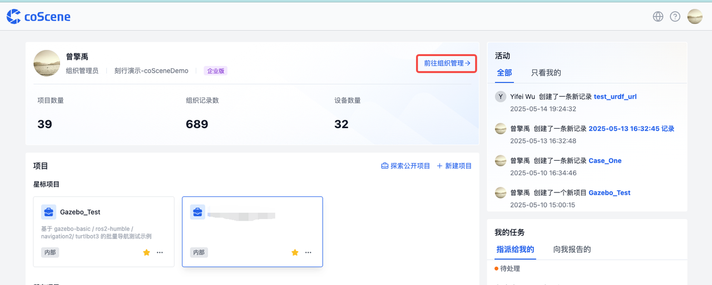
   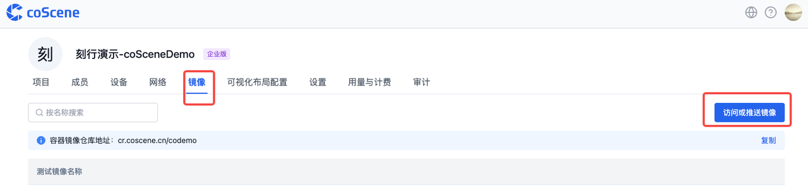
   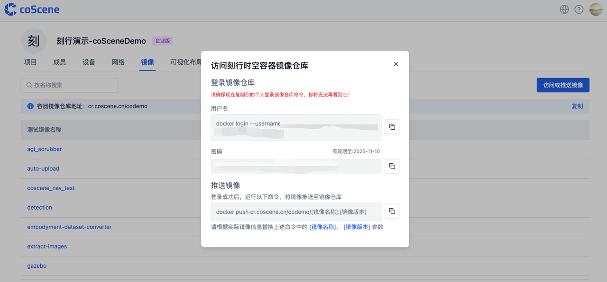

2. Log in to Docker and push the image  
   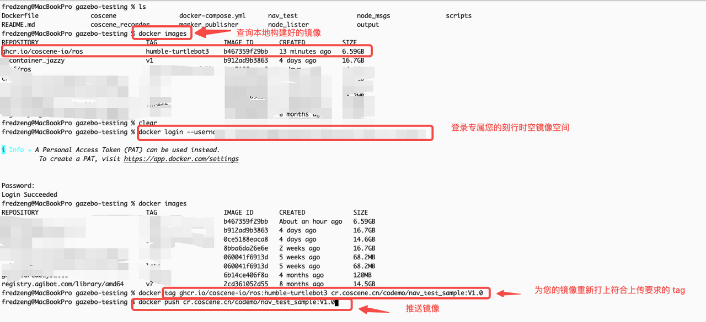

3. Verify the image inside the platform and copy its link  
   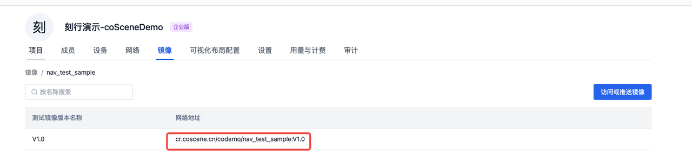

You now have a shared “runtime base” for all future simulation tests, with every dependency baked in.

---

## 📦 Step 2: Upload Your Algorithm & Test Program

After modifying your code, build and package it:

```bash
tar -czvf install.tar.gz ./install   # recommended: package the install/ folder
```

In your coScene project, click **Upload Program**.  
The platform auto‑extracts the archive and places it in the test container.

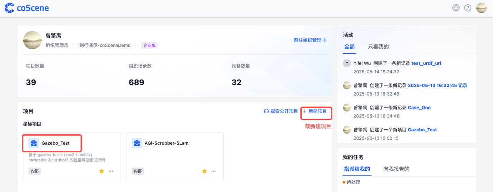  
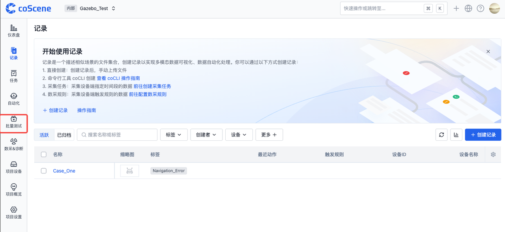  
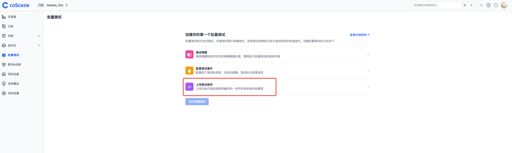  
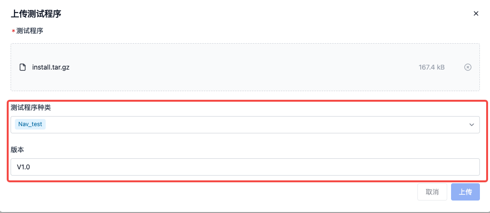

Supported uploads:

- Compiled executables or raw source to be built in‑container

Refer to the [Test Bundle Management Docs](../sim-and-tests/regression/4-test-bundle-management.md) for more info.

**Enterprise Edition**: integrate GitHub/GitLab CI to push artifacts automatically—no manual upload required.

---

## 🧪 Step 3: Prepare Test Cases

Within **Organization → Project → Records** you can define multiple test cases.  
Each record is a virtual “test scene” containing:

- **Map**: `map.pgm` + `map.yaml`
- **Robot model** (e.g., `turtlebot3_waffle_pi`)
- **Config** (e.g., `case.yaml`)
- **Gazebo world**
- Any extra resources

Example layout:

```
test_case/
├── map.pgm
├── map.yaml
├── case.yaml
├── world.world
└── extra_configs/
```


:::info Important Note

### Directory Convention

Follow the [official path structure](../sim-and-tests/regression/1-intro.md):

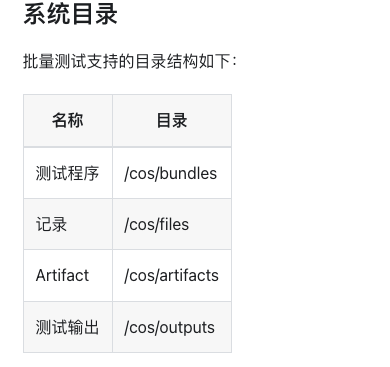

:::

### Tagging

Add labels (e.g., `Navigation_Error`) for easy filtering:

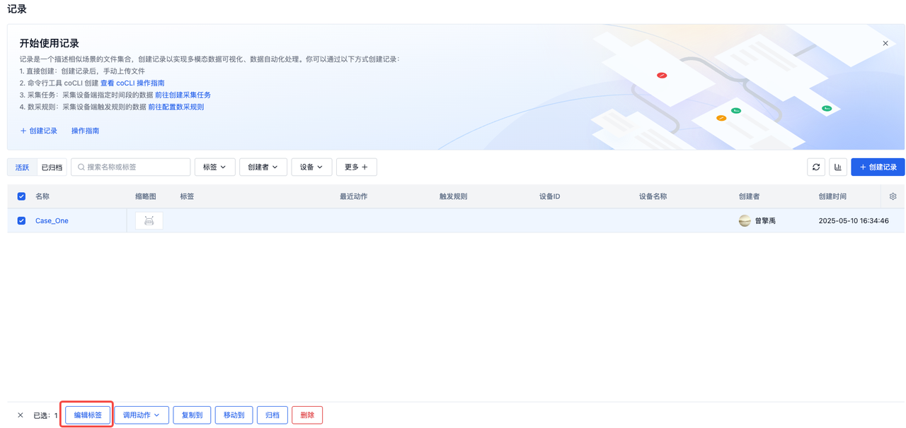  
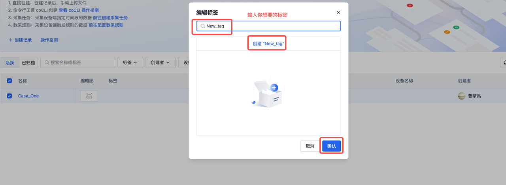  
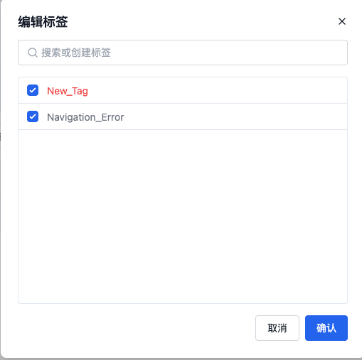  
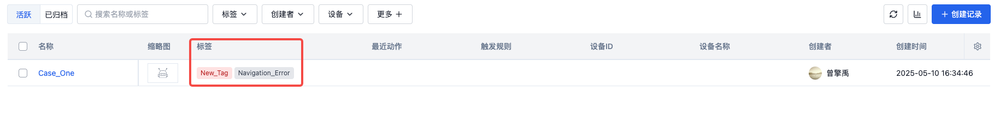

You can now select cases by tag in the next step.

---

## ⚙️ Step 4: Configure Test Triggers

Each project supports flexible trigger rules:

- Auto‑run tests on every program upload
- Manually select specific records
- Filter by tag or version

Refer to the [Regression Config Management](../sim-and-tests/regression/3-config-management.md) for more info.

  
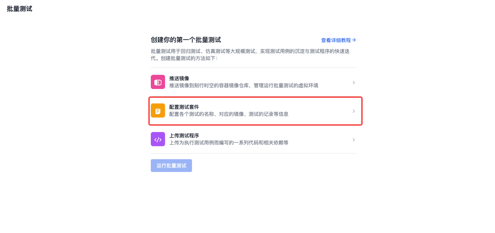  
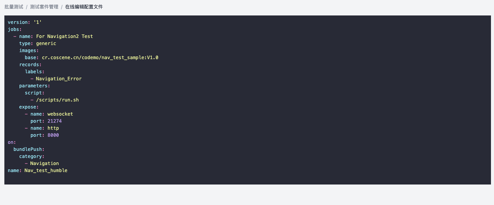

---

## 📊 Step 5: Run & Monitor Tests

During execution you get:

- Live visualization of robot state (Gazebo viewer supported)
- Automatic data recording
- Standardized test reports

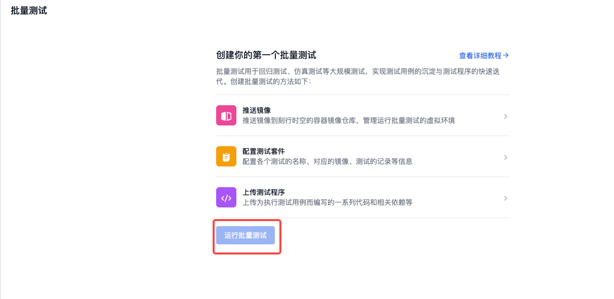  
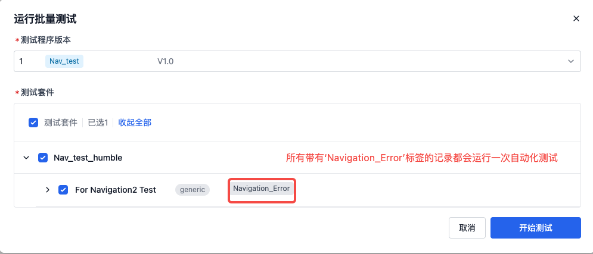  


Report includes:

- 📍 Trajectory plots
- ✅ Pass / fail metrics
- 🪵 Logs & exceptions
- 🖼️ Charts & statistics

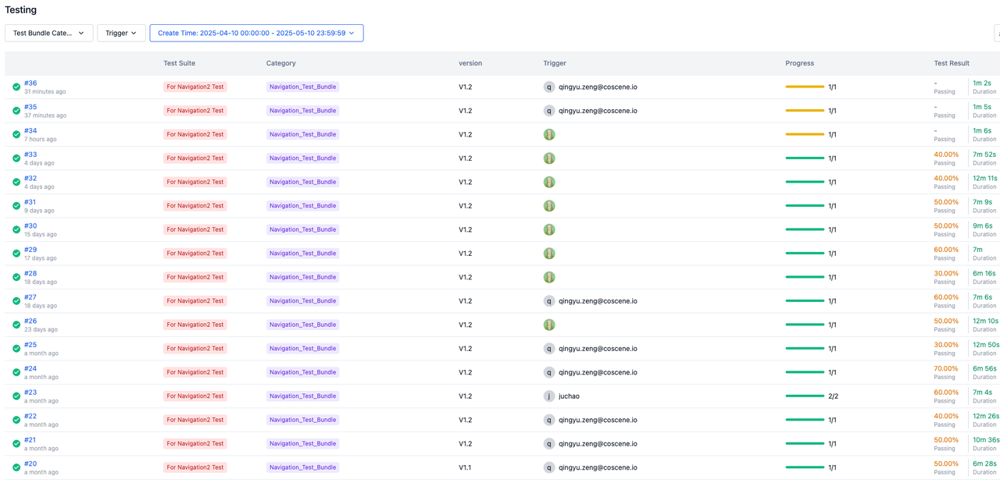  
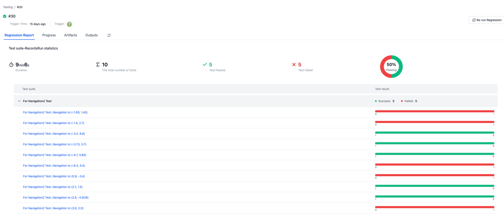

---

## 🚀 Wrap‑Up: Offload the Grind, Focus on Innovation

After every code change, you no longer need to:

- Rebuild environments
- Re‑run scripts by hand
- Manually diff logs

Just **one upload**, and coScene handles the rest—standardized, automated, and always reproducible—so you can spend more time on what truly matters.

👉 Sign up and try it out 
