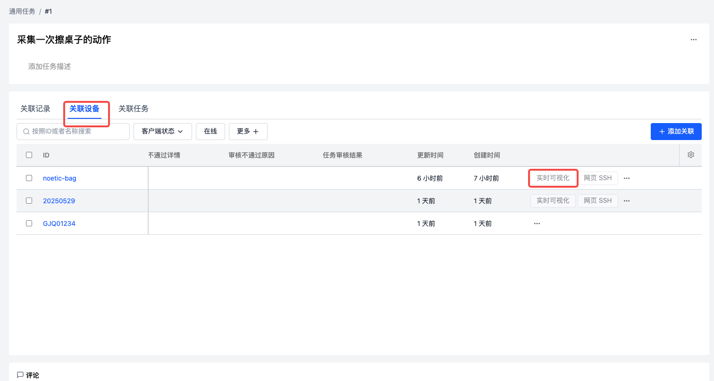

# Heterogeneous Robot Data Collection Factory Integration with coScene Platform

## Background

In the field of embodied intelligence, data is crucial for training and optimizing the behavior and decision-making capabilities of intelligent agents. After embodied intelligence data is collected and organized into records, in order to precisely use this data for model training, algorithm optimization, and other tasks, the data needs to be annotated to understand its underlying meaning, and it must undergo review to ensure data accuracy and quality. The coScene platform provides a complete solution for this, compatible with various heterogeneous robots and supporting multiple types of data uploads.

This article mainly introduces the following methods:

- **How to install and integrate coScene's edge software on the robot itself to meet the requirements for robot platform integration.**
- **Building a task management system**
- **How to perform data collection and upload operations on the robot visualization interface.**

## Prerequisites

1. **Device Registration**
   Refer to the official link: [Login to coScene](../2-get-started/1-quick-start.md), complete the **Login to coScene** section
   Refer to the official link: [Device Registration](../device/2-create-device.md)
   - Installation command (**The following code is for reference only. Please make sure to copy the installation command from your organization before adding.**):
     ```bash
     /bin/bash -c "$(curl -fsSL https://download.coscene.cn/coscout/v2/install.sh)" -s --mod="default" --org_slug="codemo" --server_url="https://openapi.coscene.cn" --coLink_endpoint="https://coordinator.coscene.cn/api" --coLink_network="fb899ea7-d71b-4cec-b531-0a5fb0015c61" --sn_file="/foo/bar/sn.txt" --sn_field="sn" --remove_config  --beta
     ```
   - sn_file: Represents the storage path of the machine's serial number file, which needs to be manually configured and the file must exist. sn_field: Represents the field that indicates the machine serial number in the above file. For example, if my robot's serial number file path is /root/robot/sn.txt, and the content in sn.txt is sn:123456, then I need to configure: --sn_file="/root/robot/sn.txt" --sn_field="sn"

2. **Install coBridge**
   - Download the deb package: [coBridge](https://github.com/coscene-io/cobridge/actions/runs/15103306677?pr=25) Choose the corresponding deb installation package according to the robot's computing platform (**Note: VPN access required to enter GitHub for download**)
   - Installation command:
     ```bash
     sudo dpkg -i ros-humble-cobridge_1.0.7-0focal_arm64.deb   # Use the actual downloaded deb file.
     ```
   - You can also refer to [Installing coScene Edge Software Using APT Repository](../client/2-apt-source-install.md)

3. **Device Admission**

   After logging into the platform, you can see the "**Go to Organization Management**" button on the homepage. Refer to the documentation for [Device Admission](../device/3-manage-device.md#enable-device)

4. **Create Project**

   After logging into the platform, you can see the "**New Project**" button on the homepage. Refer to the documentation for [Create New Project](../3-collaboration/project-collaboration/1-project.md)

5. **Add Collection Device to Project**

   After completing the above actions, we need to associate the robot with our project. Refer to the documentation for [Create New Project](../3-collaboration/project-collaboration/1-project.md)

---

## Prepare and Start ROS Node

- The robot needs to have a **data recording node** that can provide **services**, and provide services such as **start recording** (e.g., /start_record), **cancel recording** (e.g., /cancel_record), **stop recording** (e.g., /stop_record) for coScene to call.
  -- **Note**: Currently only **service** type messages are supported.
- Before starting coBridge, you need to source the workspace environment variables of the **data recording node**.
- Example startup script (please modify according to actual situation):
  ```bash
  #!/bin/bash
  set -e
  source ~/cos_ws/devel/setup.bash   # Please modify according to actual situation
  roslaunch cobridge cobridge.launch &
  sleep 3
  roslaunch record_ctrl record.launch &  # Please modify according to actual situation, this actually starts your recording node
  sleep 3
  ```

---

## Configure Visualization Layout

After entering the real-time visualization page, there is no layout by default, and you need to add visualization panels to the page according to your different collection requirements.
If you want to get started quickly, you can also contact coScene to provide official example configuration files and import them as follows.


1. Enter the real-time visualization page (refer to [Real-time Visualization](../device/5-device-remote-control.md) for method), click [Create New Layout].
   

2. Select [Data Collection] panel and other required panels (such as 3D, Raw Messages).
   
   

3. Drag the panel title bar to adjust the layout, drag the divider to adjust the size.
   
   
   After the above adjustments, you can get a preliminary visualization layout.

### Configure 3D Panel:

- Click [Settings] in the upper right corner, custom layers can set URDF.
  
  

### Configure Raw Messages Panel:

- Select the messages of interest at the top, can split/add new panels.
  
  
  
  

### Configure Data Collection Panel:

- After selecting the data collection panel, set the data save project, record tags, service names (such as /start_record, /cancel_record, /stop_record).
  
  
- **Service names must be based on the service names provided by the data recording node running on the robot!**

### Layout Management

After configuration, you can save, rename, and share with the team. It is recommended to set the configured layout as the **project default layout**.


---

## Task Configuration and Management

We need to configure different task management systems according to different business requirements to support our business needs. coScene provides flexible and configurable field, trigger, and action management capabilities for different application scenarios.


### Configure Custom Fields for Task System

In our task management system, we need to configure different fields for different tasks to meet our business requirements.
Taking collection tasks as an example, we need to configure the following fields:

- Collector
- Task Type
- Task Status
- Collected Skill Name
- Task Deadline
- Collection Quantity
- etc

After logging into the platform, you can see the "**Go to Organization Management**" button on the homepage. Click to enter organization management, go to the **Settings** interface, and select **Custom Fields** in the left navigation bar. Configure each field on the page and set whether it is required.


This page can also configure custom device-related fields to support devices associated in our task management system and configure some specific filtering fields.

After completing the configuration of organization-wide fields, enter Project Settings - Advanced page, edit project field configuration, and select the fields that records, tasks, and moments need to use.


After adding, you can use these fields on the corresponding pages.

### Configure Automated Flow Triggers for Task System

Triggers define the trigger conditions for actions. When the trigger timing is met, the trigger will check according to the configuration and execute the corresponding actions.

In our data collection scenario, we usually need to trigger task flow based on changes in task status.
Taking a typical heterogeneous data collection task as an example, we need to configure the following triggers:

- When the collector changes the task status to "Complete", automatically call the action to create an annotation task.
  Refer to the figure below:


For trigger configuration details, please refer to [Automation - Triggers](../6-automation/4-trigger.md)

### Configure Automated Actions for Task System

As we configured automated flow triggers in the previous step, when the collector changes the task status to "Complete", it will automatically call the action to create an annotation task.

coScene provides some automated actions suitable for data factories: **Create General Task**, to support our data factory business needs. We also support custom automated actions to support workflows that are more suitable for you.

Please refer to the documentation: [Automation - Actions Overview](../6-automation/2-action-overview.md)

**coScene will launch task configuration import/export functionality in the future, along with richer official task system templates. Stay tuned!**

## Data Collection, Annotation, and Review Operation Guide

### Data Collection

- After the administrator logs into the platform, enter the corresponding project and complete the following work:
  - Task configuration and management
  - Associate devices and members to the project, refer to documentation: [Project Devices/Members](../3-collaboration/project-collaboration/1-project.md)
  - Click **Tasks** in the left navigation bar and create a **General Task**. (**Note! Please create general tasks in this application scenario, as collection tasks and annotation tasks cannot meet actual requirements.**)
    

- After the collector logs into the platform, they can view pending collection tasks in **Homepage** ➡️ **My Tasks** ➡️ **Assigned to Me**. Click on this task to enter the task details page.
  
  Enter the details page, click **Associated Device**, select the collection device, click **Real-time Visualization** to enter the visualization page, where you can see our configured collection layout.
  

- Click [Start Collection], log prompt "Start collection successful" means the device starts recording. (**Specific log content depends on the feedback provided by the service!**)
  

- The collector operates the robot to complete the target task.

- After the task is completed, click [End Collection], log prompt "End collection successful" and automatically upload data. (**Specific log content depends on the feedback provided by the service!**)
  
  - coScene provides data upload log prompts here: Log shows "End collection successful" --- "Start upload" --- "File uploading X / N" --- "File upload complete" to complete data collection. In the collection log, you can view record links and upload file progress.
    

- If there's a misoperation, you can click [Cancel Collection] to discard the data.
  

- Collection records and data can be viewed in the project.
  

  

- After completing collection, the collector adds associated records in the task (filter out the collected records based on device name and creation time)

  

---

### Data Annotation

After the annotator logs into the platform, they can view pending annotation tasks in **Homepage** ➡️ **My Tasks** ➡️ **Assigned to Me**.


Click on the task to view the data records to be annotated, click on the record to enter the details page, click **Play Record** to start annotating the data.


After the annotator completes the annotation work, mark the annotation task as "Complete" to finish the annotation task. According to the automated flow trigger set by the administrator, the system will automatically create a review task and assign it to the reviewer, and the system enters the next stage.

### Data Review

After the reviewer logs into the platform, they can view pending review tasks in **Homepage** ➡️ **My Tasks** ➡️ **Assigned to Me**.


Click on the task to view the data records to be reviewed, click on the record to enter the details page, click **Play Record** to start reviewing the data.


After the reviewer completes the review work, mark the review task as "Complete" to finish the review task.

If the reviewer finds errors in data collection or annotation, they can mark it as **Review Failed** and fill in the reason in the comments. According to the automated flow trigger set by the administrator, the system will automatically create a re-annotation task or collection task and assign it to the annotator or collector, and the system enters the next stage.

## Data Application

When we need to use reviewed and approved data, we can view the data in the **Project**, filter the data through **Tags** and **Custom Fields**, select records and click **Download** to download the data (please use [coCLI](/docs/category/cocli) to download data larger than 2G), or share it with other team members.


## Frequently Asked Questions

- **Q: Can the service in the data collection panel be customized?**
  A: Yes, the platform provides templates and users can customize them.

- **Q: What other panels support real-time visualization?**
  A: All panels support it, as long as the robot sends corresponding messages.

- **Q: What other collection methods are available?**
  A: The platform supports time range collection, automatic discovery collection, etc. For details, see [related documentation](/docs/category/use-case).

---

The above is the complete process for heterogeneous robot data collection factory integration with the coScene platform. If you have any questions, please feel free to contact us.
